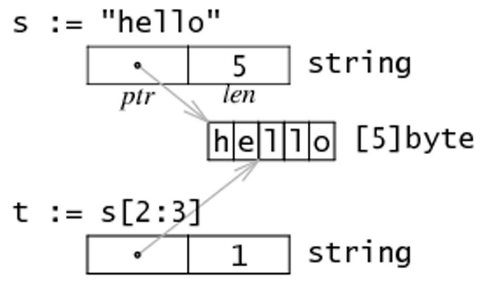
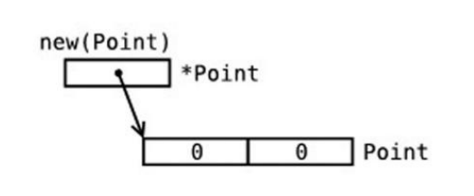
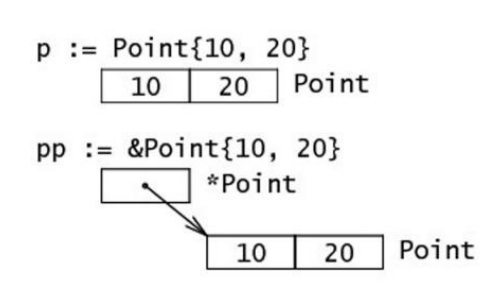
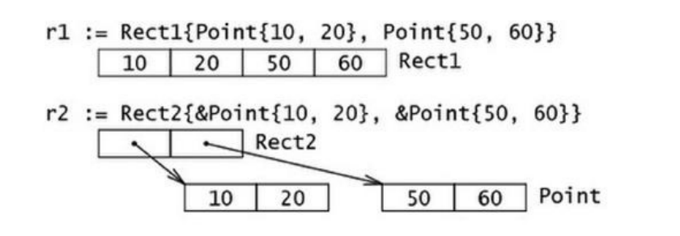
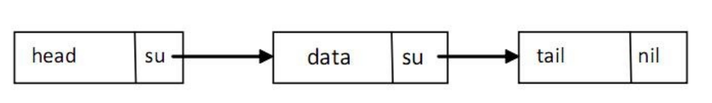
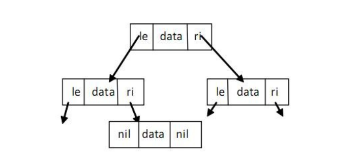
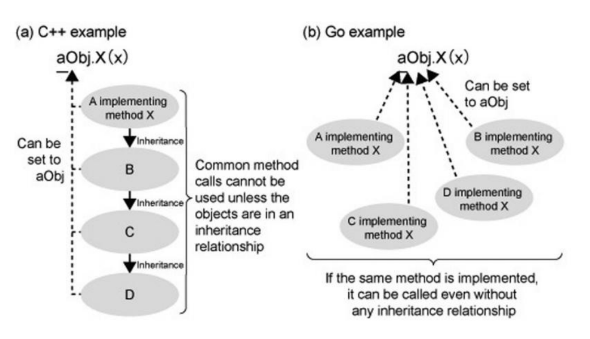

## 语法

​		当我们在学习 C ，C++，Java 的时候，我们都会编写一个 `main` 函数，这个 `main` 函数就是程序的入口。在 Go 语言中也不例外。

```go
// 在 Go 程序中，存在包的概念，每一个 Go 文件都仅属于一个包，一个包可以由许多以 .go 为扩展名的文件构成。
package main 

// 这就是入口函数
func main(){
    // ...
}
```

### 输出

Go 的标准输出依赖于 `fmt` 包，在使用时需要导入。

```go
package main

import "fmt"

func main() {
        // 当有多个参数的时候，会在中间添加空格
	fmt.Print("Hello World")
       // 最后追加换行符
	fmt.Println("Hello World")
    
	print("Hwww")
	println("---HWWWWW")
}
```

> 在上述代码中，直接使用 `print` 函数也可以进行输出。
>
> 直接使用的 `print` 函数是 Go 内置的函数，申明在 `builtin.go` 文件中，该文件只是申明变量和一些函数，并不做具体的实现。
>
> 官方不建议在项目中使用，在 debug 的时候可用，不保证是否保留。

## 1. 基本结构和基本数据类型

### 1.1 文件名、标识符、关键字

**文件名**：以 .go 为后缀进行存储

**标识符：**必须以字符（可以使用任何 UTF-8 编码的字符或 _ ）开头，然后紧跟着 0 个或 多个字符或 Unicode 数字，如：X56、group1、_x23、i、өԑ12。 

以下是无效的标识符： 1ab（以数字开头） case（Go 语言的关键字） a+b（运算符是不允许的）

> _ 本身就是一个特殊的标识符，被称为空白标识符。它可以像其他标识符那样用于变量的声明或赋值（任何类型都 可以赋值给它），但任何赋给这个标识符的值都将被抛弃，因此这些值不能在后续的代码中使用，也不可以使用这个 标识符作为变量对其它变量进行赋值或运算。

**关键字：**

|  **break**   |   **default**   |  **func**  | **interface** | **select** |
| :----------: | :-------------: | :--------: | :-----------: | :--------: |
|   **case**   |    **defer**    |   **go**   |    **map**    | **struct** |
|   **chan**   |    **else**     |  **goto**  |  **package**  | **switch** |
|  **const**   | **fallthrough** |   **if**   |   **range**   |  **type**  |
| **continue** |     **for**     | **import** |  **return**   |  **var**   |

### 1.2 Go 程序的基本结构和要素

#### 1.2.1 包的概念、导入与可见性

包是结构化代码的一种方式：每个程序都由包（通常简称为 pkg）的概念组成，可以使用自身的包或者从其它包中导入内容。

每个Go文件都属于且仅属于一个包。一个包可以包含多个以 .go 为后缀的文件组成，因此文件名和包名一般来说是不同的。

在源文件中非注释的第一行指明这个文件属于哪个包，如： package main 。 package main 表示一个可独立执行的程序，每个 Go 应用程序都包含一个名为 main 的包。

Go 中的包模型采用了显式依赖关系的机制来达到快速编译的目的，编译器会从后缀名为 .o 的对象文件（需要且只需要这个文件）中提取传递依赖类型的信息。 

> 如果 A.go 依赖 B.go ，而 B.go 又依赖 C.go ： 编译 C.go , B.go , 然后是 A.go . 为了编译 A.go , 编译器读取的是 B.o 而不是 C.o .

**可见性规则：**

> - 当标识符（包括常量、变量、类型、函数名、结构字段等等）以一个大写字母开头，如：Group1，那么使用这种形式的标识符的对象就可以被外部包的代码所使用（客户端程序需要先导入这个包），这被称为导出（像面向对象语言中的 public）；
> - 标识符如果以小写字母开头，则对包外是不可见的，但是他们在整个包的内部是可见并且可用的（像面向对象语言中的 private ）。

#### 1.2.2 函数

最简单的函数格式：

```go
func functionName(){}
```

可以在括号 () 中写入 0 个或多个函数的参数（使用逗号 , 分隔），每个参数的名称后面必须紧跟着该参数的类型。

main 函数是每一个可执行程序所必须包含的，一般来说都是在启动后第一个执行的函数（如果有 **init() 函数**则会先执行该函数）。如果你的 main 包的源代码没有包含 main 函数，则会引发构建错误 undefined: main.main 。main 函数既没有参数，也没有返回类型（与 C 家族中的其它语言恰好相反）。如果你不小心为 main 函数添加了参数或者返回类型，将会引发构建错误：

`build-error: syntax error: unexpected semicolon or newline before {`

#### 1.2.3 类型

可以包含数据的变量（或常量），可以使用不同的数据类型或类型来保存数据。使用 var 声明的变量的值会自动初始化为该类型的零值。类型定义了某个变量的值的集合与可对其进行操作的集合。

类型可以是：

- 基本类型，如：int、float、bool、string；
- 结构化的（复合的），如：struct、array、slice、map、channel；
- 只描述类型的行为的，如：interface。

> 结构化的类型没有真正的值，它使用 nil 作为默认值（在 Objective-C 中是 nil，在 Java 中是 null，在 C 和 C++ 中是NULL或 0）。值得注意的是，Go 语言中**不存在类型继承**。

函数也可以是一个确定的类型，就是以函数作为返回类型。这种类型的声明要写在函数名和可选的参数列表之后，例如：

```go
 func FunctionName (a typea, b typeb) typeFunc
```

以在函数体中的某处返回使用类型为 typeFunc 的变量 var：`rerun var`

一个函数可以拥有多返回值，返回类型之间需要使用逗号分割，并使用小括号 () 将它们括起来，如： 

```go
func FunctionName (a typea, b typeb) (t1 type1, t2 type2)
```

其中 t1，t2 为返回值

#### 1.2.4 Go程序的一般结构

总体思路如下：

> - 在完成包的 import 之后，开始对常量、变量和类型的定义或声明。 
> - 如果存在 init 函数的话，则对该函数进行定义（这是一个特殊的函数，每个含有该函数的包都会首先执行这个函数）。 
> - 如果当前包是 main 包，则定义 main 函数。 
> - 然后定义其余的函数，首先是类型的方法，接着是按照 main 函数中先后调用的顺序来定义相关函数，如果有很多函数，则可以按照字母顺序来进行排序。

```go
package main
import {
    'fmt'
}
const c = "C"
var v int = 5
type T struct{}
func init(){}
func main(){
    var a int
    Func1()
    fmt.Println(a)
}
func (t T) Method1(){}
func Func1(){}
```

Go 程序的执行（程序启动）顺序如下：

> 1. 按顺序导入所有被 main 包引用的其它包，然后在每个包中执行如下流程： 
> 2. 如果该包又导入了其它的包，则从第一步开始递归执行，但是每个包只会被导入一次。 
> 3. 然后以相反的顺序在每个包中初始化常量和变量，如果该包含有 init 函数的话，则调用该函数。 
> 4. 在完成这一切之后，main 也执行同样的过程，最后调用 main 函数开始执行程序。

#### 1.2.5 类型转换

```go
valueOfTypeB = typeB(valueOfTypeA)
// 示例：
a := 5.0
b = int(a)
```

类型 B 的值 = 类型 B(类型 A 的值)

### 1.3 常量

常量的定义用 const 定义，用于存储不会改变的数据。

常量的值必须在编译的时候就能够确定，例如：

```go
const c1 = 2/3
const c2 = getNum() // 错误
const Ln2= 0.693147180559945309417232121458\
                   176568075500134360255254120680009
```

反斜杠 \ 可以在常量表达式中作为多行的连接符使用。

### 1.4 变量

#### 1.4.1 变量的定义

在 Go 语言中，变量的定义方式如下：

```go
package main

// 函数外定义变量
// 注意非全局变量
var num6 = 4
var num7 int = 3
// 函数外定义多变量
var (
    num8 = 8
    flag4 = false
    word4 = "No"
)

func main(){
    // var是指定义变量，变量名在前，变量类型在最后
    // 不赋值，默认初始值为零值
    var num1 int
    // 定义时赋值
    var num2 int = 1
    // 不指定类型，编译器可以自动识别
    var num3 = 5
    var flag1 = true
    // 多变量定义，中间逗号隔开
    var word1, flag2, num4 = "Hello World", false, 666
    // 使用冒号进行定义变量
    num5, flag3, word2 := 123, true, "Yes"  // 只能在函数内使用
}
```

#### 1.4.2 值类型和引用类型

**值类型**有：int、float、bool、string、数组、结构

使用这些类型的变量直接指向存在内存中的值：


当使用等号 = 将一个变量的值赋值给另一个变量时，如： j = i ，实际上是在内存中将 i 的值进行了拷贝：


**引用类型**中存放的是值所在的内存地址，或内存地址中第一个字所在的位置


#### 1.4.3 init 函数

变量除了可以在全局声明中初始化，也可以在 init 函数中初始化。这是一类非常特殊的函数，它不能够被人为调用，而是在每个包完成初始化后自动执行，并且执行优先级比 main 函数高。

每一个源文件都可以包含一个或多个 init 函数。初始化总是以单线程执行，并且按照包的依赖关系顺序执行。

一个可能的用途是在开始执行程序之前对数据进行检验或修复，以保证程序状态的正确性。

```go
package trans
import (
	'math'
    'fmt'
)
var Pi float64
func init(){
    Pi = 4 * math.Atan(1) // 计算Pi值
}
```

```go
package main
import (
	'fmt'
    "./trans"
)
var twoPi = 2 * trans.Pi
func main(){
    fmt.Println("2*Pi = "%g\n, twoPi)
}
```

init 函数也经常被用在当一个程序开始之前调用后台执行的 goroutine，如下面这个例子当中的 backend() ：

```go
func init(){
    go backend()
}
```

### 1.5 基本类型和运算符

#### 1.5.1 布尔类型 bool

布尔型的值只可以是常量 true 或者 false

两个个类型相同的值可以使用相等 == 或者不等 != 运算符来进行比较并获得一个布尔型的值。

Go 对于值之间的比较有非常严格的限制，只有两个类型相同的值才可以进行比较，如果值的类型是接口（interface，第 11 章），它们也必须都实现了相同的接口。。如果其中一个值是常量，那么另外一个值的类型必须和该常量类型相兼容的。

Go 语言中包含以下逻辑运算符：

> 1. 非运算符： !
>    - 非运算符用于取得和布尔值相反的结果。
> 2. 和运算符： &&
>    - 只有当两边的值都为 true 的时候，和运算符的结果才是 true。
> 3. 或运算符： ||
>    - 只有当两边的值都为 false 的时候，或运算符的结果才是 false，其中任意一边的值为 true 就能够使得该表达式的结果为 true。

在格式化输出时，你可以使用 %t 来表示你要输出的值为布尔型。

#### 1.5.2 数字类型

##### 1.5.2.1 整型 int 和浮点型 float

Go 语言支持整型和浮点型数字，并且原生支持复数，其中位的运算采用补码。

Go 也有基于架构的类型，例如：int、uint 和 uintptr。

这些类型的长度都是根据运行程序所在的操作系统类型所决定的：

- int 和 uint 在 32 位操作系统上，它们均使用 32 位（4 个字节），在 64 位操作系统上，它们均使用 64 位（8 个字节）。 
- uintptr 的长度被设定为足够存放一个指针即可。

Go 语言中没有 float 类型。

- 整数：
  -  int8（-128 -> 127）
  -  int16（-32768 -> 32767）
  -  int32（-2,147,483,648 -> 2,147,483,647） 
  - int64（-9,223,372,036,854,775,808 -> 9,223,372,036,854,775,807） 
- 无符号整数： 
  - uint8（0 -> 255） 
  - uint16（0 -> 65,535） 
  - uint32（0 -> 4,294,967,295） 
  - uint64（0 -> 18,446,744,073,709,551,615） 
- 浮点型（IEEE-754 标准）： 
  - float32（+- 1e-45 -> +- 3.4 * 1e38）   精确到小数点后 7 位
  - float64（+- 5 1e-324 -> 107 1e308）   精确到小数点后 15 位，math 包中所有有关数学运算的函数都会要求接收这个类型。

int 型是计算最快的一种类型。 整型的零值为 0，浮点型的零值为 0.0。

可以使用 a := uint64(0) 来同时完成类型转换和赋值操作，这样 a 的类型就是 uint64。

Go 中不允许不同类型之间的混合使用，但是对于常量的类型限制非常少，因此允许常量之间的混合使用，下面这个程序很好地解释了这个现象（该程序无法通过编译）：

```go
package main
import "fmt"
func main() {
	var a int
	var b int32
	a = 15
	b = a + a
	b = b + 5 // Cannot use 'a + a' (type int) as type int32 
	fmt.Println(b)
}
```

同理，int16 也不能够被隐式转换为 int32。

如下例子：

```go
package main
import "fmt"
func main() {
	var a int16 = 34
	var b int32
	b = a  // Cannot use 'a' (type int16) as type int32 
	b = int32(a)
	fmt.Printf("16 bit int is: %d\n", a)
	fmt.Printf("32 bit int is: %d\n", b)
}
```

下面这个例子展示如何安全地从 int 型转换为 int8：

```go
func Unit8FromInt(n int) (uint8, error){
    if 0 <= n && n<= math.MaxUint8{
        return uint8(n), nil
    }
    return 0, fmt.Errorf("%d is out of the uint8 range", n)
}
```

或者安全地从 float64 转换为 int： 

```go
func IntFromFloat64(x float64) int {
	if math.MinInt32 <= x && x <= math.MaxInt32 { // x lies in the integer range
		whole, fraction := math.Modf(x)
		if fraction >= 0.5 {
			whole++
		}
		return int(whole)
	}
	panic(fmt.Sprintf("%g is out of the int32 range", x))
}
```

######  int 和 int64 是相同的类型吗？

int 是一个有符号的整型的集合，并且至少有32位。具体根据系统的位数，如果是32位系统那么就是32位，如果是64位那么就是64位

int64 是一个有符号的整型的集合且位数为64位。

在64位系统中，int 和 int64 所占的字节数都是 8 字节

```go
package main
import (
	"fmt"
	"unsafe"
)
func main() {
	var a uint = 1   	// 8
	var b uint8 = 1       // 1
	var c uint16 = 1     // 2
	var d uint32 = 1    // 4
	var e uint64 = 1    // 8
	fmt.Println(unsafe.Sizeof(a))
	fmt.Println(unsafe.Sizeof(b))
	fmt.Println(unsafe.Sizeof(c))
	fmt.Println(unsafe.Sizeof(d))
	fmt.Println(unsafe.Sizeof(e))
}
```

##### 1.5.2.2 负数

复数使用 re+imI 来表示，其中 re 代表实数部分， im 代表虚数部分，I 代表根号负 1。

示例：

```go
var c1 complex64 = 5 + 10i
fmt.Printf("The value is: %v", c1)
// 输出： 5 + 10i
```

##### 1.5.2.3 位运算

位运算只能用于整数类型的变量，且需当它们拥有等长位模式时。

**%b** 是用于表示位的格式化标识符。

###### 二元运算符

- 按位与 **&** ：

  ```go
  1 & 1 -> 1
  1 & 0 -> 0
  0 & 1 -> 0
  0 & 0 -> 0
  ```

- 按位或 **|** ：

  ```go
  1 | 1 -> 1
  1 | 0 -> 1
  0 | 1 -> 1
  0 | 0 -> 0
  ```

- 按位异或 ^ ：

  ```go
  1 ^ 1 -> 0
  1 ^ 0 -> 1
  0 ^ 1 -> 1
  0 ^ 0 -> 0
  ```

- 位清除 &^ ：将指定位置上的值设置为 0。

###### 一元运算符：

- 按位补足 ^ ：

  该运算符与异或运算符一同使用，即 m^x ，对于无符号 x 使用“全部位设置为 1”，对于有符号 x 时使用 m=-1 。例如：

  ```go
  ^2 = ^10 = -01 ^ 10 = -11
  ```

- 位左移 << ：

  用法： bitP << n 。

  bitP 的位向左移动 n 位，右侧空白部分使用 0 填充；如果 n 等于 2，则结果是 2 的相应倍数，即 2 的 n 次方。例如：

  ```go
  1 << 10 // 等于 1 KB
  1 << 20 // 等于 1 MB
  1 << 30 // 等于 1 GB
  ```

- 位右移 >> ：

  用法： bitP >> n 。 

  bitP 的位向右移动 n 位，左侧空白部分使用 0 填充；如果 n 等于 2，则结果是当前值除以 2 的 n 次方。

##### 1.5.2.4 逻辑运算符

Go 中拥有以下逻辑运算符： `== `、` != `（第 4.5.1 节）、 `< `、 `<= `、 `> `、` >= `。 它们之所以被称为逻辑运算符是因为它们的运算结果总是为布尔值 `bool` 。例如： 

```go
b3:= 10 > 5 // b3 is true
```

##### 1.5.2.5 算术运算符

常见可用于整数和浮点数的二元运算符有 `+` 、 `-` 、 `*` 和 `/` 。

（相对于一般规则而言，Go 在进行**字符串拼接时允许使用**对运算符 `+` 的重载，但 Go 本身**不允许**开发者进行自定义的运算符重载）

`/` 对于整数运算而言，结果依旧为整数，例如： `9 / 4 -> 2` 。

取余运算符只能作用于**整数**： `9 % 4 -> 1` 。

整数除以 0 可能导致程序崩溃，浮点数除以 0.0 会返回一个无穷尽的结果，使用 +Inf 表示。

GO中只有后缀增或减 `i++`。带有 `++` 和 `--` 的只能作为语句，而非表达式，因此 `n = i++` 这种写法是无效的，其它像 `f(i++)` 或者 `a[i]=b[i++]` 这些可以用于 C、C++ 和 Java 中的写法在 Go 中也是不允许的。

在运算时 **溢出** 不会产生错误，Go 会简单地将超出位数抛弃。如果你需要范围无限大的整数或者有理数（意味着只被限制于计算机内存），你可以使用标准库中的 big 包，该包提供了类似 big.Int 和 big.Rat 这样的类型。

##### 1.5.2.6 随机数

在 math/rand 库里，不可直接导入 math 库！

#### 1.5.3 运算符与优先级

```go
优先级 运算符
   7         ^ !
   6         * / % << >> & &^
   5         + - | ^
   4          == != < <= >= >
   3          <-
   2          &&
   1          ||
可以通过使用括号来临时提升某个表达式的整体运算优先级。
```

#### 1.5.4 类型别名

当你在使用某个类型时，你可以给它起另一个名字，然后你就可以在你的代码中使用新的名字（用于简化名称或解决名称冲突）。 

在 `type TZ int` 中，TZ 就是 int 类型的新名称（用于表示程序中的时区），然后就可以使用 TZ 来操作 int 类型的数据。

类型别名得到的新类型**并非和原类型完全相同**，新类型**不会拥有原类型所附带的方法**（第 10 章）；TZ 可以自定义一个方法用来输出更加人性化的时区信息。

### 1.6 字符串 string

#### 1.6.1 定义

**字符串是一种值类型**，且值不可变，即创建某个文本后你无法再次修改这个文本的内容；更深入地讲，字符串是字节的定长数组。

Go 支持以下 2 种形式的字面值：

- 解释字符串：

  该类字符串使用双引号括起来，其中的相关的转义字符将被替换，这些转义字符包括：

  - \n ：换行符 
  - \r ：回车符 
  - \t ：tab 键 
  - \u 或 \U ：Unicode 字符 
  - \\\ ：反斜杠自身

- 非解释字符串：

  该类字符串使用**反引号**括起来，支持换行，例如：

  ``This is a raw string \n` 中的 `\n\` 会被原样输出。

和 C/C++不一样，Go 中的字符串是根据长度限定，而非特殊字符 \0 。

`string` 类型的零值为长度为零的字符串，即空字符串 "" 。

一般的比较运算符（ == 、 != 、 < 、 <= 、 >= 、 > ）通过在内存中按字节比较来实现字符串的对比。你可以通过函数 len() 来获取字符串所占的字节长度，例如： len(str) 。

**注意点：对于字符串，不可获取某个字节的地址！！ 如 &str[i]**

> 因为对于上述操作，需要**操作对象是可寻址对象（addressable）**

#### 1.6.2 可寻址对象

官方对可寻址对象的定义：

> For an operand x of type T, the address operation &x generates a pointer of type *T to x. The operand must be addressable, that is, either a variable, pointer indirection, or slice indexing operation; or a field selector of an addressable struct operand; or an array indexing operation of an addressable array. As an exception to the addressability requirement, x may also be a (possibly parenthesized) composite literal. If the evaluation of x would cause a run-time panic, then the evaluation of &x does too.
>
> 对于类型为 `T` 的操作数 `x`，地址操作符 `&x` 将生成一个类型为 `*T` 的指针指向 `x`。操作数必须可寻址，即，变量、间接指针、切片索引操作，或可寻址结构体的字段选择器，或可寻址数组的数组索引操作。作为可寻址性要求的例外，`x` 也可为（圆括号括起来的）复合字面量。如果对 `x` 的求值会引起运行时恐慌，那么对 `&x` 的求值也会引起恐慌。
>
> For an operand x of pointer type *T, the pointer indirection *x denotes the variable of type T pointed to by x. If x is nil, an attempt to evaluate *x will cause a run-time panic.
>
> 对于指针类型为 `*T` 的操作数 `x`，间接指针 `*x` 表示类型为 `T` 的值指向 `x`。若 `x` 为 `nil`，尝试求值 `*x` 将会引发运行时恐慌。

##### 以下几种是可寻址的：

- 一个变量: `&x`
- 指针引用(pointer indirection): `&*x`
- slice 索引操作(不管 slice 是否可寻址): `&s[1]`
- 可寻址 struct 的字段: `&point.X`
- 可寻址数组的索引操作: `&a[0]`
- composite literal 类型: `&struct{ X int }{1}`

下列情况 `x` 是不可以寻址的，不能使用 `&x` 取得指针：

- 字符串中的字节
- map 对象中的元素
- 接口对象的动态值(通过 type assertions 获得)
- 常数
- literal 值(非 composite literal)
- package 级别的函数
- 方法 method(用作函数值)
- 中间值(intermediate value):
  - 函数调用
  - 显式类型转换
  - 各种类型的操作（除了指针引用 pointer dereference 操作`*x`):
    - channel receive operations
    - sub-string operations
    - sub-slice operations
    - 加减乘除等运算符

##### **有几个点需要解释下**：

- 常数为什么不可以寻址?

> 如果可以寻址的话，我们可以通过指针修改常数的值，破坏了常数的定义。

- map 的元素为什么不可以寻址？

> 两个原因，如果对象不存在，则返回零值，零值是不可变对象，所以不能寻址，如果对象存在，因为 Go 中 map 实现中元素的地址是变化的，这意味着寻址的结果是无意义的。

- 为什么 slice 不管是否可寻址，它的元素读是可以寻址的？

> 因为 slice 底层实现了一个数组，它是可以寻址的。

- 为什么字符串中的字符/字节又不能寻址呢？

> 因为字符串是不可变的。

规范中还有几处提到了 addressable:

- 调用一个接收者为指针类型的方法时，使用一个可寻址的值将自动获取这个值的指针
- `++`、`--` 语句的操作对象必须可寻址或者是 map 的索引操作
- 赋值语句 `=` 的左边对象必须可寻址，或者是 map 的索引操作，或者是 `_`
- 上条同样使用 `for ... range` 语句

[以上结论来自参考资料](https://shockerli.net/post/golang-faq-cannot-take-the-address/)

对于字符串的连接，可以使用 `+` 、`strings.join()`  、字节缓冲 `bytes.Buffer`。

> 创建一个用于统计字节和字符（rune）的程序，并对字符串 asSASA ddd dsjkdsjs dk 进行分析，然后再分析 asSASA ddd dsjkdsjsこん dk ，最后解释两者不同的原因（提示：使用 unicode/utf8 包）。

```go
package main
import (
	"fmt"
	"unicode/utf8"
)
func main() {
	count()
}
func count() {
	str1 := "asSASA ddd dsjkdsjs dk"
	fmt.Printf("The number of bytes in string str1 is %d\n", len(str1))
	fmt.Printf("The number of characters in string str1 is %d\n", utf8.RuneCountInString(str1))
	str2 := "asSASA ddd dsjkdsjsこん dk"
	fmt.Printf("The number of bytes in string str2 is %d\n", len(str2))
	fmt.Printf("The number of characters in string str2 is %d", utf8.RuneCountInString(str2))
}
```

输出结果：

> The number of bytes in string str1 is 22
> The number of characters in string str1 is 22
> The number of bytes in string str2 is 6
> The number of characters in string str2 is 2

结论：

> len()`函数统计字符串中所占的字节数。
>
> `utf8.RuneCountInString()`函数统计的数字符个数
>
> 当字符为 ASCII 码时则占用 1 个字节，其它字符根据需要占用 2-4 个字节。（其中中文等特殊字符一般占3个字节）

### 1.7 strings 和 strconv 包

1.7.1 概述

作为一种基本数据结构，每种语言都有一些对于字符串的预定义处理函数。Go 中使用 strings 包来完成对字符串 的主要操作。

#### 1.7.1 前缀和后缀

HasPrefix 判断字符串 s 是否以 prefix 开头：

```go
strings.HasPrefix(s, prefix string) bool
```

HasSuffix 判断字符串 s 是否以 suffix 结尾：

```go
strings.HasSuffix(s, suffix string) bool
```

#### 1.7.2 字符串包含关系

`Contains` 判断字符串 s 是否包含 substr 

```go
strings.Contains(s, substr string) bool
```

#### 1.7.3 判断子字符串或字符在父字符串中出现的位置（索引）

`Index` 返回字符串 `str` 在字符串 `s` 中的索引（ `str` 的第一个字符的索引），-1 表示字符串 s 不包含字符串 `str` ：

```go
strings.Index(s, str string) int
```

LastIndex 返回字符串 str 在字符串 s 中**最后出现位置的索引**（ str 的第一个字符的索引），-1 表示字符串 s 不包含字符串 str ：

```go
strings.LastIndex(s, str string) int
```

如果 `ch` 是非 ASCII 编码的字符，建议使用以下函数来对字符进行定位：

```go
strings.IndexRune(s string, r rune) int
```

#### 1.7.4 字符串替换

Replace 用于将字符串 str 中的前 n 个字符串 old 替换为字符串 new ，并返回一个新的字符串，如果 n = -1 则替换所有字符串 old 为字符串 new ：

```go
 strings.Replace(str, old, new, n) string
```

#### 1.7.5 统计字符串出现次数

`Count` 用于计算字符串 `str` 在字符串 s 中出现的**非重叠**次数：

```go
strings.Count(s, str string) int
```

#### 1.7.6 重复字符串

`Repeat` 用于重复 `count` 次字符串 s 并返回一个新的字符串：

```go
strings.Repeat(s, count int) string
```

#### 1.7.7 修改字符串大小写

`ToLower` 将字符串中的 `Unicode 字符`全部转换为相应的小写字符： 

```go
 strings.ToLower(s) string 
```

`ToUpper` 将字符串中的 `Unicode 字符`全部转换为相应的大写字符： 

```go
strings.ToUpper(s) string
```

#### 1.7.8 修剪字符串

你可以使用 `strings.TrimSpace(s)` 来剔除字符串开头和结尾的空白符号；如果你想要剔除指定字符，则可以使用 `strings.Trim(s, "cut")` 来将开头和结尾的 `cut` 去除掉。该函数的第二个参数可以包含任何字符，如果你只想 剔除开头或者结尾的字符串，则可以使用 `TrimLeft` 或者 `TrimRight` 来实现。

#### 1.7.9 分割字符串

`strings.Fields(s)` 将会利用 1 个或多个空白符号来作为动态长度的分隔符将字符串分割成若干小块，并返回一个 slice，如果字符串只包含空白符号，则返回一个长度为 0 的 slice。

 `strings.Split(s, sep)` 用于自定义分割符号来对指定字符串进行分割，同样返回 slice。

因为这 2 个函数都会返回 slice，所以习惯使用 for-range 循环来对其进行处理

#### 1.7.10 拼接 slice 到字符串

`Join` 用于将元素类型为 string 的 slice 使用分割符号来拼接组成一个字符串：

```go
strings.Join(sl []string, sep string) string
```

#### 1.7.11 从字符串中读取内容

函数 `strings.NewReader(str)` 用于生成一个 Reader 并读取字符串中的内容，然后返回指向该 Reader 的指针，从其它类型读取内容的函数还有：

- Read() 从 []byte 中读取内容。
- ReadByte() 和 ReadRune() 从字符串中读取下一个 byte 或者 rune。

#### 1.7.12 字符串与其它类型的转换

与字符串相关的类型转换都是通过 `strconv` 包实现的。

该包包含了一些变量用于获取程序运行的操作系统平台下 int 类型所占的位数，如： `strconv.IntSize` 。

**任何类型 T 转换为字符串总是成功的。**

针对从数字类型转换到字符串，Go 提供了以下函数：

- `strconv.Itoa(i int) string` 返回**数字 i 所表示的字符串**类型的十进制数。 
- `strconv.FormatFloat(f float64, fmt byte, prec int, bitSize int) string`  将 **64 位浮点型的数字转换为字符串**，其中 `fmt` 表示格式（其值可以是 'b' 、 'e' 、 'f' 或 'g' ）， `prec` 表示精度， `bitSize` 则使用 32 表示 `float32`，用 64 表示 `float64`。

将字符串转换为其它类型 tp 并不总是可能的，可能会在运行时抛出错误 parsing "…": invalid argument 。

针对从字符串类型转换为数字类型，Go 提供了以下函数：

- `strconv.Atoi(s string) (i int, err error)` 将字符串转换为 int 型。
- `strconv.ParseFloat(s string, bitSize int) (f float64, err error)` 将字符串转换为 float64 型。

利用多返回值的特性，这些函数会返回 2 个值，第 1 个是转换后的结果（如果转换成功），第 2 个是可能出现的错误，因此，我们一般使用以下形式来进行从字符串到其它类型的转换：

```go
val, err = strconv.Atoi(s)
```

### 1.8 时间和日期

`time` 包为我们提供了一个数据类型 `time.Time` （作为值使用）以及显示和测量时间和日期的功能函数。 

当前时间可以使用 `time.Now()` 获取，或者使用 `t.Day()` 、 `t.Minute()` 等等来获取时间的一部分；你甚至可以自定义时间格式化字符串，例如： `fmt.Printf("%02d.%02d.%4d\n", t.Day(), t.Month(), t.Year())` 将会输出 21.07.2011 。

### 1.9 指针

Go 语言为程序员提供了控制数据结构的指针的能力；但是，你不能进行指针运算。

Go 语言允许你控制特定集合的数据结构、分配的数量以及内存访问模式，这些对构建运行良好的系统是非常重要的：指针对于性能的影响是不言而喻的，而如果你想要做的是系统编程、操作系统或者网络应用，指针更是不可或缺的一部分。

```go
package main
import "fmt"
func main(){
    var i = 5
    var iP *int
    iP = &i
}
```

对于上述代码之间变量的关系可以用下图来表示


指针的一个高级应用是你可以传递一个变量的引用（如函数的参数），这样不会传递变量的拷贝。指针传递是很廉价的，**只占用 4 个或 8 个字节**。当程序在工作中需要占用大量的内存，或很多变量，或者两者都有，使用指针会减少内存占用和提高效率。**被指向的变量也保存在内存中**，直到没有任何指针指向它们，所以从它们被创建开始就具有相互独立的生命周期。

## 2. 控制结构

### 2.1 if-else 结构

```go
if condition {
 	// todo
}else{
    // todo
}
```

```go
if condition1{
     // todo 
}else if condition2{
	// todo
}else{
	// todo
}
```

```go
if val := 10; val > max{
    // todo
}
```

### 2.2 测试多返回值函数的错误

Go 语言的函数经常使用两个返回值来表示执行是否成功：返回**某个值**以及 **true** 表示成功；返回**零值**（或 nil）和 **false** 表示失败。

当**不使用 true 或 false** 的时候，也可以使用一个 **error 类型**的变量来代替作为第二个返回值：**成功执行的话，error 的值为 nil**，否则就会包含相应的错误信息。

```
t, ok := mySqrt(25.0)
if ok {
	fmt.Println(t)
}
```


### 2.3 switch 结构

相比较 C 和 Java 等其它语言而言，Go 语言中的 switch 结构使用上更加灵活。它接受任意形式的表达式：

同时测试多个可能符合条件的值，使用逗号分割它们，例如： case val1, val2, val3 

一旦成功地匹配到某个分支，在执行完相应代码后就会退出整个 switch 代码块，也就是说您不需要特别使用 `break` 语句来表示结束。

因此，程序也不会自动地去执行下一个分支的代码。如果在执行完每个分支的代码后，还希望继续执行后续分支的代 码，可以使用 `fallthrough` 关键字来达到目的。

在 `case ...:` 语句之后，您不需要使用花括号将多行语句括起来，但您可以在分支中进行任意形式的编码。

若代码只有一行时，可以直接放置在 `case` 后面。

同样可以使用 return 语句来提前结束代码块的执行。

```go
func swc(condition string) (v string){
	// condition 可以是任意类型
	switch condition {
	case "1","4":
		fmt.Println("condition equals 1 or 4")
		// 提前退出可以使用break，或 return
	case "2fdsfdsf":
		fmt.Println("condition equals 2 ")
		// 继续执行下一个case不跳出
		fallthrough
	case "-1":
		fmt.Println("condition equals -1 ")
	case "-122":
		fmt.Println("condition equals -1 ")
	default:
		fmt.Println("do not enter any number")
	}
	return condition
}
```

除了上面形式，还有第二种形式，即不提供任何被判断的值，然后在每个 case 分支中进行测试不同的条件

```go
switch {
    case i < 0:
    //
    case i == 0:
    //
    default:
    //
}
```

第三种使用形式：判断条件是一个初始化语句

```go
switch result := cal(); {
    case result < 0:
    // 
    case result > 0:
    // 
    default:
    //
}
```

switch 语句还可以被用于 `type-switch` 来判断某个 `interface` 变量中实际存储的变量类型。

```go
switch t := areaIntf.(type) {
	case *Square:
		fmt.Printf("Type Square %T with value %v\n", t, t)
	case *Circle:
		fmt.Printf("Type Circle %T with value %v\n", t, t)
	case nil:
		fmt.Printf("nil value: nothing to check?\n")
	default:
		fmt.Printf("Unexpected type %T\n", t)
	}
```

### 2.4 for 结构

#### 2.4.1 基于计数器的迭代

```go
func main(){
    for i := 0; i < 3; i++ {
        fmt.Println("This is the %d iteration", i)
    }
}
```

for 嵌套：

```
for i := 0; i < 5; i++{
	for j := 0;  j < 5; j++{
	
	}
}
```

#### 2.4.2 基于条件判断的迭代

for 结构的第二种形式是没有头部的条件判断迭代（类似其它语言中的 while 循环），基本形式为： `for 条件语句 {}` 。

```
func main(){
	var i int = 5
	for i >= 0{
		i -= 2
		fmt.Println(i)
	}
}
```

#### 2.4.3 无限循环

条件语句是可以被省略的，如 `i:=0; ; i++` 或 `for { }` 或 `for ;; { }` （ ;; 会在使用 gofmt 时被移 除）：这些循环的本质就是**无限循环**。**最后一个形式**也可以被改写为 **for true** { } ，但**一般情况下都会直接写 for { }** 。

无限循环的经典应用是服务器，用于不断等待和接受新的请求。

```go
for t, err = p.Token(); err == nil; t, err = p.Token() {
	...
 }
```

#### 2.4.4 for-range 结构

这是 Go 特有的一种的迭代结构，您会发现它在许多情况下都非常有用。它可以迭代任何一个集合（包括数组和 map，详见第 7 和 8 章）。语法上很**类似其它语言中 `foreach` 语句**，但您依旧可以获得每次迭代所对应的索引。 一般形式为： **for ix, val := range coll { }** 。

要注意的是， `val` 始终为集合中对应索引的值拷贝，因此它一般只具有只读性质，对它所做的任何修改都不会影响到集合中原有的值（译者注：**如果 `val` 为指针，则会产生指针的拷贝，依旧可以修改集合中的原值**）。一个字符串是 Unicode 编码的字符（或称之为 `rune` ）集合，因此您也可以用它迭代字符串：

```Go
for pos, char := range str{
 // ...
}
```

每个 rune 字符和索引在 for-range 循环中是一一对应的。它能够自动根据 UTF-8 规则识别 Unicode 编码的字符。

### 2.5 Break 与 continue

一个 break 的作用范围为该语句出现后的最内部的结构，它可以被用于任何形式的 for 循环（计数器、条件判断等）。但在 `switch` 或 `select` 语句中，break 语句的作用结果是**跳过整个代码块**，执行后续的代码。

同其他语言类似，break 只能跳出当前循环，continue则是继续下一次循环。

### 2.6 标签与 goto

for、switch 或 select 语句都可以配合标签（label）形式的标识符使用，即某一行第一个以冒号（ : ）结尾的单词（gofmt 会将后续代码自动移至下一行）。

```go
LABEL1:
	for i := 0; i <= 5; i++ {
		for j := 0; j <= 5; j++ {
			if j == 4 {
				continue LABEL1
			}
			fmt.Printf("i is: %d, and j is: %d\n", i, j)
		}
	}
```

本例中，`continue` 语句指向 `LABEL1`，当执行到该语句的时候，就会跳转到 LABEL1 标签的位置。 

您可以看到**当 j == 4 和 j == 5 的时候，没有任何输出：**标签的作用对象为外部循环，因此 **i 会直接变成下一个循环的值**，而此时 j 的值就被重设为 0，即它的初始值。如果将 `continue` 改为 `break`，则不会只退出内层循环， 而是直接退出外层循环了。另外，还可以使用 goto 语句和标签配合使用来模拟循环。

## 3. 函数

### 3.1 介绍

每一个程序都包含很多的函数：函数是基本的代码块。

Go是**编译型语言**，所以**函数编写的顺序是无关紧要的**；鉴于可读性的需求，最好把 main() 函数写在文件的前面，其他函数按照一定逻辑顺序进行编写（例如函数被调用的顺序）。

Go 里面有三种类型的函数： 

- 普通的带有名字的函数 
- 匿名函数或者lambda函数（参考 第 6.8 节） 
- 方法（Methods，参考 第 10.6 节）

如果需要申明一个在外部定义的函数，你只需要给出函数名与函数签名，不需要给出函数体：

```go
func flushICache(begin, end uintptr) // implemented externally
```

函数也可以以申明的方式被使用，作为一个函数类型，就像：

```go
type binOp func(int, int) int
```

### 3.2 函数参数与返回值

Go 的函数返回值可以有多个。这是不同于 C/C++/Java/C# 的一大特性。

函数定义时，它的形参一般是有名字的，不过我们也可以定义没有形参名的函数，只有相应的形参类型，就像这样： `func f(int, int, float64)` 。

没有参数的函数通常被称为 **niladic** 函数（niladic function），就像 `main.main()` 。

#### 3.2.1 按值传递（call by value） 按引用传递（call by reference）

Go 默认使用按值传递来传递参数，也就是传递参数的副本。函数接收参数副本之后，在使用变量的过程中可能对副本的值进行更改，但不会影响到原来的变量，比如 `Function(arg1)` 。

如果你希望函数可以直接修改参数的值，而不是对参数的副本进行操作，你需要将参数的地址（变量名前面添加&符号，比如 &variable）传递给函数，这就是按引用传递，比如 `Function(&arg1)`，此时传递给函数的是一个指针。

如果传递给函数的是一个指针，**指针的值（一个地址）会被复制**，但指针的值所指向的地址上的值不会被复制；我们可以通过这个指针的值来修改这个值所指向的地址上的值。

> 指针也是变量类型，有自己的地址和值，通常指针的值指向一个变量的地址。所以，按引用传递也是按值传递。

在函数调用时，像切片（slice）、字典（map）、接口（interface）、通道（channel）这样的引用类型都是默认使用**引用传递**（即使没有显式的指出指针）。

#### 3.2.2 命名的返回值（named return variables）

即在函数的返回值位置的变量有变量名，而非只有数据类型。

```go
func f1(a int )(int, int){
    // ...
    // v1,v2是函数体内定义好的变量。
    return v1, v2
}
func f2(a int) (v1 int, v2 int){
	// ...
	return v1, v2;
	// 下面的 return 起到同样效果
	return 
}
```


#### 3.2.3 空白符（blank identifier）

空白符用来匹配一些不需要的值，然后丢弃掉。

`ThreeValues` 是拥有三个返回值的不需要任何参数的函数，在下面的例子中，我们将第一个与第三个返回值赋给了 `i1` 与 `f1` 。第二个返回值赋给了空白符 _ ，然后自动丢弃掉。

```go
package main
import "fmt"
func main() {
    var i1 int
    var f1 float32
    i1, _, f1 = ThreeValues()
    fmt.Printf("The int: %d, the float: %f \n", i1, f1)
}
func ThreeValues() (int, int, float32) {
	return 5, 6, 7.5
}

```

另外一个示例，函数接收两个参数，比较它们的大小，然后按小-大的顺序返回这两个数，示例代码为minmax.go。

```go
package main
import "fmt"
func main() {
	var min, max int
	min, max = MinMax(4478, 65)
	fmt.Printf("Minmium is: %d, Maximum is: %d\n", min, max)
}
func MinMax(a int, b int) (min int, max int) {
	if a < b {
		min = a
		max = b
	} else { // a = b or a < b
		min = b
		max = a
	}
	return
}
```

#### 3.2.4 改变外部变量（outside variable）

传递指针给函数不但可以节省内存（因为没有复制变量的值），而且赋予了函数直接修改外部变量的能力，所以被修改的变量不再需要使用 return 返回。如下的例子， reply 是一个指向 int 变量的指针，通过这个指针，我们在函数内修改了这个 int 变量的数值。

```go
package main
import (
	"fmt"
)
// this function changes reply:
func Multiply(a, b int, reply *int) {
	*reply = a * b
}
func main() {
	n := 0
	reply := &n
	Multiply(10, 5, reply)
	fmt.Println("Multiply:", *reply) // Multiply: 50
}
```

### 3.3 传递变长参数

如果函数的最后一个参数是采用 ...type 的形式，那么这个函数就可以处理一个变长的参数，这个长度可以为 0，这样的函数称为变参函数。

```go
func myFunc(a, b, arg ...int) {}
```

示例函数和调用：

```go
func Greeting(prefix string, who ...string)
Greeting("hello:", "Joe", "Anna", "Eileen")
```

在 Greeting 函数中，变量 who 的值为 `[]string{"Joe", "Anna", "Eileen"}` 。

如果参数被存储在一个数组 arr 中，则可以通过 `arr...` 的形式来传递参数调用变参函数。

```go
package main
import "fmt"
func main() {
	x := min(1, 3, 2, 0)
	fmt.Printf("The minimum is: %d\n", x)
	arr := []int{7, 9, 3, 5, 1}
	x = min(arr...)
	fmt.Printf("The minimum in the array arr is: %d", x)
}
func min(a ...int) int {
	if len(a) == 0 {
		return 0
	}
	min := a[0]
	for _, v := range a {
		if v < min {
			min = v
		}
	}
	return min
}
```

### 3.4 defer 和追踪

关键字 defer 允许我们推迟到函数返回之前（或任意位置执行 return 语句之后）一刻才执行某个语句或函数（为什么要在返回之后才执行这些语句？因为 return 语句同样可以包含一些操作，而不是单纯地返回某个值）。

关键字 defer 的用法类似于面向对象编程语言 Java 和 C# 的 finally 语句块，它一般用于释放某些已分配的资源。

```go
package main

import "fmt"

func main() {
   function1()
}

func function1() {
   fmt.Printf("In function1 at the top\n")
   defer function2()
   //function2()
   fmt.Printf("In function1 at the bottom!\n")
}

func function2() {
   fmt.Printf("function2: Deferred until the end of the calling function!\n")
}
```

作用：在函数结束的时候返回 defer 的位置，然后执行 defer 的语句，使用的变量值应看 defer 之前的值。

当有多个 defer 行为被注册时，它们会以逆序执行（类似栈，即后进先出）：

```go
func function1() {
   for i := 0; i < 5; i++ {
      defer fmt.Println(i)
   }
}
```

关键字 defer 允许我们进行一些函数执行完成后的收尾工作，例如： 

- 关闭文件流 （详见 第 12.2 节） 

  ```go
  // open a file
  defer file.Close() 
  ```

- 解锁一个加锁的资源 （详见 第 9.3 节） 

  ```go
  mu.Lock() 
  defer mu.Unlock() 
  ```

- 打印最终报告 

  ```
  printHeader() 
  defer printFooter() 
  ```

- 关闭数据库链接 

  ```
  open a database connection 
  defer disconnectFromDB() 
  ```

合理使用 defer 语句能够使得代码更加简洁。 

以下代码模拟了上面描述的第 4 种情况： 

```go
package main
import "fmt"
func main() {
	doDBOperations()
}
func connectToDB() {
	fmt.Println("ok, connected to db")
}
func disconnectFromDB() {
	fmt.Println("ok, disconnected from db")
}
func doDBOperations() {
	connectToDB()
	fmt.Println("Defering the database disconnect.")
	defer disconnectFromDB() //function called here with defer
	fmt.Println("Doing some DB operations ...")
	fmt.Println("Oops! some crash or network error ...")
	fmt.Println("Returning from function here!")
	return //terminate the program
	// deferred function executed here just before actually returning, even if
	// there is a return or abnormal termination before
}
```

使用 defer 语句实现代码追踪

### 3.5 内置函数

Go 语言拥有一些不需要进行导入操作就可以使用的内置函数。它们有时可以针对不同的类型进行操作，例如：len、cap 和 append，或必须用于系统级的操作，例如：panic。因此，它们需要直接获得编译器的支持。


### 3.6 递归函数

当一个函数在其函数体内调用自身，则称之为递归。

Go 语言中也可以使用相互调用的递归函数：多个函数之间相互调用形成闭环。因为 Go 语言编译器的特殊性，这些函数的声明顺序可以是任意的。下面这个简单的例子展示了函数 odd 和 even 之间的相互调用。

```go
package main
import (
   "fmt"
)
func main() {
   fmt.Printf("%d is even: is %t\n", 16, even(16)) // 16 is even: is true
   fmt.Printf("%d is odd: is %t\n", 17, odd(17))
   // 17 is odd: is true
   fmt.Printf("%d is odd: is %t\n", 18, odd(18))
   // 18 is odd: is false
}
func even(nr int) bool {
   if nr == 0 {
      return true
   }
   return odd(RevSign(nr) - 1)
}
func odd(nr int) bool {
   if nr == 0 {
      return false
   }
   return even(RevSign(nr) - 1)
}
func RevSign(nr int) int {
   if nr < 0 {
      return -nr
   }
   return nr
}
```

### 3.7 将函数作为参数

函数可以作为其它函数的参数进行传递，然后在其它函数内调用执行，一般称之为回调。

```go
package main

import (
   "fmt"
)

func main() {
   callback(1, Add)
}

func Add(a, b int) {
   fmt.Printf("The sum of %d and %d is: %d\n", a, b, a+b)
}
// 第二个参数是函数，方法名是 f，参数为两个int
func callback(y int, f func(int, int)) {
   f(y, 2) // this becomes Add(1, 2)
}
```

> The sum of 1 and 2 is: 3

将函数作为参数的最好的例子是函数 `strings.IndexFunc()` ：

该函数的签名是 `func IndexFunc(s string, f func(c int) bool) int` ，它的返回值是在函数 `f(c)` 返回 true、-1 或从未返回时的索引值。

例如 `strings.IndexFunc(line, unicode.IsSpace)` 就会返回 `line` 中第一个空白字符的索引值。

### 3.8 闭包

当我们不希望给函数起名字的时候，可以使用匿名函数，例如： func(x, y int) int { return x + y } 。

这样的一个函数不能够独立存在（编译器会返回错误： non-declaration statement outside function body ），但可以被赋值于某个变量，即保存函数的地址到变量中： `fplus := func(x, y int) int { return x + y }` ，然后通过变量名对函数进行调用： `fplus(3,4)` 。

也可以直接对匿名函数进行调用： `func(x, y int) int { return x + y } (3, 4)` 。

```go
// 计算从 1 到 1 百万整数的总和的匿名函数：
func () {
   sum := 0
   for i := 1; i <= 1e6; i++ {
      sum += i
   }
}()
```

表示参数列表的第一对括号必须紧挨着关键字 `func` ，因为匿名函数没有名称。**花括号 {} 涵盖着函数体**，最后的一对**括号表示对该匿名函数的调用**。

下面的例子展示了如何将匿名函数赋值给变量并对其进行调用（function_literal.go）：

```go
package main

import "fmt"

func main() {
   f()
}
func f() {
   for i := 0; i < 4; i++ {
      g := func(i int) { fmt.Printf("%d ", i) } //此例子中只是为了演示匿名函数可分配不同的内存地址，在现实开发中，不应该 把该部分信息放置到循环中。
      g(i)
      fmt.Printf(" - g is of type %T and has value %v\n", g, g)
   }
}
```

我们可以看到变量 g 代表的是 func(int) ，变量的值是一个内存地址。 

所以我们实际上拥有的是一个函数值：匿名函数可以被赋值给变量并作为值使用。

---

```go
package main

import "fmt"

func f() (ret int) {
   defer func() {
      ret++
   }()
   return 1
}
func main() {
   fmt.Println(f())
}
```

输出为2，变量 ret 的值为 2，因为 ret++ 是在执行 return 1 语句后发生的。

这可用于在返回语句之后修改返回的 error 时使用。

> 此处 ret 等于 2，是因为 defer 延迟的是一个匿名函数，函数中用到的 ret 变量应该是 return 语句执行后的值。

### 3.9 应用闭包：将函数作为返回值

在程序 function_return.go 中我们将会看到函数 Add2 和 Adder 均会返回签名为 func(b int) int 的函数：

```go
func Add2() (func(b int) int)
func Adder(a int) (func(b int) int)
```

函数 Add2 不接受任何参数，但函数 Adder 接受一个 int 类型的整数作为参数。

以将 Adder 返回的函数存到变量中。

```go
package main

import "fmt"

func main() {
   // make an Add2 function, give it a name p2, and call it:
   p2 := Add2()
   fmt.Printf("Call Add2 for 3 gives: %v\n", p2(3))
   // make a special Adder function, a gets value 3:
   TwoAdder := Adder(2)
   fmt.Printf("The result is: %v\n", TwoAdder(3))
}

func Add2() func(b int) int {
   return func(b int) int {
      return b + 2
   }
}

func Adder(a int) func(b int) int {
   return func(b int) int {
      return a + b
   }
}
```

> Call Add2 for 3 gives: 5 
>
> The result is: 5

下例为一个略微不同的实现（function_closure.go）：

```go
package main

import "fmt"

func main() {
   var f = Adder()
   fmt.Print(f(1), " - ")
   fmt.Print(f(20), " - ")
   fmt.Print(f(300))
}

func Adder() func(int) int {
   var x int
   return func(delta int) int {
      x += delta
      return x
   }
}
```

函数 Adder() 现在被赋值到变量 f 中（类型为 func(int) int ）。

> 1 - 21 - 321

三次调用函数 f 的过程中函数 Adder() 中变量 **delta** 的值分别为：**1、20 和 300**。

在多次调用中，**变量 x 的值是被保留**的，即 0 + 1 = 1 ，然后 1 + 20 = 21 ，最后 21 + 300 = 321 ：

闭包函数**保存并积累其中的变量的值**，不管外部函数退出与否，它**都能够继续操作外部函数中的局部变量**。

在闭包中使用到的变量可以是在闭包函数体内声明的，也可以是在外部函数声明的： 

```go
var g int
go func (i int) {
   s := 0
   for j := 0; j < i; j++ {
      s += j
   }
   g = s
}(1000) // Passes argument 1000 to the function literal.
```

这样闭包函数就能够被应用到整个集合的元素上，并修改它们的值。然后这些变量就可以用于表示或计算全局或平均值。

##### 工厂函数

一个返回值为另一个函数的函数可以被称之为工厂函数，这在您需要创建一系列相似的函数的时候非常有用：书写一个工厂函数而不是针对每种情况都书写一个函数。下面的函数演示了如何动态返回追加后缀的函数：

```go
func MakeAddSuffix(suffix string) func(string) string {
   return func(name string) string {
      if !strings.HasSuffix(name, suffix) {
         return name + suffix
      }
      return name
   }
}
```

现在，我们可以生成如下函数：

```go
addBmp := MakeAddSuffix(“.bmp”)
addJpeg := MakeAddSuffix(“.jpeg”)
```

然后调用它们：

```go
addBmp := MakeAddSuffix(“.bmp”)
addJpeg := MakeAddSuffix(“.jpeg”)
```

可以返回其它函数的函数和接受其它函数作为参数的函数均被称之为高阶函数，是函数式语言的特点。

### 3.10 使用闭包调试

当您在分析和调试复杂的程序时，无数个函数在不同的代码文件中相互调用，如果这时候能够准确地知道哪个文件中的具体哪个函数正在执行，对于调试是十分有帮助的。您可以使用 `runtime` 或 `log` 包中的特殊函数来实现这样的功能。包 `runtime` 中的函数 `Caller()` 提供了相应的信息，因此可以在需要的时候实现一个 `where()` 闭包函数来打印函数执行的位置：

```go
where := func () {
   _, file, line, _ := runtime.Caller(1)
   log.Printf("%s:%d", file, line)
}
where()
// some code
where()
// some more code
where()
```

也可以设置 log 包中的 flag 参数来实现：

```go
log.SetFlags(log.Llongfile)
log.Print("")
```

或使用一个更加简短版本的 where 函数：

```go
var where = log.Print
 func func1() {
where()
... some code
where()
... some code
where()
}
```


### 3.11 计算函数执行时间

```go
start := time.Now()
longCalculation()
end := time.Now()
delta := end.Sub(start)
fmt.Printf("longCalculation took this amount of time: %s\n", delta)
```

### 3.12 通过内存缓存来提升性能

当在进行大量的计算时，提升性能最直接有效的一种方式就是避免重复计算。

通过在内存中缓存和重复利用相同计算的结果，称之为内存缓存。


```go
package main

import (
   "fmt"
   "time"
)

const LIM = 41

var fibs [LIM]uint64

func main() {
   var result uint64 = 0
   start := time.Now()
   for i := 0; i < LIM; i++ {
      result = fibonacci(i)
      fmt.Printf("fibonacci(%d) is: %d\n", i, result)
   }
   end := time.Now()
   delta := end.Sub(start)
   fmt.Printf("longCalculation took this amount of time: %s\n", delta)
}

func fibonacci(n int) (res uint64) {
   // memoization: check if fibonacci(n) is already known in array:
   if fibs[n] != 0 {
      res = fibs[n]
      return
   }
   if n <= 1 {
      res = 1
   } else {
      res = fibonacci(n-1) + fibonacci(n-2)
   }
   fibs[n] = res
   return
}
```

## 4. 数组与切片

### 4.1 声明和初始化

#### 4.1.1 概念 

数组是具有**相同唯一类型**的一组已编号且**长度固定**的数据项序列（这是一种同构的数据结构）；这种类型可以是任意的原始类型例如整型、字符串或者自定义类型。

数组元素可以通过 **索引**（位置）来读取（或者修改），索引从 0 开始，第一个元素索引为 0，第二个索引为 1，以此类推。（数组以 0 开始在所有类 C 语言中是相似的）。元素的数目，也称为长度或者**数组大小必须是固定**的并且在**声明该数组时就给出**（编译时需要知道数组长度以便分配内存）；数组长度最大为 2Gb。

```go
var arr [5]int = [5]int{1,2,3,4,5}
// var arr [3]int // 未初始化
```

在内存中的结构是：


每个元素是一个整型值，当声明数组时所有的元素都会被自动初始化为默认值 0。

对索引项为 i 的数组元素赋值可以这么操作： arr[i] = value ，所以数组是 **可变的**。

Go 语言中的数组是一种 **值类型**（不像 C/C++ 中是指向首元素的指针），所以可以通过 new() 来创建： var arr1 = new([5]int) 。

arr1 的类型是 ***[5]int** ，而 arr2 的类型是 **[5]int** 

这样的结果就是`当把一个数组赋值给另一个时，需要在做一次数组内存的拷贝操作`。例如：

```go
arr2 := *arr1 // 本质上是获取了 arr1 上的内容然后进行拷贝操作
arr2[2] = 100
```

这样两个数组就有了不同的值，在赋值后修改 arr2 不会对 arr1 生效。（arr2 是值类型，所以进行了值拷贝操作）

所以在函数中数组作为参数传入时，如 func1(arr2) ，会产生一次数组拷贝，func1 方法不会修改原始的数组 arr2。

#### 4.1.2 数组常量

```go
var arr1 [3]int = [3]int{1,2,3}
var arr2 []int = []int{1,2,3}
arr3 := [3]int{1,2,3}
arr4 := [...]{1,2,3,4,5,6}
var arr5 = new([5]int)
arr5[2] = 3
```

由于索引的存在，遍历数组的方法自然就是使用 for 结构:

- 通过 for 初始化数组项
- 通过 for 打印数组元素
- 通过 for 依次处理元素

用法一：

```go
for i := 0; i < len(arr); i++{
	arr[i] = ... 
}
```

用法二：

for-range方式

```go
for idx, val := range arr{
	fmt.Println(idx, val)
}
```

第一个接收参数是下标，第二个是值。

如果数组值已经提前知道了，那么可以通过 数组常量 的方法来初始化数组，而不用依次使用 []= 方法（所有的组成元素都有相同的常量语法）。

```go
package main

import "fmt"

func main() {
    // 第一种变化
   // var arrAge = [5]int{18, 20, 15, 22, 16}
    // 第二种变化：... 可以忽略，从技术上说它们其实变化成了切片。
   // var arrLazy = [...]int{5, 6, 7, 8, 22}
   // var arrLazy = []int{5, 6, 7, 8, 22}
    // 第三种变化： key: value syntax
    // 只有索引 3 和 4 被赋予实际的值，其他元素都被设置为空的字符串
   var arrKeyValue = [5]string{3: "Chris", 4: "Ron"}
   // var arrKeyValue = []string{3: "Chris", 4: "Ron"}

   for i := 0; i < len(arrKeyValue); i++ {
      fmt.Printf("Person at %d is %s\n", i, arrKeyValue[i])
   }
}
```

#### 4.1.2 多维数组

数组通常是一维的，但是可以用来组装成多维数组，例如： `[3][5]int `，`[2][2][2]float64`

内部数组总是长度相同的。Go 语言的多维数组是矩形式的（唯一的例外是切片的数组)

定义方式：

```go
var arr [2][2]int = [2][2]int{{1,2},{4,5}}
arr1 := [2][2]int{{1,2},{4,5}}
// 没有参数的话会以初始化的长度进行设定。
var arr [][2]int = [][2]int{{1,2},{4,5}}
arr1 := [][2]int{{1,2},{4,5}}
// new 方式生成数组
var arr2 = new([1][1]int)
```

#### 4.1.4 将数组传递给函数

把一个大数组传递给函数会消耗很多内存。有两种方法可以避免这种现象：

- 传递数组的指针 
- 使用数组的切片

第一种方法：

```go
package main

import "fmt"

func main() {
   array := [3]float64{7.0, 8.5, 9.1}
    // 传数组指针
   x := Sum(&array) // Note the explicit address-of operator
   // to pass a pointer to the array
   fmt.Printf("The sum of the array is: %f", x)
}

func Sum(a *[3]float64) (sum float64) {
   for _, v := range a { // derefencing *a to get back to the array is not necessary!
      sum += v
   }
   return
}
```

### 4.2 切片 

#### 4.2.1 切片

切片（slice）是对**数组一个连续片段的引用**（该数组我们称之为相关数组，通常是匿名的），所以**切片是一个引用类型**（因此更类似于 C/C++ 中的数组类型，或者 Python 中的 list 类型）。这个片段可以是整个数组，或者是由起始和终止索引标识的一些项的子集。需要注意的是，终止索引标识的项不包括在切片内。切片提供了一个相关数组的动态窗口。

切片是可索引的，并且可以由 len() 函数获取长度。

给定项的切片索引可能比相关数组的相同元素的索引小。和数组不同的是，**切片的长度可以在运行时修改**，**最小为 0** ，**最大为相关数组的长度**：切片是一个 **长度可变**的数组。

切片提供了计算容量的函数 `cap()` 可以测量切片最长可以达到多少：它等于**切片的长度 + 数组除切片之外的长度**。如果 s 是一个切片， cap(s) 就是从 s[0] 到数组末尾的数组长度。**切片的长度永远不会超过它的容量**， 所以对于切片 s 来说该不等式永远成立： `0 <= len(s) <= cap(s)` 。

多个切片如果表示同一个数组的片段，它们可以共享数据；因此一个切片和相关数组的其他切片是共享存储的，相反，**不同的数组总是代表不同的存储。数组实际上是切片的构建块**。

优点 因为**切片是引用**，所以它们不需要使用额外的内存并且比使用数组更有效率，所以在 Go 代码中**切片比数组更常用**。

声明切片的格式是： `var identifier []type` （不需要说明长度）。

一个切片在未初始化之前默认为 nil，长度为 0。

切片的初始化格式是： `var slice1 []type = arr1[start:end]` 。

这表示 slice1 是由数组 arr1 从 start 索引到 end-1 索引之间的元素构成的子集（切分数组， start:end 被称为 slice 表达式）。所以 `slice1[0]` 就等于 `arr1[start]` 。这可以在 arr1 被填充前就定 义好。

如果某个人写： `var slice1 []type = arr1[:]` 那么 slice1 就等于完整的 arr1 数组（所以这种表示方式是 `arr1[0:len(arr1)]` 的一种缩写）。另外一种表述方式是： `slice1 = &arr1` 。

如果你想去掉 slice1 的最后一个元素，只要 `slice1 = slice1[:len(slice1)-1]` 。

一个由数字 1、2、3 组成的切片可以这么生成： `s := [3]int{1,2,3}[:]` 甚至更简单的 `s := []int{1,2,3}`。

`s2 := s[:]` 是用切片组成的切片，拥有相同的元素，但是仍然指向相同的相关数组。

一个切片 s 可以这样扩展到它的大小上限： `s = s[:cap(s)]` ，如果再扩大的话就会导致运行时错误。

对于每一个切片（包括 string），以下状态总是成立的：

```go
s == s[:i] + s[i:] // i是一个整数且: 0 <= i <= len(s)
len(s) <= cap(s)
```

切片也可以用类似数组的方式初始化： `var x = []int{2, 3, 5, 7, 11}` 。这样就创建了一个长度为 5 的数组并且创建了一个相关切片。

切片在内存中的组织方式实际上是一个有 3 个域的结构体：**指向相关数组的指针**，**切片长度**以及**切片容量**。

下图给出了一个长度为 2，容量为 4 的切片。

- y[0] = 3 且 y[1] = 5 。 
- 切片 y[0:4] 由 元素 3, 5， 7 和 11 组成。


`cap()` 函数记录的是左指针到原数组右边界的大小。

#### 4.2.2 将切片传递给函数

如果你有一个函数需要对数组做操作，你可能总是需要把参数声明为切片。当你调用该函数时，把数组分片，创建为一个 切片引用并传递给该函数。

```go
func sum(a []int) int {
	s := 0
    for i := 0; i < len(a); i++{
        s += a[i];
    }
    return s;
}
func main(){
    var arr = [5]int{0,1,2,3,4}
    sum(arr[:])
}

```

#### 4.2.3 用 make() 创建一个切片

当相关数组还没有定义时，我们可以使用 make() 函数来创建一个切片 同时创建好相关数组： `var slice1 []type = make([]type, len)` 。

也可以简写为 `slice1 := make([]type, len)` ，这里 len 是数组的长度并且也是 slice 的初始长度。

定义 `s2 := make([]int, 10)` ，那么 `cap(s2) == len(s2) == 10` 。

make 接受 2 个参数：**元素的类型**以及**切片的元素个数**。

如果你想创建一个 slice1，它不占用整个数组，而只是占用以 len 为个数个项，那么只要： `slice1 := make([]type, len, cap)` 。

make 的使用方式是： `func make([]T, len, cap)` ，其中 cap 是可选参数。

下面两种方法可以生成相同的切片:

```go
make([]int, 50, 100)
new([100]int)[0:50]
```

下图描述了使用 make 方法生成的切片的内存结构：


#### 4.2.4 new() 和 make() 的区别

看起来二者没有什么区别，都在堆上分配内存，但是它们的行为不同，适用于不同的类型。

- **new(T) 为每个新的类型T分配一片内存**，初始化为 **0** 并且返回类型为 ***T** 的内存地址：这种方法 返回一个**指向类型为 T，值为 0 的地址的指针**，它适用于**值类型**如数组和结构体（参见第 10 章）；它相当于 `&T{}` 。 
- make(T) 返回一个**类型为 T 的初始值**，它只适用于3种内建的引用类型：切片、map 和 channel。

换言之，new 函数分配内存，make 函数初始化；下图给出了区别：


在图 7.3 的第一幅图中：

```go
var p *[]int = new([]int) // *p == nil; with len and cap 0
p := new([]int)
```

在第二幅图中， p := make([]int, 0) ，切片 已经被初始化，但是指向一个空的数组。

以上两种方式实用性都不高。下面的方法：

```go
var v []int = make([]int, 10, 50)
// 或者
v := make([]int, 10, 50)
```

这样分配一个有 50 个 int 值的数组，并且创建了一个长度为 10，容量为 50 的 切片 v，该 切片 指向数组的 前 10 个元素。

#### 4.2.5 多维 切片

和数组一样，切片通常也是一维的，但是也可以由一维组合成高维。通过分片的分片（或者切片的数组），长度可以任意动态变化，所以 Go 语言的多维切片可以任意切分。而且，内层的切片必须单独分配（通过 make 函数）。

#### 4.2.6 bytes 包

类型 `[]byte` 的切片十分常见，Go 语言有一个 bytes 包专门用来解决这种类型的操作方法。

bytes 包和字符串包十分类似（参见第 4.7 节）。而且它还包含一个十分有用的类型 Buffer:

```go
import "bytes"
type Buffer struct{
...
}
```

这是一个长度可变的 bytes 的 buffer，提供 Read 和 Write 方法，因为读写长度未知的 bytes 最好使用 buffer。

Buffer 可以这样定义： var buffer bytes.Buffer 。

或者使用 new 获得一个指针： var r *bytes.Buffer = new(bytes.Buffer) 。

或者通过函数： func NewBuffer(buf []byte) *Buffer ，创建一个 Buffer 对象并且用 buf 初始化好；NewBuffer 最好用在从 buf 读取的时候使用。

通过 buffer 串联字符串，类似于 Java 的 StringBuilder 类。

 在下面的代码段中，我们创建一个 buffer，通过 buffer.WriteString(s) 方法将字符串 s 追加到后面，最后再通过 buffer.String() 方法转换为 string：

```go
var buffer bytes.Buffer
for {
   if s, ok := getNextString(); ok { //method getNextString() not shown here
      buffer.WriteString(s)
   } else {
      break
   }
}
fmt.Print(buffer.String(), "\n")
```

这种实现方式比使用 += 要更节省内存和 CPU，尤其是要串联的字符串数目特别多的时候。

### 4.3 For-range 结构 

这种构建方法可以应用于数组和切片:

```go
for ix, value := range slice1 {
 ...
}
```

第一个返回值 ix 是数组或者切片的索引，第二个是在该索引位置的值；他们都是仅在 for 循环内部可见的局部变量。value 只是 slice1 某个索引位置的值的一个拷贝，不能用来修改 slice1 该索引位置的值。

多维切片下的 for-range：

通过计算行数和矩阵值可以很方便的写出如（参考第 7.1.3 节）的 for 循环来，例如：

```go
for row := range screen{
	for column := range screen[row]{
		screen[row][column] = 1
	}
}
```

### 4.4 切片重组（reslice） 

我们已经知道切片创建的时候通常比相关数组小，例如：

```go
 slice1 := make([]type, start_length, capacity)
```

其中 `start_length` 作为切片初始长度而 `capacity` 作为相关数组的长度。

这么做的好处是我们的切片在达到容量上限后可以扩容。改变切片长度的过程称之为切片重组 reslicing，做法如下： `slice1 = slice1[0:end]` ，其中 end 是新的末尾索引（即长度）。

将切片扩展 1 位可以这么做：

```go
sl = sl[0:len(sl)+1]
```

切片可以反复扩展直到占据整个相关数组。

如下示例：

```go
package main

import "fmt"

func main() {
	slice1 := make([]int, 0, 10)
	// load the slice, cap(slice1) is 10:
	for i := 0; i < cap(slice1); i++ {
		slice1 = slice1[0 : i+1]
		slice1[i] = i
		fmt.Printf("The length of slice is %d\n", len(slice1))
	}

	// print the slice:
	for i := 0; i < len(slice1); i++ {
		fmt.Printf("Slice at %d is %d\n", i, slice1[i])
	}
}
```

```go
var ar = [10]int{0,1,2,3,4,5,6,7,8,9}
var a = ar[5:7] // reference to subarray {5,6} - len(a) is 2 and cap(a) is 5
```

将 a 重新分片：

```go
a = a[0:4] // ref of subarray {5,6,7,8} - len(a) is now 4 but cap(a) is still 5
```

### 4.5 切片的复制与追加 

如果想增加切片的**容量**，我们必须创建一个新的更大的切片并把原分片的内容都拷贝过来。下面的代码描述了从拷贝切片的 copy 函数和向切片追加新元素的 append 函数。

```go
package main

import "fmt"

func main() {
	sl_from := []int{1, 2, 3}
	sl_to := make([]int, 10)

	n := copy(sl_to, sl_from)
	fmt.Println(sl_to)
	fmt.Printf("Copied %d elements\n", n) // n == 3

	sl3 := []int{1, 2, 3}
	sl3 = append(sl3, 4, 5, 6)
	fmt.Println(sl3)
}
```

func append(s[]T, x ...T) []T 其中 append 方法将 0 个或多个具有相同类型 s 的元素追加到切片后面并且返回新的切片；追加的元素必须和原切片的元素同类型。如果 s 的容量不足以存储新增元素，append 会分配新的切片来保证已有切片元素和新增元素的存储。因此**，返回的切片可能已经指向一个不同的相关数组了**。append 方法总是返回成功，除非系统内存耗尽了。

如果你想将切片 y 追加到切片 x 后面，只要将第二个参数扩展成一个列表即可： `x = append(x, y...)` 。

append 在大多数情况下很好用，但是如果你想完全掌控整个追加过程，你可以实现一个这样的 AppendByte 方法：

```go
func AppendByte(slice []byte, data ...byte) []byte {
	m := len(slice)
	n := m + len(data)
	if n > cap(slice) { // if necessary, reallocate
		// allocate double what's needed, for future growth.
		newSlice := make([]byte, (n+1)*2)
		copy(newSlice, slice)
		slice = newSlice
	}
	slice = slice[0:n]
	copy(slice[m:n], data)
	return slice
}
```

func copy(dst, src []T) int copy 方法将类型为 T 的切片从源地址 src 拷贝到目标地址 dst，覆盖 dst 的相关元素，并且返回拷贝的元素个数。源地址和目标地址可能会有重叠。拷贝个数是 src 和 dst 的长度最小值。如果 src 是字符串那么元素类型就是 byte。如果你还想继续使用 src，在拷贝结束后执行 src = dst 。

### 4.6 字符串、数组和切片的应用

#### 4.6.1 从字符串生成字节切片

假设 s 是一个字符串（本质上是一个字节数组），那么就可以直接通过 `c := []byte(s)` 来获取一个字节的切片 c。另外，您还可以通过 copy 函数来达到相同的目的： `copy(dst []byte, src string)` 。

同样的，还可以使用 for-range 来获得每个元素：

```go
package main

import "fmt"

func main() {
	s := "\u00ff\u754c"
	for i, c := range s {
		fmt.Printf("%d:%c ", i, c)
	}
}
//  0:ÿ 2:界
```

我们知道，Unicode 字符会占用 2 个字节，有些甚至需要 3 个或者 4 个字节来进行表示。如果发现错误的 UTF8 字符，则该字符会被设置为 U+FFFD 并且索引向前移动一个字节。

和字符串转换一样，您同样可以使用 `c := []int32(s)` 语法，这样切片中的每个 int 都会包含对应的 Unicode 代码，因为字符串中的每次字符都会对应一个整数。

类似的，也可以将字符串转换为元素类型为 rune 的切片： `r := []rune(s)` 。

可以通过代码 `len([]int32(s))` 来获得字符串中字符的数量，但使用 `utf8.RuneCountInString(s)` 效率会更高一 点。

将一个字符串追加到某一个字符数组的尾部：

```go
var b []byte
var s string
b = append(b, s...)
```

#### 4.6.2 获取字符串的某一部分

使用 `substr := str[start:end]` 可以从字符串 str 获取到从索引 `start` 开始到 `end-1` 位置的子字符串。

`str[start:]` 则表示获取从 `start` 开始到 `len(str)-1` 位置的子字符串。

`str[:end]` 表示获取从 `0` 开始到 `end-1` 的子字符串。

#### 4.6.3 字符串和切片的内存结构

在内存中，一个字符串实际上是一个双字结构，即一个指向实际数据的指针和记录字符串长度的整数。

字符串 string s = "hello" 和子字符串 t = s[2:3] 在内存中的结构可以用下图表示：



#### 4.6.4 修改字符串中的某个字符

Go 语言中的字符串是不可变的，也就是说 `str[index]` 这样的表达式是不可以被放在等号左侧的。如果尝试运行 `str[i] = 'D'` 会得到错误： `cannot assign to str[i]` 。

因此，您必须先将字符串转换成字节数组，然后再通过修改数组中的元素值来达到修改字符串的目的，最后将字节数组转换回字符串格式。

例如，将字符串 “hello” 转换为 “cello”：

```
s := "hello"
c := []byte(s)
c[9] = 'c'
s2 := string(c)
```

#### 4.6.5 字节数组对比函数

下面的 Compare 函数会返回两个字节数组字典顺序的整数对比结果，即 `0 if a == b, -1 if a < b, 1 if a > b` 。

```go
func Compare(a, b []byte) int {
	for i := 0; i < len(a) && i < len(b); i++ {
		switch {
		case a[i] > b[i]:
			return 1
		case a[i] < b[i]:
			return -1
		}
	}
	// 数组的长度可能不同
	switch {
	case len(a) < len(b):
		return -1
	case len(a) > len(b):
		return 1
	}
	return 0 // 数组相等
}
```

#### 4.6.6 搜索及排序切片和数组

标准库提供了 `sort` 包来实现常见的搜索和排序操作。您可以使用 `sort` 包中的函数 `func Ints(a []int)` 来实现对 int 类型的切片排序。例如 `sort.Ints(arri)` ，其中变量 `arri` 就是需要被升序排序的数组或切片。为了检查某个数组是否已经被排序，可以通过函数 `IntsAreSorted(a []int) bool` 来检查，如果返回 `true` 则表示已经被排序。

想要在数组或切片中搜索一个元素，该数组或切片必须先被排序（因为**标准库的搜索算法使用的是二分法**）。然后，您就可以使用函数 `func SearchInts(a []int, n int) int` 进行搜索，并返回对应结果的索引值。

#### 4.6.7 append 函数常见操作

我们在第 7.5 节提到的 append 非常有用，它能够用于各种方面的操作：

1. 将切片 b 的元素追加到切片 a 之后： a = append(a, b...) 

2. 复制切片 a 的元素到新的切片 b 上：

   ```go
   b = make([]T, len(a))
   copy(b, a)
   ```

3. 删除位于索引 i 的元素： `a = append(a[:i], a[i+1:]...)` 

4. 切除切片 a 中从索引 i 至 j 位置的元素： `a = append(a[:i], a[j:]...)` 

5. 为切片 a 扩展 j 个元素长度： `a = append(a, make([]T, j)...)`

6. 在索引 i 的位置插入元素 x： `a = append(a[:i], append([]T{x}, a[i:]...)...)`

7. 在索引 i 的位置插入长度为 j 的新切片： `a = append(a[:i], append(make([]T, j), a[i:]...)...)`

8. 在索引 i 的位置插入切片 b 的所有元素： `a = append(a[:i], append(b, a[i:]...)...)` 

9. 取出位于切片 a 最末尾的元素 x： `x, a = a[len(a)-1], a[:len(a)-1]` 

10. 将元素 x 追加到切片 a： `a = append(a, x)`

#### 4.6.8 切片和垃圾回收

切片的底层指向一个数组，该数组的实际容量可能要大于切片所定义的容量。只有在没有任何切片指向的时候，底层的数组内存才会被释放，这种特性有时会导致程序占用多余的内存。

示例 函数 `FindDigits` 将一个文件加载到内存，然后搜索其中所有的数字并返回一个切片。

```go
var digitRegexp = regexp.MustCompile("[0-9]+")
func FindDigits(filename string) []byte {
	b, _ := ioutil.ReadFile(filename)
	return digitRegexp.Find(b)
}
```

这段代码可以顺利运行，但返回的 `[]byte` 指向的底层是整个文件的数据。只要该返回的切片不被释放，垃圾回收 器就不能释放整个文件所占用的内存。换句话说，一点点有用的数据却占用了整个文件的内存。

想要避免这个问题，可以通过拷贝我们需要的部分到一个新的切片中：

```go
func FindDigits(filename string) []byte{
	b, _:= ioutil.ReadFile(filename)
	b = digitRegexp.Find(b)
	c := make([]byte, len(b))
	copy(c, b)
	return c
}
```

## 5. Map

map 是一种特殊的数据结构：一种元素对（pair）的无序集合，pair 的一个元素是 key，对应的另一个元素是 value，所以这个结构也称为关联数组或字典。这是一种快速寻找值的理想结构：给定 key，对应的 value 可以迅速定位。

map 这种数据结构在其他编程语言中也称为字典（Python）、hash 和 HashTable 等。

### 5.1 声明、初始化和 make

#### 5.1.1 概念

map 是引用类型，可以使用如下声明：

```go
var map1 map[string]int
      变量名    map[key 类型] value 类型
```

（ [keytype] 和 valuetype 之间允许有空格，但是 gofmt 移除了空格）

在声明的时候不需要知道 map 的长度，map 是可以动态增长的。

未初始化的 map 的值是 `nil`。

key 可以是任意可以用 `==` 或者 `!=` 操作符比较的类型，比如 `string、int、float`。所以`数组、切片和结构体`不能作为 key (*译者注：含有数组切片的结构体不能作为 key，只包含内建类型的 struct 是可以作为 key 的*），但是**指针和接口类型**可以。如果要用`结构体作为 key 可以提供 Key() 和 Hash() 方法`，这样可以通过结构体的域计算出唯一的数字或者字符串的 key。

value 可以是任意类型的；通过使用空接口类型，我们可以存储任意值，但是使用这种类型作为值时需要先做一次类型断言。

**map 传递给函数的代价很小**：在 32 位机器上占 4 个字节，64 位机器上占 8 个字节，无论实际上存储了多少数据。通过 key 在 map 中寻找值是很快的，比线性查找快得多，但是仍然比从数组和切片的索引中直接读取要慢 100 倍；所以如果你很在乎性能的话还是建议用切片来解决问题。

map 也可以用函数作为自己的值，这样就可以用来做分支结构：key 用来选择要执行的函数。

如果 key1 是 map1 的key，那么 `map1[key1]` 就是对应 key1 的值，就如同数组索引符号一样（数组可以视为 一种简单形式的 map，key 是从 0 开始的整数）。

key1 对应的值可以通过赋值符号来设置为 val1： `map1[key1] = val1` 。

令 `v := map1[key1]` 可以将 key1 对应的值赋值给 v；如果 map 中没有 key1 存在，那么 v 将被赋值为 map1 的值类型的空值。

常用的 `len(map1)` 方法可以获得 map 中的 pair 数目，这个数目是可以伸缩的，因为 map-pairs 在运行时可以**动态添加和删除**。

```go
package main

import "fmt"

func main() {

   var mapLit map[string]int
   var mapAssigned map[string]int

   mapLit = map[string]int{"one": 1, "two": 2}
   mapCreated := make(map[string]float32)
   mapAssigned = mapLit

   mapCreated["key1"] = 4.5
   mapCreated["key2"] = 3.14159
   mapAssigned["two"] = 3

   fmt.Printf("Map literal at \"one\" is: %d\n", mapLit["one"])
   fmt.Printf("Map created at \"key2\" is: %f\n", mapCreated["key2"])
   fmt.Printf("Map assigned at \"two\" is: %d\n", mapLit["two"])
   fmt.Printf("Map literal at \"ten\" is: %d\n", mapLit["ten"])
}
```

mapLit 说明了 `map literals` 的使用方法： map 可以用 `{key1: val1, key2: val2}` 的描述方法来初始化，就 像数组和结构体一样。

map 是 **引用类型** 的： 内存用 **make 方法**来分配。

map 的初始化： `var map1 = make(map[keytype]valuetype)` 

或者简写为： `map1 := make(map[keytype]valuetype)`

上面例子中的 mapCreated 就是用这种方式创建的： `mapCreated := make(map[string]float32)` 。 相当于： `mapCreated := map[string]float32{} `。

mapAssigned 也是 mapList 的引用，对 mapAssigned 的修改也会影响到 mapLit 的值。

**不要使用 new**，永远用 make 来构造 map

注意：如果你错误的使用 new() 分配了一个引用对象，你会获得一个空引用的指针，相当于声明了一个**未初始化的变量并且取了它的地址**：

`mapCreated := new(map[string]float32)`

调用： `mapCreated["key1"] = 4.5` 的时候，编译器会报错：

>  invalid operation: mapCreated["key1"] (index of type *map[string]float32).

**map 的值可以是任意类型的：**

```go
package main
import "fmt"
func main() {
	mf := map[int]func() int{
		1: func() int { return 10 },
		2: func() int { return 20 },
		5: func() int { return 50 },
	}
	fmt.Println(reflect.TypeOf(mf[1]))
}
```

输出结果为： `map[1:0x10903be0 5:0x10903ba0 2:0x10903bc0]` : 整形都被映射到函数地址。（value 为函数类型）

#### 5.1.2 map 容量

和数组不同，map 可以根据新增的 key-value 对动态的伸缩，因此它不存在固定长度或者最大限制。但是我们可以选择标明 map 的初始容量 `capacity` ，就像这样： `make(map[keytype]valuetype, cap)` 。例如：

```go
map2 := make(map[string]float32, 100)
```

当 map 增长到容量上限的时候，如果再增加新的 key-value 对，map 的大小会自动加 1。所以出于性能的考虑，对于大的 map 或者会快速扩张的 map，即使只是大概知道容量，也最好先标明。

#### 5.1.3 用切片作为 map 的值

应用场景：一个 key 中需要对应多个 value （1 -> n）。

```go
mp1 := make(map[int][]int)
```

### 5.2 测试键值对是否存在及删除元素

`val1, isPresent = map1[key1]`

`isPresent` 返回一个 `bool` 值：如果 `key1` 存在于 map1，`val1` 就是 `key1` 对应的 `value` 值，并且 `isPresent`为`true`；如果 `key1` 不存在，`val1` 就是一个空值，并且 `isPresent` 会返回 false。

**从 map1 中删除 key1：** 

直接 `delete(map1, key1)` 就可以。

使用示例：

```go
package main

import "fmt"

func main() {
   var value int
   var isPresent bool

   map1 := make(map[string]int)
   map1["New Delhi"] = 55
   map1["Beijing"] = 20
   map1["Washington"] = 25
   value, isPresent = map1["Beijing"]
   if isPresent {
      fmt.Printf("The value of \"Beijing\" in map1 is: %d\n", value)
   } else {
      fmt.Printf("map1 does not contain Beijing")
   }

   value, isPresent = map1["Paris"]
   fmt.Printf("Is \"Paris\" in map1 ?: %t\n", isPresent)
   fmt.Printf("Value is: %d\n", value)

   // delete an item:
   delete(map1, "Washington")
   value, isPresent = map1["Washington"]
   if isPresent {
      fmt.Printf("The value of \"Washington\" in map1 is: %d\n", value)
   } else {
      fmt.Println("map1 does not contain Washington")
   }
}
```

### 5.3 for-range 的配套用法

可以使用 for 循环构造 map：

```go
for key, value := range map1{

}
```

第一个返回值 key 是 map 中的 key 值，第二个返回值则是该 key 对应的 value 值；这两个都是仅 for 循环内部可见的局部变量。其中第一个返回值key值是一个可选元素。

如果你只关心值，可以这么使用：

```go
for _, value := range map1{

}
```

如果只想获取 key，你可以这么使用：

```
for key  := range map1{
}
```

使用示例：

```go
package main

import "fmt"

func main() {
   map1 := make(map[int]float32)
   map1[1] = 1.0
   map1[2] = 2.0
   map1[3] = 3.0
   map1[4] = 4.0
   for key, value := range map1 {
      fmt.Printf("key is: %d - value is: %f\n", key, value)
   }
}
```

**注意 map 不是按照 key 的顺序排列的，也不是按照 value 的序排列的。**

### 5.4 map 类型的切片

假设我们想获取一个 map 类型的切片，我们必须使用两次 make() 函数，第一次分配切片，第二次分配 切片中每个 map 元素（参见下面的例子 8.4）。

```go
package main

import "fmt"

func main() {
   // Version A:
   items := make([]map[int]int, 5)
   for i := range items {
      items[i] = make(map[int]int, 1)
      items[i][1] = 2
   }
   fmt.Printf("Version A: Value of items: %v\n", items)

   // Version B: NOT GOOD!
   items2 := make([]map[int]int, 5)
   for _, item := range items2 {
      item = make(map[int]int, 1) // item is only a copy of the slice element.
      item[1] = 2                 // This 'item' will be lost on the next iteration.
   }
   fmt.Printf("Version B: Value of items: %v\n", items2)
}
```

需要注意的是，应当像 A 版本那样通过索引使用切片的 map 元素。在 B 版本中获得的项只是 map 值的一个拷贝而已，所以真正的 map 元素没有得到初始化。

### 5.5 map 的排序

map 默认是无序的，不管是按照 key 还是按照 value 默认都不排序。

如果你想为 map 排序，需要将 key（或者 value）拷贝到一个切片，再对切片排序（使用 sort 包），然后可以使用切片的 for-range 方法打印出所有的 key 和 value。

```go
// the telephone alphabet:
package main

import (
   "fmt"
   "sort"
)

var (
   barVal = map[string]int{"alpha": 34, "bravo": 56, "charlie": 23,
      "delta": 87, "echo": 56, "foxtrot": 12,
      "golf": 34, "hotel": 16, "indio": 87,
      "juliet": 65, "kili": 43, "lima": 98}
)

func main() {
   fmt.Println("unsorted:")
   for k, v := range barVal {
      fmt.Printf("Key: %v, Value: %v / ", k, v)
   }
   keys := make([]string, len(barVal))
   i := 0
   for k, _ := range barVal {
      keys[i] = k
      i++
   }
   sort.Strings(keys)
   fmt.Println()
   fmt.Println("sorted:")
   for _, k := range keys {
      fmt.Printf("Key: %v, Value: %v / ", k, barVal[k])
   }
}
```

但是如果你想要一个排序的列表你最好使用结构体切片，这样会更有效：

```go
type name struct {
	key string
	value int
}

```

### 5.6 将 map 的键值对调

这里对调是指调换 key 和 value。如果 map 的值类型可以作为 key 且所有的 value 是唯一的，那么通过下面的方法可以简单的做到键值对调。

```go
package main

import (
   "fmt"
)

var (
   barVal = map[string]int{"alpha": 34, "bravo": 56, "charlie": 23,
      "delta": 87, "echo": 56, "foxtrot": 12,
      "golf": 34, "hotel": 16, "indio": 87,
      "juliet": 65, "kili": 43, "lima": 98}
)

func main() {
   invMap := make(map[int]string, len(barVal))
   for k, v := range barVal {
      invMap[v] = k
   }
   fmt.Println("inverted:")
   for k, v := range invMap {
      fmt.Printf("Key: %v, Value: %v / ", k, v)
   }
}
```

如果**原始 value 值不唯一**那么这么做肯定会出错；为了保证不出错，当遇到不唯一的 key 时应当立刻停止，这样可能会导致没有包含原 map 的所有键值对！一种解决方法就是仔细检查唯一性并且使用多值 map，比如使用 `map[int][]string` 类型。

## 6. 包（package）

### 6.1 标准库概述

像 fmt 、 os 等这样具有常用功能的内置包在 Go 语言中有 150 个以上，它们被称为标准库，大部分(一些底 层的除外)内置于 Go 本身。

- unsafe : 包含了一些打破 Go 语言“类型安全”的命令，一般的程序中不会被使用，可用在 C/C++ 程序的调用中。 
- syscall - os - os/exec : 
  - os : 提供给我们一个平台无关性的操作系统功能接口，采用类Unix设计，隐藏了不同操作系统间差 异，让不同的文件系统和操作系统对象表现一致。 
  - os/exec : 提供我们运行外部操作系统命令和程序的方式。 
  - syscall : 底层的外部包，提供了操作系统底层调用的基本接口。

通过一个 Go 程序让Linux重启来体现它的能力。

```go
package main

import (
   "syscall"
)

const LINUX_REBOOT_MAGIC1 uintptr = 0xfee1dead
const LINUX_REBOOT_MAGIC2 uintptr = 672274793
const LINUX_REBOOT_CMD_RESTART uintptr = 0x1234567

func main() {
   syscall.Syscall(syscall.SYS_REBOOT,
      LINUX_REBOOT_MAGIC1,
      LINUX_REBOOT_MAGIC2,
      LINUX_REBOOT_CMD_RESTART)
}
```

- archive/tar 和 /zip-compress ：压缩(解压缩)文件功能。

- fmt - io - bufio - path/filepath - flag :

  - fmt : 提供了格式化输入输出功能。 
  - io : 提供了基本输入输出功能，大多数是围绕系统功能的封装。 
  - bufio : 缓冲输入输出功能的封装。 
  - path/filepath : 用来操作在当前系统中的目标文件名路径。 
  - flag : 对命令行参数的操作。

- strings - strconv - unicode - regexp - bytes :

  - strings : 提供对字符串的操作。 
  - strconv : 提供将字符串转换为基础类型的功能。 
  - unicode : 为 unicode 型的字符串提供特殊的功能。 
  - regexp : 正则表达式功能。 
  - bytes : 提供对字符型分片的操作。 
  - index/suffixarray : 子字符串快速查询。

- math - math/cmath - math/big - math/rand - sort :

  - math : 基本的数学函数。 
  - math/cmath : 对复数的操作。 
  - math/rand : 伪随机数生成。 
  - sort : 为数组排序和自定义集合。 
  - math/big : 大数的实现和计算。

- container - /list-ring-heap : 实现对集合的操作。

  - list : 双链表。 
  - ring : 环形链表。

  下面代码演示了如何遍历一个链表(当 l 是 *List )：

  ```go
  for e := l.Front(); e != nil; e = e.next(){
  // ...
  }
  ```

- time - log :
  - time : 日期和时间的基本操作。 
  - log : 记录程序运行时产生的日志,我们将在后面的章节使用它。
- encoding/json - encoding/xml - text/template : 
  - encoding/json : 读取并解码和写入并编码 JSON 数据。 
  - encoding/xml :简单的 XML1.0 解析器,有关 JSON 和 XML 的实例请查阅第 12.9/10 章节。 
  - text/template :生成像 HTML 一样的数据与文本混合的数据驱动模板（参见第 15.7 节）。
- net - net/http - html :
  - net : 网络数据的基本操作。 
  - http : 提供了一个可扩展的 HTTP 服务器和基础客户端，解析 HTTP 请求和回复。 
  - html : HTML5 解析器。
- runtime : Go 程序运行时的交互操作，例如垃圾回收和协程创建。 
- reflect : 实现通过程序运行时反射，让程序操作任意类型的变量。

exp 包中有许多将被编译为新包的实验性的包。它们将成为独立的包在下次稳定版本发布的时候。如果前一个版本已经存在了，它们将被作为过时的包被回收。然而 Go1.0 发布的时候并不包含过时或者实验性的包。

### 6.2 regexp 包

在下面的程序里，我们将在字符串中对正则表达式进行匹配。

如果是简单模式，使用 Match 方法便可：

```go
ok, _ := regexp.Match(pat, []byte(searchIn))
```

变量 ok 将返回 true 或者 false，我们也可以使用 `MatchString` ：

```go
 ok, _ := regexp.MatchString(pat, searchIn)
```

更多方法中，必须先将正则通过 Compile 方法返回一个 Regexp 对象。然后我们将掌握一些匹配，查找，替换相关的功能。

```go
package main

import (
   "fmt"
   "regexp"
   "strconv"
)

func main() {
   //目标字符串
   searchIn := "John: 2578.34 William: 4567.23 Steve: 5632.18"
   pat := "[0-9]+.[0-9]+" //正则

   f := func(s string) string {
      v, _ := strconv.ParseFloat(s, 32)
      return strconv.FormatFloat(v*2, 'f', 2, 32)
   }

   if ok, _ := regexp.Match(pat, []byte(searchIn)); ok {
      fmt.Println("Match Found!")
   }

   re, _ := regexp.Compile(pat)
   //将匹配到的部分替换为"##.#"
   str := re.ReplaceAllString(searchIn, "##.#")
   fmt.Println(str)
   //参数为函数时
   str2 := re.ReplaceAllStringFunc(searchIn, f)
   fmt.Println(str2)
}
```

Compile 函数也可能返回一个错误，我们在使用时忽略对错误的判断是因为我们确信自己正则表达式是有效的。

当用户输入或从数据中获取正则表达式的时候，我们有必要去检验它的正确性。另外我们也可以使用 `MustCompile` 方 法，它可以像 Compile 方法一样检验正则的有效性，但是当正则不合法时程序将 panic（详情查看第 13.2 节)。

### 6.3 锁和 sync 包

在一些复杂的程序中，通常通过不同线程执行不同应用来实现程序的并发。当不同线程要使用同一个变量时，经常会 出现一个问题：无法预知变量被不同线程修改的顺序！(这通常被称为资源竞争,指不同线程对同一变量使用的竞争)

经典的做法是一次只能让一个线程对共享变量进行操作。当变量被一个线程改变时(临界区)，我们为它上锁，直到这个线程执行完成并解锁后，其他线程才能访问它。

特别是我们之前章节学习的 map 类型是不存在锁的机制来实现这种效果(出于对性能的考虑)，所以 map 类型是非 线程安全的。当并行访问一个共享的 map 类型的数据，map 数据将会出错。

在 Go 语言中这种锁的机制是通过 sync 包中 Mutex 来实现的。sync 来源于 “synchronized” 一词，这意味着线程将有序的对同一变量进行访问。

`sync.Mutex` 是一个互斥锁，它的作用是守护在临界区入口来确保同一时间只能有一个线程进入临界区。

假设 info 是一个需要上锁的放在共享内存中的变量。通过包含 `Mutex` 来实现的一个典型例子如下：

```go
import "sync"
type Info struct{
	mu sync.Mutex
	// ... 其他属性
}
```

如果一个函数想要改变这个变量可以这样写:

```go
func Update(info *Info){
	info.mu.Lock()
	// critical section: 临界区
	info.Str = // new value
	// end critical section
	info.mu.Unlock()
}
```

还有一个很有用的例子是通过 Mutex 来实现一个可以上锁的共享缓冲器:

```go
type SyncedBuffer struct{
	lock sync.Mutex
	buffer bytes.Buffer
}
```

在 sync 包中还有一个 `RWMutex` 锁：他能通过 `RLock()` 来允许同一时间多个线程对变量进行读操作，但是只能一个线程进行写操作。如果使用 `Lock()` 将和普通的 `Mutex` 作用相同。包中还有一个方便的 `Once` 类型变量的方法 `once.Do(call)` ，这个方法确保被调用函数只能被调用一次。

相对简单的情况下，通过使用 sync 包可以解决同一时间只能一个线程访问变量或 map 类型数据的问题。如果这种方式导致程序明显变慢或者引起其他问题，我们要重新思考来通过 `goroutines` 和 `channels` 来解决问题，这是在 Go 语言中所提倡用来实现并发的技术。

### 6.4 精密计算和 big 包

对于整数的高精度计算 Go 语言中提供了 `big` 包。其中包含了 `math` 包：有用来表示大整数的 `big.Int` 和表示大有理数的 `big.Rat` 类型（可以表示为 2/5 或 3.1416 这样的分数，而不是无理数或 π）。

这些类型可以实现任意位类型的数字，只要内存足够大。缺点是更大的内存和处理开销使它们使用起来要比内置的数字类型慢很多。

大的整型数字是通过 `big.NewInt(n)` 来构造的，其中 n 为 int64 类型整数。

而大有理数是用过 `big.NewRat(N,D)` 方法构造。N（分子）和 D（分母）都是 int64 型整数。

因为 Go 语言不支持运算符重载，所以所有大数字类型都有像是 Add() 和 Mul() 这样的方法。

它们作用于作为 `receiver` 的整数和有理数，大多数情况下它们修改 `receiver` 并以 `receiver` 作为返回结果。因为没有必要创建 `big.Int` 类型的临时变量来存放中间结果，所以这样的运算可通过内存链式存储。

```go
// big.go
package main

import (
   "fmt"
   "math"
   "math/big"
)

func main() {
   // Here are some calculations with bigInts:9223372036854775807
   im := big.NewInt(math.MaxInt64)
   in := im
   io := big.NewInt(1956)
   ip := big.NewInt(1)
   ip.Mul(im, in).Add(ip, im).Div(ip, io)
   fmt.Printf("Big Int: %v\n", ip)
   // Here are some calculations with bigInts:
   rm := big.NewRat(math.MaxInt64, 1956)
   rn := big.NewRat(-1956, math.MaxInt64)
   ro := big.NewRat(19, 56)
   rp := big.NewRat(1111, 2222)
   rq := big.NewRat(1, 1)
   rq.Mul(rm, rn).Add(rq, ro).Mul(rq, rp)
   fmt.Printf("Big Rat: %v\n", rq)
}
```

### 6.5 自定义包和可见性

当写自己包的时候，要使用短小的不含有 _ (下划线)的小写单词来为文件命名。这里有个简单例子来说明包是如何相互调用以及可见性是如何实现的。

当前目录下（examples/chapter9）有一个名为 `package_test.go` 的程序, 它使用了自定义包 `pack1` 中 `pack1.go` 的代码。

这段程序(连同编译链接生成的 pack1.a)存放在当前目录下一个名为 pack1 的文件夹下。所以链接器将包的对象和主程序对象链接在一起。

`pack1.go`：

```go
package pack1
var PackInt int = 42
var PackFloat = 3.14
func ReturnStr() string(){
	return "Hello Main!"
}
```

它包含了一个整型变量 PackInt 和一个返回字符串的函数 ReturnStr 。这段程序在运行时不做任何的事情，因为它不包含有一个 main 函数。

在主程序 package_test.go 中这个包通过声明的方式被导入

```go
import "./pack1/pack1"
```

import 的一般格式如下:

```go
import "包的路径或 URL 地址"
```

路径是指当前目录的相对路径。

 `package_test.go：`

```go
package main
// import 自定义包要用最新的路径规范，即 项目名/...
import (
	"fmt"
	"learnGo/src/Page9/pack1"
)

func main() {
	var test1 string
	test1 = pack1.ReturnStr()
	fmt.Printf("ReturnStr from package1: %s\n", test1)
	fmt.Printf("Integer from package1: %d\n", pack1.Pack1Int)
	// fmt.Printf("Float from package1: %f\n", pack1.pack1Float)
}
```

因此，按照惯例子目录和包之间有着密切的联系：为了区分不同包存放在不同的目录，每个包(所有属于这个包中的 go 文件)都存放在和包名相同的子目录下：

Import with `.` :

```go
import . "./pack1"
```

当使用 . 来做为包的别名时，你可以不通过包名来使用其中的项目。例如： test := ReturnStr() 。

在当前的命名空间导入 pack1 包，一般是为了具有更好的测试效果

Import with `_` :

```go
 import _ "./pack1/pack1"
```

pack1包只导入其副作用，也就是说，只执行它的init函数并初始化其中的全局变量。

导入外部安装包:

如果你要在你的应用中使用一个或多个外部包，首先你必须使用 go install （参见第 9.7 节）在你的本地机器上安装它们。

**包的初始化**: 

程序的执行开始于导入包，初始化 main 包然后调用 main 函数。 

一个没有导入的包将通过分配初始值给所有的包级变量和调用源码中定义的包级 init 函数来初始化。一个包可能有多个 init 函数甚至在一个源码文件中。它们的执行是无序的。这是最好的例子来测定包的值是否只依赖于相同包下的其他值或者函数。 

init 函数是不能被调用的。 

导入的包在包自身初始化前被初始化，而一个包在程序执行中只能初始化一次。 

编译并安装一个包(参见第 9.7 节)：在 Linux/OS X 下可以用类似第 3.9 节的 Makefile 脚本做到这一点：

```makefile
include $(GOROOT)/src/Make.inc
TARG=pack1
GOFILES=\
pack1.go\
pack1b.go\
include $(GOROOT)/src/Make.pkg
```

通过 chmod 777 ./Makefile 确保它的可执行性。

上面脚本内的include语引入了相应的功能，将自动检测机器的架构并调用正确的编译器和链接器。

然后终端执行 make 或 gomake 工具：他们都会生成一个包含静态库 pack1.a 的 _obj 目录。

go install(参见第 9.7 节，从 Go1 的首选方式)同样复制 pack1.a 到本地的 $GOROOT/pkg 的目录中一个以操作系统为名的子目录下。像 import "pack1" 代替 import "path to pack1" ，这样只通过名字就可以将包在程序中导入。

### 6.6 为自定义包使用 godoc

godoc工具（第 3.6 节）在显示自定义包中的注释也有很好的效果：注释必须以 // 开始并无空行放在声明（包，类型，函数）前。godoc 会为每个文件生成一系列的网页。

例如：

- 在 doc_examples 目录下我们有第 11.7 节中的用来排序的 go 文件，文件中有一些注释（文件需要未编译）

- 命令行下进入目录下并输入命令： `godoc -http=:6060 -goroot=”.”`

  （ . 是指当前目录，-goroot 参数可以是 /path/to/my/package1 这样的形式指出 package1 在你源码中的位置或接受用冒号形式分隔的路径，无根目录的路径为相对于当前目录的相对路径）

- 在浏览器打开地址：http://localhost:6060

然后你会看到本地的 godoc 页面（详见第 3.6 节）从左到右一次显示出目录中的包：

### 6.7 使用 go install 安装自定义包

go install 是 Go 中自动包安装工具：如需要将包安装到本地它会从远端仓库下载包：检出、编译和安装一气呵成。

在包安装前的先决条件是要自动处理包自身依赖关系的安装。被依赖的包也会安装到子目录下，但是没有文档和示例：可以到网上浏览。

go install 使用了 GOPATH 变量。

假设我们要安装一个有趣的包 tideland：

因为我们需要创建目录在 Go 安装目录下，所以我们需要使用 root 或者 su 的身份执行命令。

确保 Go 环境变量已经设置在 root 用户下的 ./bashrc 文件中。

使用命令安装： go install tideland-cgl.googlecode.com/hg 。

可执行文件 hg.a 将被放到 `\$GOPATH/pkg/linux_amd64/tideland-cgl.googlecode.com` 目录下，源码文件被放置在 `$GOPATH//src/tideland-cgl.googlecode.com/hg` 目录下，同样有个 `hg.a` 放置在 _obj 的子目录下。

现在就可以在 go 代码中使用这个包中的功能了，例如使用包名 cgl 导入：

```go
import cgl "tideland-cgl.googlecode.com/hg"
```

从 Go1 起 go install 安装 Google Code 的导入路径形式是： `"code.google.com/p/tideland-cgl"`

### 6.8 自定义包的目录结构、go install 和 go test

#### 6.8.1 自定义包的目录结构

```
/home/user/goprograms
   ucmain.go (uc包主程序)
   Makefile (ucmain的2-makefile)
   ucmain
   src/uc (包含uc包的go源码)
      uc.go
         uc_test.go
         Makefile (包的1-makefile)
         uc.a
         _obj
            uc.a
         _test
            uc.a
   bin (包含最终的执行文件)
            ucmain
   pkg/linux_amd64
            uc.a (包的目标文件)
```

将你的项目放在 goprograms 目录下(你可以创建一个环境变量 GOPATH，详见第 2.2/3 章节：在 .profile 和 .bashrc 文件中添加 `export GOPATH=/home/user/goprograms` )，而你的项目将作为 src 的子目录。uc 包中的 功能在 uc.go 中实现。

**示例 uc.go：**

```go
package uc
import "strings"

func UpperCase(str string) string {
	return strings.ToUpper(str)
}
```

包通常附带一个或多个测试文件，在这我们创建了一个 uc_test.go 文件，如第 9.8 节所述。

**示例 test.go**

```go
package uc
import "testing"
type ucTest struct {
   in, out string
}

var ucTests = []ucTest{
   ucTest{"abc", "ABC"},
   ucTest{"cvo-az", "CVO-AZ"},
   ucTest{"Antwerp", "ANTWERP"},
}

func TestUC(t *testing.T) {
   for _, ut := range ucTests {
      uc := UpperCase(ut.in)
      if uc != ut.out {
         t.Errorf("UpperCase(%s) = %s, must be %s", ut.in, uc, ut.out)
      }
   }
}
```

通过指令编译并安装包到本地： `go install uc` , 这会将 uc.a 复制到 pkg/linux_amd64 下面。

另外，使用 make ，通过以下内容创建一个包的 Makefile(1) 在 src/uc 目录下:

```makefile
include $(GOROOT)/src/Make.inc

TARG=uc
GOFILES=\
		uc.go\
		
include $(GOROOT)/src/Make.pkg
```

在该目录下的命令行调用: gomake

这将创建一个 _obj 目录并将包编译生成的存档 uc.a 放在该目录下。

这个包可以通过 go test 测试。

创建一个 uc.a 的测试文件在目录下，输出为 PASS 时测试通过。

接下来我们创建主程序 ucmain.go:

**示例 ucmain.go：**

```go
package main
// 此处如果提示找不到uc包，则使用最新的导包规范
import (
"./uc/uc"
"fmt"
)

func main() {
   str1 := "USING package uc!"
   fmt.Println(uc.UpperCase(str1))
}
```

然后在这个目录下输入 go install 。

另外复制 uc.a 到 uc 目录并创建一个 Makefile(2) 并写入文本：

```makefile
include $(GOROOT)/src/Make.inc
TARG=ucmain
GOFILES=\
	ucmain.go\

 include $(GOROOT)/src/Make.cmd
```

执行 gomake 编译 ucmain.go 成可执行文件ucmain

运行 `./ucmain` 显示: `USING PACKAGE UC!` 。

#### 6.8.2 本地安装包

本地包在用户目录下，使用给出的目录结构，以下命令用来从源码安装本地包：

```cmd
go install /home/user/goprograms/src/uc # 编译安装uc
cd /home/user/goprograms/uc
go install ./uc # 编译安装uc（和之前的指令一样）
cd ..
go install . # 编译安装ucmain
```

安装到 `$GOPATH` 下：

如果我们想安装的包在系统上的其他 Go 程序中被使用，它一定要安装到 `$GOPATH` 下。 

这样做，在 .profile 和 .bashrc 中设置 `export GOPATH=/home/user/goprograms` 。

然后执行 go install uc 将会复制包存档到 `$GOPATH/pkg/LINUX_AMD64/uc` 。

现在，uc 包可以通过 import "uc" 在任何 Go 程序中被引用。

#### 6.8.3 依赖系统的代码

在不同的操作系统上运行的程序以不同的代码实现是非常少见的：绝大多数情况下语言和标准库解决了大部分的可移植性问题。

你有一个很好的理由去写平台平台特定的代码，例如汇编语言。这种情况下，按照下面的约定是合理的：

```
1. prog1.go
2. prog1_linux.go
3. prog1_darwin.go
4. prog1_windows.go
```

prog1.go 定义了不同操作系统通用的接口，并将系统特定的代码写到 prog1os.go 中。 

对于 Go 工具你可以指定 `prog1$GOOS.go `或 `prog1$GOARCH.go `或在平台 Makefile 中： `prog1$(GOOS).go` 或 `prog1_$(GOARCH).go\` 。

### 6.9 通过 Git 打包和安装

见 <  GO 入门指南 > (The Way To GO)  第 9.9 章节

### 6.10 Go 的外部包和项目

见 <  GO 入门指南 > (The Way To GO)  第 9.10 章节

### 6.11 在 Go 程序中使用外部库

见 <  GO 入门指南 > (The Way To GO)  第 9.11 章节

## 7. 结构（struct）与方法（method）

Go 通过类型别名（alias types）和结构体的形式支持用户自定义类型，或者叫定制类型。

一个带属性的结构体试图表示一个现实世界中的实体。

结构体是复合类型（composite types），当需要定义一个类型，它由一系列属性组成，每个属性都有自己的类型和值的时候，就应该使用结构体，它把数据聚集在一起。然后可以访问这些数据，就好像它是一个独立实体的一部分。

`结构体也是值类型`，因此可以通过 `new 函数来创建`。

组成结构体类型的那些数据称为 字段（fields）。每个字段都有一个类型和一个名字；在一个结构体中，字段名字必须是唯一的。

### 7.1 结构体定义

结构体定义的一般方式如下：

```go
type identifier struct{
    field1 type1
    field2 type2
}
```

`type T struct {a, b int}` 也是合法的语法，它更适用于简单的结构体。

结构体里的字段都有 名字，像 field1、field2 等，如果**字段在代码中从来也不会被用到**，那么可以命名它为 **_**。

结构体的字段可以是任何类型，甚至是结构体本身（参考第 10.5 节），也可以是函数或者接口（参考第 11 章）。可以声明结构体类型的一个变量，然后像下面这样给它的字段赋值：

```go
var s T
s.a = 5
s.b = 8
```

数组可以看作是一种结构体类型，不过它使用**下标**而不是具名的字段。

使用 new 函数给一个新的结构体变量分配内存，它**返回指向已分配内存的指针**： `var t *T = new(T)` ，如果需要可以把这条语句放在不同的行（比如定义是包范围的，但是分配却没有必要在开始就做）。

```go
var t *T
t = new(T)
```

写这条语句的惯用方法是： `t := new(T)` ，变量 t 是一个指向 T 的指针，此时结构体字段的值是它们所属类 型的零值。

声明 `var t T` 也会给 `t` 分配内存，并零值化内存，但是这个时候 `t` 是类型`T`。在这两种方式中， `t` 通常被称做类型 `T` 的一个实例（instance）或对象（object）。

**示例：**

```go
package main

import "fmt"

type struct1 struct {
	i1 int
	f1 float32
	str string
}

func main() {
	ms := new(struct1)
	ms.i1 = 11
	ms.f1 = 11.1
	ms.str = "1111"

	fmt.Printf("The int is: %d\n", ms.i1)
	fmt.Printf("The float is: %f\n", ms.f1)
	fmt.Printf("The int is: %s\n", ms.str)
	fmt.Println(ms)
}
```

使用 `fmt.Println` 打印一个结构体的默认输出可以很好的显示它的内容，类似使用 %v 选项。

就像在面向对象语言所作的那样，可以使用点号符给字段赋值： `structname.fieldname = value` 。

同样的，使用点号符可以获取结构体字段的值： `structname.fieldname`。

在 Go 语言中这叫 **选择器**（selector）。无论变量是一个**结构体类型**还是一个**结构体类型指针**，都使用同样的 **选择器符**（selector-notation） 来引用结构体的字段：

```go
type myStruct struct { i int }
var v myStruct // v是结构体类型变量
var p *myStruct // p是指向一个结构体类型变量的指针
v.i
p.i
```

初始化一个结构体实例（一个**结构体字面量**：struct-literal）的更简短和惯用的方式如下：

```go
ms := &struct1{10, 15.5, "Chris"}
// 此时ms的类型是 *struct1
```

或者：

```go
var ms struct1
ms = struct1(10, 15.2, "MeShell")
```

*混合字面量语法*（composite literal syntax） `&struct1{a, b, c}` 是一种简写，底层仍然会调用 `new ()` ，这里值的顺序必须按照字段顺序来写。

在下面的例子中能看到可以通过在值的前面放上字段名来初始化字段的方式。表达式 `new(Type)` 和 `&Type{}` 是等价的。

时间间隔（开始和结束时间以秒为单位）是使用结构体的一个典型例子：

```go
type Interval struct{
    start int
    end int
}
```

初始化方式：

```go
intr := Interval{0, 3}  // (A)
intr := Interval{end:5, start:1} // (B)
 intr := Interval{end:5} // (C)
```

在（A）中，值必须以字段在结构体定义时的顺序给出，`&` 不是必须的。

（B）显示了另一种方式，字段名加一个冒号放在值的前面，这种情况下**值的顺序不必一致**，并且某些字段还可以被忽略掉，就像（C）中那样。

结构体类型和字段的命名遵循可见性规则（第 4.2 节），一个导出的结构体类型中有些字段是导出的，另一些不是，这是可能的。

下图说明了结构体类型实例和一个指向它的指针的内存布局：

```go
type Point struct { x, y int }
```

使用 new 初始化：



作为结构体字面量初始化：



类型 strcut1 在定义它的包 pack1 中必须是唯一的，它的完全类型名是： `pack1.struct1` 。

下面的例子 `Listing 10.2—person.go` 显示了一个结构体 Person，一个方法，方法有一个类型为 `*Person` 的参数（因此对象本身是可以被改变的），以及三种调用这个方法的不同方式：

```go
package main

import (
   "fmt"
   "strings"
)

type Person struct {
   firstName string
   lastName  string
}

func upPerson(p *Person) {
   p.firstName = strings.ToUpper(p.firstName)
   p.lastName = strings.ToUpper(p.lastName)
}

func main() {
   // 1-struct as a value type:
   var pers1 Person
   pers1.firstName = "Chris"
   pers1.lastName = "Woodward"
   upPerson(&pers1)
   fmt.Printf("The name of the person is %s %s\n", pers1.firstName, pers1.lastName)

   // 2—struct as a pointer:
   pers2 := new(Person)
   pers2.firstName = "Chris"
   pers2.lastName = "Woodward"
   (*pers2).lastName = "Woodward" // 这是合法的
   upPerson(pers2)
   fmt.Printf("The name of the person is %s %s\n", pers2.firstName, pers2.lastName)

   // 3—struct as a literal:
   pers3 := &Person{"Chris", "Woodward"}
   upPerson(pers3)
   fmt.Printf("The name of the person is %s %s\n", pers3.firstName, pers3.lastName)
}
```

在上面例子的第二种情况中，可以直接通过指针，像 `pers2.lastName="Woodward"` 这样给结构体字段赋值，没有像 C++ 中那样需要使用 `->` 操作符，Go 会自动做这样的转换。

注意也可以通过解指针的方式来设置值： `(*pers2).lastName = "Woodward"`

**结构体的内存布局**

Go 语言中，**结构体和它所包含的数据**在内存中是以**连续块的形式**存在的，即使结构体中**嵌套有其他的结构体**，这在性能上带来了很大的优势。

不像 Java 中的引用类型，一个对象和它里面包含的对象可能会在不同的内存空间中，这点和 Go 语言中的指针很像。下面的例子清晰地说明了这些情况：

```go
type Rect1 struct {Min, Max Point }
type Rect2 struct {Min, Max *Point }
```



**递归结构体**

结构体类型可以通过引用自身来定义。这在定义链表或二叉树的元素（通常叫节点）时特别有用，此时节点包含指向临近节点的链接（地址）。如下所示，链表中的 `su` ，树中的 `ri` 和 `le` 分别是指向别的节点的指针。

*链表：*



这块的 data 字段用于存放有效数据（比如 float64）， su 指针指向后继节点。

```go
type Node struct{
	data float64
	su *Node
}
```

链表中的第一个元素叫 `head` ，它指向第二个元素；最后一个元素叫 `tail` ，它没有后继元素，所以它的 `su` 为 `nil` 值。当然真实的链接会有很多数据节点，并且链表可以动态增长或收缩。

同样地可以定义一个双向链表，它有一个前趋节点 pr 和一个后继节点 su ：

```go
type Node struct{
	pr *Node
	su *Node
	data float64
}
```

*二叉树：*




二叉树中每个节点最多能链接至两个节点：左节点（le）和右节点（ri），这两个节点本身又可以有左右节点，依次类推。树的顶层节点叫根节点（root），底层没有子节点的节点叫叶子节点（leaves），叶子节点的 `le` 和 `ri` 指针为 nil 值。在 Go 中可以如下定义二叉树：

```go
type Tree struct{
	le *Tree
	ri *Tree
	data float64
}
```

**结构体转换**

Go 中的类型转换遵循严格的规则。当为结构体定义了一个 alias 类型时，此结构体类型和它的 alias 类型都有相同的底层类型，它们可以如示例 10.3 那样互相转换，同时需要注意其中非法赋值或转换引起的编译错误。

**示例 10.3：**

```go
package main
import "fmt"
type number struct{
    f float32
}
type nr number
func main(){
    a := number{5.0}
    b := nr{5.0}
    // var i float32 = b // compile-error: cannot use b (type nr) as type float32 in assignment
    // var i = float32(b) // compile-error: cannot convert b (type nr) to type float32
    // var c number = b // compile-error: cannot use b (type nr) as type number in assignment
16. // needs a conversion:
    var c =number(b)
    fmt.Println(a, b, c)
}
```

### 7.2 使用工厂方法创建结构体实例

Go 语言不支持面向对象编程语言中那样的构造子方法，但是可以很容易的在 Go 中实现 “构造子工厂”方法。为了方便通常会为类型定义一个工厂，按惯例，工厂的名字以 new 或 New 开头。假设定义了如下的 File 结构体类型：

```go
type File struct{
    fd int // 文件描述符
    name string // 文件名
}
```

下面是这个结构体类型对应的工厂方法，它返回一个指向结构体实例的指针：

```go
func NewFile(fd int, name string) *File{
    if fd < 0 {
        return nil
    }
    return &File(fd, name)
}
```

然后这样调用它：

```go
f := NewFile(10, "./test.txt")
```

在 Go 语言中常常像上面这样在工厂方法里使用初始化来简便的实现构造函数。

如果 `File` 是一个结构体类型，那么表达式 `new(File)` 和 `&File{}` 是等价的。

这可以和大多数面向对象编程语言中笨拙的初始化方式做个比较： `File f = new File(...)` 。

我们可以说是工厂实例化了类型的一个对象，就像在基于类的OO语言中那样。

如果想知道结构体类型T的一个实例占用了多少内存，可以使用： `size := unsafe.Sizeof(T{})`

####  7.2.2 map 和 struct vs new() 和 make()

现在为止我们已经见到了可以使用 make() 的三种类型中的其中两个：

```
slices / maps / channels（见第 14 章）
```

下面的例子说明了在映射上使用 new 和 make 的区别以及可能发生的错误：

```go
package main

type Foo map[string]string
type Bar struct {
	thingOne string
	thingTwo int
}

func main() {
	// OK
	y := new(Bar)
	(*y).thingOne = "hello"
	(*y).thingTwo = 1

	// NOT OK
	z := make(Bar) // 编译错误：cannot make type Bar。make 的作用对象只有 slice、map、channel
	(*z).thingOne = "hello"
	(*z).thingTwo = 1

	// OK
	x := make(Foo)
	x["x"] = "goodbye"
	x["y"] = "world"

	// NOT OK
	u := new(Foo)
	(*u)["x"] = "goodbye" // 运行时错误!! panic: assignment to entry in nil map
	(*u)["y"] = "world"
}
```

`new()` 一个 `map` 并试图使用数据 填充它，将会引发运行时错误！ 因为 `new(Foo)` 返回的是一个指向 `nil` 的指针，它尚未被分配内存。所以在 使用 `map` 时要特别谨慎。

### 7.3 使用自定义包中的结构体

`structPack.go：`

```go
package structPack

type ExpStruct struct {
   Mi1 int
   Mf1 float32
}
```

`smain.go：`

```go
package main

import (
   "fmt"
   "learnGo/src/Page10/structPack"
)

func main() {
   struct1 := new(structPack.ExpStruct)
   struct1.Mi1 = 10
   struct1.Mf1 = 13.0
   fmt.Printf("Mi1 = %d\n", struct1.Mi1)
   fmt.Printf("Mf1 = %f\n", struct1.Mf1)
}
```

### 7.4 带标签的结构体

结构体中的字段除了有名字和类型外，还可以有一个可选的标签（tag）：它是一个附属于字段的字符串，可以是文档或其他的重要标记。标签的内容不可以在一般的编程中使用，只有包 reflect 能获取它。

reflect 包可以在运行时自省类型、属性和方法，比如：在一个变量上调用 `reflect.TypeOf()` 可以获取变量的正确类型，如果变量是一个结构体类型，就可以通过 `Field` 来索引结构体的字段，然后就可以使用 `Tag` 属性。

```go
package main

import (
   "fmt"
   "reflect"
)

type TagType struct { // tags
   field1 bool   "An important answer"
   field2 string "The name of the thing"
   field3 int    "How much there are"
}

func main() {
   tt := TagType{true, "Barak Obama", 1}
   for i := 0; i < 3; i++ {
      refTag(tt, i)
   }
}

func refTag(tt TagType, ix int) {
   ttType := reflect.TypeOf(tt)
   ixField := ttType.Field(ix)
   fmt.Printf("%v\n", ixField.Tag)
}
```

### 7.5 匿名字段和内嵌结构体

#### 7.5.1 定义

结构体可以包含**一个或多个 匿名（或内嵌）字段**，即这些字段**没有显式**的名字，只有字段的**类型是必须的**，此时**类型就是字段的名字**。匿名字段本身可以是一个结构体类型，即**结构体可以包含内嵌结构体**。

可以粗略地将这个和面向对象语言中的继承概念相比较，随后将会看到它被用来模拟类似继承的行为。Go 语言中的继承是通过内嵌或组合来实现的，所以可以说，在 Go 语言中，相比较于继承，组合更受青睐。

通过类型 `outer.int` 的名字来获取存储在匿名字段中的数据，于是可以得出一个结论：**在一个结构体中对于每一种数据类型只能有一个匿名字段**。

#### 7.5.2 内嵌结构体

同样地结构体也是一种数据类型，所以它也可以作为一个匿名字段来使用。

外层结构体通过 `outer.in1` 直接进入内层结构体的字段，内嵌结构体甚至可以来自其他包。内层结构体被**简单的插入**或者**内嵌进外层结构体**。这个简单的“继承”机制提供了一种方式，使得可以从另外一个或一些类型继承部分或全部实现。

```go
package main

import "fmt"

type A struct {
   ax, ay int
}

type B struct {
   A
   bx, by float32
}

func main() {
   b := B{A{1, 2}, 3.0, 4.0}
   fmt.Println(b.ax, b.ay, b.bx, b.by)
   fmt.Println(b.A)
}
```

#### 7.5.3 命名冲突

当两个字段拥有相同的名字（可能是继承来的名字）时该怎么办呢？

1. 外层名字会覆盖内层名字（但是两者的内存空间都保留），这提供了一种重载字段或方法的方式；
2. 如果相同的名字在同一级别出现了两次，如果这个名字被程序使用了，将会引发一个错误（不使用没关系）。没有办法来解决这种问题引起的二义性，必须由程序员自己修正。

例子：

```go
type A struct {a int}
type B struct {a, b int}

type C struct {A; B}
var c C;

```

**规则 2**：使用 `c.a` 是错误的，到底是 `c.A.a` 还是 `c.B.a` 呢？会导致编译器错误：`ambiguous DOT reference c.a disambiguate with either c.A.a or c.B.a`。

```go
type D struct {B; b float32}
var d D;
```

**规则1**：使用 `d.b` 是没问题的：它是 `float32`，而不是 B 的 b 。如果想要内层的 b 可以通过 `d.B.b` 得到。

### 7.6 方法

#### 7.6.1 定义

在 Go 中有一个概念，它和方法有着同样的名字，并且大体上意思相同：Go 方法是`作用在接收者（receiver）上的一个函数`，接收者是`某种类型的变量`。因此方法是一种`特殊类型的函数`。

接收者类型可以是（几乎）任何类型，不仅仅是结构体类型：任何类型都可以有方法，甚至可以是`函数类型`，可以是 `int`、`bool`、`string` 或数组的别名类型。但是接收者不能是一个接口类型（参考 第 11 章），因为接口是一个抽象定义，但是方法却是具体实现；如果这样做会引发一个编译错误：`invalid receiver type…`。

最后**接收者不能是一个指针类型**，但是它**可以是任何其他允许类型的指针**。

一个类型加上它的方法等价于面向对象中的一个类。一个重要的区别是：在 Go 中，**类型的代码和绑定在它上面的方法的代码可以不放置在一起**，它们可以**存在在不同的源文件**，唯一的要求是：**它们必须是同一个包的**。

类型 T（或 *T）上的所有方法的集合叫做类型 T（或 *T）的方法集。

因为方法是函数，所以同样的，**不允许方法重载**，即对于**一个类型只能有一个给定名称的方法**。但是如果基于**接收者类型，是有重载的**：具有同样名字的方法可以在 2 个或多个不同的接收者类型上存在，比如在同一个包里这么做是允许的：

```go
func (a *denseMatrix) Add(b Matrix) Matrix
func (a *sparseMatrix) Add(b Matrix) Matrix
```

别名类型不能有它原始类型上已经定义过的方法。

定义方法的一般格式如下：

```go
func (recv receiver_type) methodName(parameter_list) (return_value_list) { ... }
```

在方法名之前， `func` 关键字之后的括号中指定 `receiver`。

如果 `recv` 是 receiver 的实例，`Method1` 是它的方法名，那么方法调用遵循传统的 `object.name` 选择器 符号：`recv.Method1()`。

```go
func (_ receiver_type) methodName(parameter_list) (return_value_list) { ... }
```

recv 就像是面向对象语言中的 this 或 self ，但是 Go 中并没有这两个关键字。

**下面是一个*结构体上*的简单方法的例子：**

```go
package main

import "fmt"

type TwoInts struct {
   a int
   b int
}

func main() {
   two1 := new(TwoInts)
   two1.a = 12
   two1.b = 10

   fmt.Printf("The sum is: %d\n", two1.AddThem())
   fmt.Printf("Add them to the param: %d\n", two1.AddToParam(20))

   two2 := TwoInts{3, 4}
   fmt.Printf("The sum is: %d\n", two2.AddThem())
}

func (tn *TwoInts) AddThem() int {
   return tn.a + tn.b
}

func (tn *TwoInts) AddToParam(param int) int {
   return tn.a + tn.b + param
}
```

**下面是*非结构体*类型上方法的例子：**

```go
package main

import "fmt"

type IntVector []int

func (v IntVector) Sum() (s int) {
   for _, x := range v {
      s += x
   }
   return
}

func main() {
   fmt.Println(IntVector{1, 2, 3}.Sum()) // 输出是6

}
```

#### 7.6.2 函数和方法的区别

函数将变量作为参数：`Function1(recv)` 

方法在变量上被调用：`recv.Method1()` 

在接收者是指针时，方法可以改变接收者的值（或状态），这点函数也可以做到（当参数作为指针传递，即通过引用调用时，函数也可以改变参数的状态）。 

不要忘记 Method1 后边的括号 ()，否则会引发编译器错误： `method recv.Method1 is not an expression, must be called`

接收者必须有一个显式的名字，这个名字必须在方法中被使用。

receiver_type 叫做 （接收者）基本类型，这个类型必须在和方法同样的包中被声明。

在 Go 中，（接收者）类型关联的方法不写在类型结构里面，就像类那样；耦合更加宽松；类型和方法之间的关联由 接收者来建立。

方法没有和数据定义（结构体）混在一起：它们是正交的类型；表示（数据）和行为（方法）是独立的。

#### 7.6.3 指针或值作为接收者

鉴于性能的原因， `recv` 最常见的是一个指向 receiver_type 的指针（因为我们不想要一个实例的拷贝，如果 按值调用的话就会是这样），特别是在 receiver 类型是结构体时，就更是如此了。

鉴于性能的原因， recv 最常见的是一个指向 receiver_type 的指针（因为我们不想要一个实例的拷贝，如果 按值调用的话就会是这样），特别是在 receiver 类型是结构体时，就更是如此了。

下面的例子 pointer_value.go 作了说明：

 `change()` 接受一个指向 B 的指针，并改变它内部的成员； `write()` 接受通过拷贝接受 B 的值并只输出B的内容。

注意 Go 为我们做了探测工作，我们自己并没有指出**是否在指针上调用方法**，Go 替我们做了这些事情。**b1 是值**而 **b2 是指针**，方法都支持运行了。

```go
package main

import (
   "fmt"
   "reflect"
)

type B struct {
   thing int
}

func (b *B) change() { b.thing = 1 }

func (b B) write() string {
   return fmt.Sprint(b)
}

func main() {
   var b1 B // b1是值
   fmt.Println(b1.thing)
   b1.change()
   fmt.Println(b1.write())

   b2 := new(B) // b2是指针
   b2.change()
   fmt.Println(b2.write())
}

/* 输出：
{1}
{1}
*/
```

试着在 `write()` 中改变接收者b的值：将会看到它可以正常编译，但是开始的 b 没有被改变。

将指针作为接收者不是必须的，如下面的例子，我们只是需要 Point3 的值来做计算：

```go
type Point3 struct{ x, y, z float64 }

// A method on Point3
func (p Point3) Abs() float64 {
   return math.Sqrt(p.x*p.x + p.y*p.y + p.z*p.z)
}
```

因为 Point3 是作为值传递给方法的，因此传递的是它的拷贝，这在 Go 中合法的。也可以在指向这个类型的指针上调用此方法（会自动解引用）。

假设 `p3` 定义为一个**指针**： `p3 := &Point{ 3, 4, 5}` 。

可以使用 `p3.Abs()` 来替代 `(*p3).Abs()` 。

在值和指针上调用方法：

可以有连接到类型的方法，也可以有连接到类型指针的方法。

对于类型 T，如果在 *T 上存在方法 `Meth()` ，并且 t 是这个类型的变量，那么 `t.Meth()` 会被自动转换为 `(&t).Meth()` 。

指针方法和值方法都可以在指针或非指针上被调用，如下面程序所示，类型 List 在值上有一个方法 Len() ，在指针上有一个方法 Append() ，但是可以看到两个方法都可以在两种类型的变量上被调用。

```go
package main

import (
   "fmt"
)

type List []int

func (l List) Len() int        { return len(l) }
func (l *List) Append(val int) { *l = append(*l, val) }

func main() {
   // 值
   var lst List
   lst.Append(1)
   fmt.Printf("%v (len: %d)", lst, lst.Len()) // [1] (len: 1)

   // 指针
   plst := new(List)
   plst.Append(2)
   fmt.Printf("%v (len: %d)", plst, plst.Len()) // &[2] (len: 1)
}
```

#### 7.6.4 方法和未导出字段

```go
package main

import (
   "fmt"
   "learnGo/src/Page10/person"
)

func main() {
   p := new(person.Person)
   /**
      下面这行代码执行出错，由可见性可知，属性为 private，所以包外不可见
    */
   //p.firstName = "ds"
   p.SetFirstName("MeShell")
   fmt.Println(p.GetFirstName()) // Output: Eric
}
```

#### 7.6.5 内嵌类型的方法和继承

当一个**匿名类型被内嵌在结构体**中时，匿名类型的**可见方法也同样被内嵌**，这在效果上等同于外层类型 继承 了这些方法：将父类型放在子类型中来实现亚型。

这个机制提供了一种简单的方式来模拟经典面向对象语言中的子类和继承相关的效果，也类似 Ruby 中的混入（mixin）。

下面是一个示例：假定有一个 Engine 接口类型，一个 Car 结构体类 型，它包含一个 Engine 类型的匿名字段：

```go
type Engine interface{
    Start()
    Stop()
}
type Car struct{
    Engine
}
```

我们可以构建如下的代码：

```go
func (c *Car) GoToWorkIn(){
    // get int car
    c.Start()
    // drive to work
    c.Stop()
    // get out of car
}
```

下面是 method3.go 的完整例子，它展示了内嵌结构体上的方法可以直接在外层类型的实例上调用：

```go
package main

import (
   "fmt"
   "math"
)

type Point struct {
   x, y float64
}

func (p *Point) Abs() float64 {
   return math.Sqrt(p.x*p.x + p.y*p.y)
}

type NamedPoint struct {
   Point
   name string
}

func main() {
   n := &NamedPoint{Point{3, 4}, "Pythagoras"}
   fmt.Println(n.Abs()) // 打印5
}
```

内嵌将一个已存在类型的字段和方法注入到了另一个类型里：匿名字段上的方法“晋升”成为了外层类型的方法。

当然类型可以有只作用于本身实例而不作用于内嵌“父”类型上的方法，

可以覆写方法（像字段一样）：和内嵌类型方法具有同样名字的外层类型的方法会覆写内嵌类型对应的方法。

在示例 10.18 method4.go 中添加：

```go
func (n *NamePoint) Abs() float64{
    return n.Point.Abs() * 100.
}
```

现在 fmt.Println(n.Abs()) 会打印 500 。

因为一个结构体可以嵌入多个匿名类型，所以实际上我们可以有一个简单版本的多重继承，就像： `type Child struct { Father; Mother}` 。

结构体内嵌和自己在同一个包中的结构体时，可以彼此访问对方所有的字段和方法。

#### 7.6.6 如何在类型中嵌入功能

主要有两种方法来实现在类型中嵌入功能：

- A：聚合（或组合）：包含一个所需功能类型的具名字段。 
- B：内嵌：内嵌（匿名地）所需功能类型，像前一节所演示的那样。

为了使这些概念具体化，假设有一个 `Customer` 类型，我们想让它通过 `Log` 类型来包含日志功能， `Log` 类型只是简单地包含一个累积的消息（当然它可以是复杂的）。如果想让特定类型都具备日志功能，你可以实现一个这样的 `Log` 类型，然后将它作为特定类型的一个字段，并提供 `Log()` ，它返回这个日志的引用。

方式 A 可以通过如下方法实现：

```go
package main

import (
   "fmt"
)

type Log struct {
   msg string
}

type Customer struct {
   Name string
   log  *Log
}

func main() {
   c := new(Customer)
   c.Name = "Barak Obama"
   c.log = new(Log)
   c.log.msg = "1 - Yes we can!"
   // shorter
   c = &Customer{"Barak Obama", &Log{"1 - Yes we can!"}}
   // fmt.Println(c) &{Barak Obama 1 - Yes we can!}
   c.Log().Add("2 - After me the world will be a better place!")
   //fmt.Println(c.log)
   fmt.Println(c.Log())

}

func (l *Log) Add(s string) {
   l.msg += "\n" + s
}

func (l *Log) String() string {
   return l.msg
}

func (c *Customer) Log() *Log {
   return c.log
}
```

相对的方式 B 可能会像这样：

```go
/**
   内嵌方式
 */
func main() {
   c := &Customer{"Barak Obama", Log{"1 - Yes we can!"}}
   c.Add("2 - After me the world will be a better place!")
   fmt.Println(c)

}

func (l *Log) Add(s string) {
   l.msg += "\n" + s
}

func (l *Log) String() string {
   return l.msg
}

func (c *Customer) String() string {
   return c.Name + "\nLog:" + fmt.Sprintln(c.Log)
}
```

内嵌的类型不需要指针， `Customer` 也不需要 `Add` 方法，它使用 `Log` 的 `Add` 方法， `Customer` 有自己的 `String` 方法，并且在它里面调用了 `Log` 的 `String` 方法。

如果内嵌类型嵌入了其他类型，也是可以的，那些类型的方法可以直接在外层类型中使用。

因此一个好的策略是创建一些小的、可复用的类型作为一个工具箱，用于组成域类型。

#### 7.6.7 多重继承

多重继承指的是类型获得多个父类型行为的能力，它在传统的面向对象语言中通常是不被实现的（C++ 和 Python 例外）。因为在类继承层次中，多重继承会给编译器引入额外的复杂度。但是在 Go 语言中，通过在类型中嵌入所有必要的父类型，可以很简单的实现多重继承。

作为一个例子，假设有一个类型 `CameraPhone` ，通过它可以 Call() ，也可以 `TakeAPicture()` ，但是第一个方法属于类型 Phone ，第二个方法属于类型 Camera 。

只要嵌入这两个类型就可以解个问题，如下所示：

```go
package main

import (
"fmt"
)
type Camera struct{}

func (c *Camera) TakeAPicture() string {
   return "Click"
}

type Phone struct{}

func (p *Phone) Call() string {
   return "Ring Ring"
}

type CameraPhone struct {
   Camera
   Phone
}

func main() {
   cp := new(CameraPhone)
   fmt.Println("Our new CameraPhone exhibits multiple behaviors...")
   fmt.Println("It exhibits behavior of a Camera: ", cp.TakeAPicture())
   fmt.Println("It works like a Phone too: ", cp.Call())
}
```

#### 7.6.8 通用方法和方法命名

在编程中一些基本操作会一遍又一遍的出现，比如打开（Open）、关闭（Close）、读（Read）、写（Write）、排序（Sort）等等，并且它们都有一个大致的意思：打开（Open）可以作用于一个文件、一个网络连接、一个数据库连接等等。具体的实现可能千差万别，但是基本的概念是一致的。

在 Go 语言中，通过使用接口（参考 第 11 章），标准库广泛的应用了这些规则，在标准库中这些通用方法都有一致的名字，比如 `Open()` 、 `Read()` 、 `Write()` 等。想写规范的 Go 程序，就应该遵守这些约定，给方法合适的名字和签名，就像那些通用方法那样。这样做会使 Go 开发的软件更加具有一致性和可读性。

#### 7.6.9 和其他面向对象语言比较 Go 的类型和方法

在如 C++、Java、C# 和 Ruby 这样的面向对象语言中，方法在类的上下文中被定义和继承：在一个对象上调用方法时，运行时会检测类以及它的超类中是否有此方法的定义，如果没有会导致异常发生。

在 Go 语言中，这样的继承层次是完全没必要的：如果方法在此类型定义了，就可以调用它，和其他类型上是否存在这个方法没有关系。在这个意义上，Go 具有更大的灵活性。

下面的模式就很好的说明了这个问题：



Go 不需要一个显式的类定义，如同 Java、C++、C# 等那样，相反地，“类”是通过提供一组作用于一个共同类型的方法集来隐式定义的。类型可以是结构体或者任何用户自定义类型。

比如：我们想定义自己的 Integer 类型，并添加一些类似转换成字符串的方法，在 Go 中可以如下定义：

```go
type Integer int
func (i *Integer) String() string{
    return strconv.Itoa(int(*i))
}
```

在 Java 或 C# 中，这个方法需要和类 Integer 的定义放在一起，在 Ruby 中可以直接在基本类型 int 上定义这个方法。

**总结**

在 Go 中，类型就是类（数据和关联的方法）。Go 不知道类似面向对象语言的类继承的概念。继承有两个好处：代码复用和多态。 

在 Go 中，代码复用通过组合和委托实现，多态通过接口的使用来实现：有时这也叫组件编程（Component Programming）。 

许多开发者说相比于类继承，Go 的接口提供了更强大、却更简单的多态行为。

### 7.7 类型的 String() 方法和格式化描述符


### 7.8 垃圾回收和 SetFinalizer


