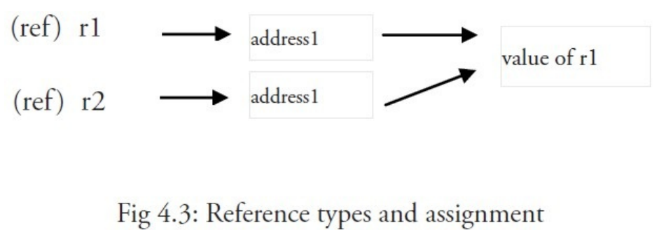

## 语法

​		当我们在学习 C ，C++，Java 的时候，我们都会编写一个 `main` 函数，这个 `main` 函数就是程序的入口。在 Go 语言中也不例外。

```go
// 在 Go 程序中，存在包的概念，每一个 Go 文件都仅属于一个包，一个包可以由许多以 .go 为扩展名的文件构成。
package main 

// 这就是入口函数
func main(){
    // ...
}
```

### 输出

Go 的标准输出依赖于 `fmt` 包，在使用时需要导入。

```go
package main

import "fmt"

func main() {
        // 当有多个参数的时候，会在中间添加空格
	fmt.Print("Hello World")
       // 最后追加换行符
	fmt.Println("Hello World")
    
	print("Hwww")
	println("---HWWWWW")
}
```

> 在上述代码中，直接使用 `print` 函数也可以进行输出。
>
> 直接使用的 `print` 函数是 Go 内置的函数，申明在 `builtin.go` 文件中，该文件只是申明变量和一些函数，并不做具体的实现。
>
> 官方不建议在项目中使用，在 debug 的时候可用，不保证是否保留。

## 1. 基本结构和基本数据类型

### 1.1 文件名、标识符、关键字

**文件名**：以 .go 为后缀进行存储

**标识符：**必须以字符（可以使用任何 UTF-8 编码的字符或 _ ）开头，然后紧跟着 0 个或 多个字符或 Unicode 数字，如：X56、group1、_x23、i、өԑ12。 

以下是无效的标识符： 1ab（以数字开头） case（Go 语言的关键字） a+b（运算符是不允许的）

> _ 本身就是一个特殊的标识符，被称为空白标识符。它可以像其他标识符那样用于变量的声明或赋值（任何类型都 可以赋值给它），但任何赋给这个标识符的值都将被抛弃，因此这些值不能在后续的代码中使用，也不可以使用这个 标识符作为变量对其它变量进行赋值或运算。

**关键字：**

|  **break**   |   **default**   |  **func**  | **interface** | **select** |
| :----------: | :-------------: | :--------: | :-----------: | :--------: |
|   **case**   |    **defer**    |   **go**   |    **map**    | **struct** |
|   **chan**   |    **else**     |  **goto**  |  **package**  | **switch** |
|  **const**   | **fallthrough** |   **if**   |   **range**   |  **type**  |
| **continue** |     **for**     | **import** |  **return**   |  **var**   |

### 1.2 Go 程序的基本结构和要素

#### 1.2.1 包的概念、导入与可见性

包是结构化代码的一种方式：每个程序都由包（通常简称为 pkg）的概念组成，可以使用自身的包或者从其它包中导入内容。

每个Go文件都属于且仅属于一个包。一个包可以包含多个以 .go 为后缀的文件组成，因此文件名和包名一般来说是不同的。

在源文件中非注释的第一行指明这个文件属于哪个包，如： package main 。 package main 表示一个可独立执行的程序，每个 Go 应用程序都包含一个名为 main 的包。

Go 中的包模型采用了显式依赖关系的机制来达到快速编译的目的，编译器会从后缀名为 .o 的对象文件（需要且只需要这个文件）中提取传递依赖类型的信息。 

> 如果 A.go 依赖 B.go ，而 B.go 又依赖 C.go ： 编译 C.go , B.go , 然后是 A.go . 为了编译 A.go , 编译器读取的是 B.o 而不是 C.o .

**可见性规则：**

> - 当标识符（包括常量、变量、类型、函数名、结构字段等等）以一个大写字母开头，如：Group1，那么使用这种形式的标识符的对象就可以被外部包的代码所使用（客户端程序需要先导入这个包），这被称为导出（像面向对象语言中的 public）；
> - 标识符如果以小写字母开头，则对包外是不可见的，但是他们在整个包的内部是可见并且可用的（像面向对象语言中的 private ）。

#### 1.2.2 函数

最简单的函数格式：

```go
func functionName(){}
```

可以在括号 () 中写入 0 个或多个函数的参数（使用逗号 , 分隔），每个参数的名称后面必须紧跟着该参数的类型。

main 函数是每一个可执行程序所必须包含的，一般来说都是在启动后第一个执行的函数（如果有 **init() 函数**则会先执行该函数）。如果你的 main 包的源代码没有包含 main 函数，则会引发构建错误 undefined: main.main 。main 函数既没有参数，也没有返回类型（与 C 家族中的其它语言恰好相反）。如果你不小心为 main 函数添加了参数或者返回类型，将会引发构建错误：

`build-error: syntax error: unexpected semicolon or newline before {`

#### 1.2.3 类型

可以包含数据的变量（或常量），可以使用不同的数据类型或类型来保存数据。使用 var 声明的变量的值会自动初始化为该类型的零值。类型定义了某个变量的值的集合与可对其进行操作的集合。

类型可以是：

- 基本类型，如：int、float、bool、string；
- 结构化的（复合的），如：struct、array、slice、map、channel；
- 只描述类型的行为的，如：interface。

> 结构化的类型没有真正的值，它使用 nil 作为默认值（在 Objective-C 中是 nil，在 Java 中是 null，在 C 和 C++ 中是NULL或 0）。值得注意的是，Go 语言中**不存在类型继承**。

函数也可以是一个确定的类型，就是以函数作为返回类型。这种类型的声明要写在函数名和可选的参数列表之后，例如：

```go
 func FunctionName (a typea, b typeb) typeFunc
```

以在函数体中的某处返回使用类型为 typeFunc 的变量 var：`rerun var`

一个函数可以拥有多返回值，返回类型之间需要使用逗号分割，并使用小括号 () 将它们括起来，如： 

```go
func FunctionName (a typea, b typeb) (t1 type1, t2 type2)
```

其中 t1，t2 为返回值

#### 1.2.4 Go程序的一般结构

总体思路如下：

> - 在完成包的 import 之后，开始对常量、变量和类型的定义或声明。 
> - 如果存在 init 函数的话，则对该函数进行定义（这是一个特殊的函数，每个含有该函数的包都会首先执行这个函数）。 
> - 如果当前包是 main 包，则定义 main 函数。 
> - 然后定义其余的函数，首先是类型的方法，接着是按照 main 函数中先后调用的顺序来定义相关函数，如果有很多函数，则可以按照字母顺序来进行排序。

```go
package main
import {
    'fmt'
}
const c = "C"
var v int = 5
type T struct{}
func init(){}
func main(){
    var a int
    Func1()
    fmt.Println(a)
}
func (t T) Method1(){}
func Func1(){}
```

Go 程序的执行（程序启动）顺序如下：

> 1. 按顺序导入所有被 main 包引用的其它包，然后在每个包中执行如下流程： 
> 2. 如果该包又导入了其它的包，则从第一步开始递归执行，但是每个包只会被导入一次。 
> 3. 然后以相反的顺序在每个包中初始化常量和变量，如果该包含有 init 函数的话，则调用该函数。 
> 4. 在完成这一切之后，main 也执行同样的过程，最后调用 main 函数开始执行程序。

#### 1.2.5 类型转换

```go
valueOfTypeB = typeB(valueOfTypeA)
// 示例：
a := 5.0
b = int(a)
```

类型 B 的值 = 类型 B(类型 A 的值)

### 1.3 常量

常量的定义用 const 定义，用于存储不会改变的数据。

常量的值必须在编译的时候就能够确定，例如：

```go
const c1 = 2/3
const c2 = getNum() // 错误
const Ln2= 0.693147180559945309417232121458\
                   176568075500134360255254120680009
```

反斜杠 \ 可以在常量表达式中作为多行的连接符使用。

### 1.4 变量

#### 1.4.1 变量的定义

在 Go 语言中，变量的定义方式如下：

```go
package main

// 函数外定义变量
// 注意非全局变量
var num6 = 4
var num7 int = 3
// 函数外定义多变量
var (
    num8 = 8
    flag4 = false
    word4 = "No"
)

func main(){
    // var是指定义变量，变量名在前，变量类型在最后
    // 不赋值，默认初始值为零值
    var num1 int
    // 定义时赋值
    var num2 int = 1
    // 不指定类型，编译器可以自动识别
    var num3 = 5
    var flag1 = true
    // 多变量定义，中间逗号隔开
    var word1, flag2, num4 = "Hello World", false, 666
    // 使用冒号进行定义变量
    num5, flag3, word2 := 123, true, "Yes"  // 只能在函数内使用
}
```

#### 1.4.2 值类型和引用类型

**值类型**有：int、float、bool、string、数组、结构

使用这些类型的变量直接指向存在内存中的值：


当使用等号 = 将一个变量的值赋值给另一个变量时，如： j = i ，实际上是在内存中将 i 的值进行了拷贝：


**引用类型**中存放的是值所在的内存地址，或内存地址中第一个字所在的位置



#### 1.4.3 init 函数

变量除了可以在全局声明中初始化，也可以在 init 函数中初始化。这是一类非常特殊的函数，它不能够被人为调用，而是在每个包完成初始化后自动执行，并且执行优先级比 main 函数高。

每一个源文件都可以包含一个或多个 init 函数。初始化总是以单线程执行，并且按照包的依赖关系顺序执行。

一个可能的用途是在开始执行程序之前对数据进行检验或修复，以保证程序状态的正确性。

```go
package trans
import (
	'math'
    'fmt'
)
var Pi float64
func init(){
    Pi = 4 * math.Atan(1) // 计算Pi值
}
```

```go
package main
import (
	'fmt'
    "./trans"
)
var twoPi = 2 * trans.Pi
func main(){
    fmt.Println("2*Pi = "%g\n, twoPi)
}
```

init 函数也经常被用在当一个程序开始之前调用后台执行的 goroutine，如下面这个例子当中的 backend() ：

```go
func init(){
    go backend()
}
```

### 1.5 基本类型和运算符

#### 1.5.1 布尔类型 bool

布尔型的值只可以是常量 true 或者 false

两个个类型相同的值可以使用相等 == 或者不等 != 运算符来进行比较并获得一个布尔型的值。

Go 对于值之间的比较有非常严格的限制，只有两个类型相同的值才可以进行比较，如果值的类型是接口（interface，第 11 章），它们也必须都实现了相同的接口。。如果其中一个值是常量，那么另外一个值的类型必须和该常量类型相兼容的。

Go 语言中包含以下逻辑运算符：

> 1. 非运算符： !
>    - 非运算符用于取得和布尔值相反的结果。
> 2. 和运算符： &&
>    - 只有当两边的值都为 true 的时候，和运算符的结果才是 true。
> 3. 或运算符： ||
>    - 只有当两边的值都为 false 的时候，或运算符的结果才是 false，其中任意一边的值为 true 就能够使得该表达式的结果为 true。

在格式化输出时，你可以使用 %t 来表示你要输出的值为布尔型。

#### 1.5.2 数字类型

##### 1.5.2.1 整型 int 和浮点型 float

Go 语言支持整型和浮点型数字，并且原生支持复数，其中位的运算采用补码。

Go 也有基于架构的类型，例如：int、uint 和 uintptr。

这些类型的长度都是根据运行程序所在的操作系统类型所决定的：

- int 和 uint 在 32 位操作系统上，它们均使用 32 位（4 个字节），在 64 位操作系统上，它们均使用 64 位（8 个字节）。 
- uintptr 的长度被设定为足够存放一个指针即可。

Go 语言中没有 float 类型。

- 整数：
  -  int8（-128 -> 127）
  -  int16（-32768 -> 32767）
  -  int32（-2,147,483,648 -> 2,147,483,647） 
  - int64（-9,223,372,036,854,775,808 -> 9,223,372,036,854,775,807） 
- 无符号整数： 
  - uint8（0 -> 255） 
  - uint16（0 -> 65,535） 
  - uint32（0 -> 4,294,967,295） 
  - uint64（0 -> 18,446,744,073,709,551,615） 
- 浮点型（IEEE-754 标准）： 
  - float32（+- 1e-45 -> +- 3.4 * 1e38）   精确到小数点后 7 位
  - float64（+- 5 1e-324 -> 107 1e308）   精确到小数点后 15 位，math 包中所有有关数学运算的函数都会要求接收这个类型。

int 型是计算最快的一种类型。 整型的零值为 0，浮点型的零值为 0.0。

可以使用 a := uint64(0) 来同时完成类型转换和赋值操作，这样 a 的类型就是 uint64。

Go 中不允许不同类型之间的混合使用，但是对于常量的类型限制非常少，因此允许常量之间的混合使用，下面这个程序很好地解释了这个现象（该程序无法通过编译）：

```go
package main
import "fmt"
func main() {
	var a int
	var b int32
	a = 15
	b = a + a
	b = b + 5 // Cannot use 'a + a' (type int) as type int32 
	fmt.Println(b)
}
```

同理，int16 也不能够被隐式转换为 int32。

如下例子：

```go
package main
import "fmt"
func main() {
	var a int16 = 34
	var b int32
	b = a  // Cannot use 'a' (type int16) as type int32 
	b = int32(a)
	fmt.Printf("16 bit int is: %d\n", a)
	fmt.Printf("32 bit int is: %d\n", b)
}
```

下面这个例子展示如何安全地从 int 型转换为 int8：

```go
func Unit8FromInt(n int) (uint8, error){
    if 0 <= n && n<= math.MaxUint8{
        return uint8(n), nil
    }
    return 0, fmt.Errorf("%d is out of the uint8 range", n)
}
```

或者安全地从 float64 转换为 int： 

```go
func IntFromFloat64(x float64) int {
	if math.MinInt32 <= x && x <= math.MaxInt32 { // x lies in the integer range
		whole, fraction := math.Modf(x)
		if fraction >= 0.5 {
			whole++
		}
		return int(whole)
	}
	panic(fmt.Sprintf("%g is out of the int32 range", x))
}
```

######  int 和 int64 是相同的类型吗？

int 是一个有符号的整型的集合，并且至少有32位。具体根据系统的位数，如果是32位系统那么就是32位，如果是64位那么就是64位

int64 是一个有符号的整型的集合且位数为64位。

在64位系统中，int 和 int64 所占的字节数都是 8 字节

```go
package main
import (
	"fmt"
	"unsafe"
)
func main() {
	var a uint = 1   	// 8
	var b uint8 = 1       // 1
	var c uint16 = 1     // 2
	var d uint32 = 1    // 4
	var e uint64 = 1    // 8
	fmt.Println(unsafe.Sizeof(a))
	fmt.Println(unsafe.Sizeof(b))
	fmt.Println(unsafe.Sizeof(c))
	fmt.Println(unsafe.Sizeof(d))
	fmt.Println(unsafe.Sizeof(e))
}
```

##### 1.5.2.2 负数

复数使用 re+imI 来表示，其中 re 代表实数部分， im 代表虚数部分，I 代表根号负 1。

示例：

```go
var c1 complex64 = 5 + 10i
fmt.Printf("The value is: %v", c1)
// 输出： 5 + 10i
```

##### 1.5.2.3 位运算

位运算只能用于整数类型的变量，且需当它们拥有等长位模式时。

**%b** 是用于表示位的格式化标识符。

###### 二元运算符

- 按位与 **&** ：

  ```go
  1 & 1 -> 1
  1 & 0 -> 0
  0 & 1 -> 0
  0 & 0 -> 0
  ```

- 按位或 **|** ：

  ```go
  1 | 1 -> 1
  1 | 0 -> 1
  0 | 1 -> 1
  0 | 0 -> 0
  ```

- 按位异或 ^ ：

  ```go
  1 ^ 1 -> 0
  1 ^ 0 -> 1
  0 ^ 1 -> 1
  0 ^ 0 -> 0
  ```

- 位清除 &^ ：将指定位置上的值设置为 0。

###### 一元运算符：

- 按位补足 ^ ：

  该运算符与异或运算符一同使用，即 m^x ，对于无符号 x 使用“全部位设置为 1”，对于有符号 x 时使用 m=-1 。例如：

  ```go
  ^2 = ^10 = -01 ^ 10 = -11
  ```

- 位左移 << ：

  用法： bitP << n 。

  bitP 的位向左移动 n 位，右侧空白部分使用 0 填充；如果 n 等于 2，则结果是 2 的相应倍数，即 2 的 n 次方。例如：

  ```go
  1 << 10 // 等于 1 KB
  1 << 20 // 等于 1 MB
  1 << 30 // 等于 1 GB
  ```

- 位右移 >> ：

  用法： bitP >> n 。 

  bitP 的位向右移动 n 位，左侧空白部分使用 0 填充；如果 n 等于 2，则结果是当前值除以 2 的 n 次方。

##### 1.5.2.4 逻辑运算符

Go 中拥有以下逻辑运算符： `== `、` != `（第 4.5.1 节）、 `< `、 `<= `、 `> `、` >= `。 它们之所以被称为逻辑运算符是因为它们的运算结果总是为布尔值 `bool` 。例如： 

```go
b3:= 10 > 5 // b3 is true
```

##### 1.5.2.5 算术运算符

常见可用于整数和浮点数的二元运算符有 `+` 、 `-` 、 `*` 和 `/` 。

（相对于一般规则而言，Go 在进行**字符串拼接时允许使用**对运算符 `+` 的重载，但 Go 本身**不允许**开发者进行自定义的运算符重载）

`/` 对于整数运算而言，结果依旧为整数，例如： `9 / 4 -> 2` 。

取余运算符只能作用于**整数**： `9 % 4 -> 1` 。

整数除以 0 可能导致程序崩溃，浮点数除以 0.0 会返回一个无穷尽的结果，使用 +Inf 表示。

GO中只有后缀增或减 `i++`。带有 `++` 和 `--` 的只能作为语句，而非表达式，因此 `n = i++` 这种写法是无效的，其它像 `f(i++)` 或者 `a[i]=b[i++]` 这些可以用于 C、C++ 和 Java 中的写法在 Go 中也是不允许的。

在运算时 **溢出** 不会产生错误，Go 会简单地将超出位数抛弃。如果你需要范围无限大的整数或者有理数（意味着只被限制于计算机内存），你可以使用标准库中的 big 包，该包提供了类似 big.Int 和 big.Rat 这样的类型。

##### 1.5.2.6 随机数

在 math/rand 库里，不可直接导入 math 库！

#### 1.5.3 运算符与优先级

```go
优先级 运算符
   7         ^ !
   6         * / % << >> & &^
   5         + - | ^
   4          == != < <= >= >
   3          <-
   2          &&
   1          ||
可以通过使用括号来临时提升某个表达式的整体运算优先级。
```

#### 1.5.4 类型别名

当你在使用某个类型时，你可以给它起另一个名字，然后你就可以在你的代码中使用新的名字（用于简化名称或解决名称冲突）。 

在 `type TZ int` 中，TZ 就是 int 类型的新名称（用于表示程序中的时区），然后就可以使用 TZ 来操作 int 类型的数据。

类型别名得到的新类型**并非和原类型完全相同**，新类型**不会拥有原类型所附带的方法**（第 10 章）；TZ 可以自定义一个方法用来输出更加人性化的时区信息。

### 1.6 字符串 string

#### 1.6.1 定义

**字符串是一种值类型**，且值不可变，即创建某个文本后你无法再次修改这个文本的内容；更深入地讲，字符串是字节的定长数组。

Go 支持以下 2 种形式的字面值：

- 解释字符串：

  该类字符串使用双引号括起来，其中的相关的转义字符将被替换，这些转义字符包括：

  - \n ：换行符 
  - \r ：回车符 
  - \t ：tab 键 
  - \u 或 \U ：Unicode 字符 
  - \\\ ：反斜杠自身

- 非解释字符串：

  该类字符串使用**反引号**括起来，支持换行，例如：

  ``This is a raw string \n` 中的 `\n\` 会被原样输出。

和 C/C++不一样，Go 中的字符串是根据长度限定，而非特殊字符 \0 。

`string` 类型的零值为长度为零的字符串，即空字符串 "" 。

一般的比较运算符（ == 、 != 、 < 、 <= 、 >= 、 > ）通过在内存中按字节比较来实现字符串的对比。你可以通过函数 len() 来获取字符串所占的字节长度，例如： len(str) 。

**注意点：对于字符串，不可获取某个字节的地址！！ 如 &str[i]**

> 因为对于上述操作，需要**操作对象是可寻址对象（addressable）**

#### 1.6.2 可寻址对象

官方对可寻址对象的定义：

> For an operand x of type T, the address operation &x generates a pointer of type *T to x. The operand must be addressable, that is, either a variable, pointer indirection, or slice indexing operation; or a field selector of an addressable struct operand; or an array indexing operation of an addressable array. As an exception to the addressability requirement, x may also be a (possibly parenthesized) composite literal. If the evaluation of x would cause a run-time panic, then the evaluation of &x does too.
>
> 对于类型为 `T` 的操作数 `x`，地址操作符 `&x` 将生成一个类型为 `*T` 的指针指向 `x`。操作数必须可寻址，即，变量、间接指针、切片索引操作，或可寻址结构体的字段选择器，或可寻址数组的数组索引操作。作为可寻址性要求的例外，`x` 也可为（圆括号括起来的）复合字面量。如果对 `x` 的求值会引起运行时恐慌，那么对 `&x` 的求值也会引起恐慌。
>
> For an operand x of pointer type *T, the pointer indirection *x denotes the variable of type T pointed to by x. If x is nil, an attempt to evaluate *x will cause a run-time panic.
>
> 对于指针类型为 `*T` 的操作数 `x`，间接指针 `*x` 表示类型为 `T` 的值指向 `x`。若 `x` 为 `nil`，尝试求值 `*x` 将会引发运行时恐慌。

##### 以下几种是可寻址的：

- 一个变量: `&x`
- 指针引用(pointer indirection): `&*x`
- slice 索引操作(不管 slice 是否可寻址): `&s[1]`
- 可寻址 struct 的字段: `&point.X`
- 可寻址数组的索引操作: `&a[0]`
- composite literal 类型: `&struct{ X int }{1}`

下列情况 `x` 是不可以寻址的，不能使用 `&x` 取得指针：

- 字符串中的字节
- map 对象中的元素
- 接口对象的动态值(通过 type assertions 获得)
- 常数
- literal 值(非 composite literal)
- package 级别的函数
- 方法 method(用作函数值)
- 中间值(intermediate value):
  - 函数调用
  - 显式类型转换
  - 各种类型的操作（除了指针引用 pointer dereference 操作`*x`):
    - channel receive operations
    - sub-string operations
    - sub-slice operations
    - 加减乘除等运算符

##### **有几个点需要解释下**：

- 常数为什么不可以寻址?

> 如果可以寻址的话，我们可以通过指针修改常数的值，破坏了常数的定义。

- map 的元素为什么不可以寻址？

> 两个原因，如果对象不存在，则返回零值，零值是不可变对象，所以不能寻址，如果对象存在，因为 Go 中 map 实现中元素的地址是变化的，这意味着寻址的结果是无意义的。

- 为什么 slice 不管是否可寻址，它的元素读是可以寻址的？

> 因为 slice 底层实现了一个数组，它是可以寻址的。

- 为什么字符串中的字符/字节又不能寻址呢？

> 因为字符串是不可变的。

规范中还有几处提到了 addressable:

- 调用一个接收者为指针类型的方法时，使用一个可寻址的值将自动获取这个值的指针
- `++`、`--` 语句的操作对象必须可寻址或者是 map 的索引操作
- 赋值语句 `=` 的左边对象必须可寻址，或者是 map 的索引操作，或者是 `_`
- 上条同样使用 `for ... range` 语句

[以上结论来自参考资料](https://shockerli.net/post/golang-faq-cannot-take-the-address/)

对于字符串的连接，可以使用 `+` 、`strings.join()`  、字节缓冲 `bytes.Buffer`。

> 创建一个用于统计字节和字符（rune）的程序，并对字符串 asSASA ddd dsjkdsjs dk 进行分析，然后再分析 asSASA ddd dsjkdsjsこん dk ，最后解释两者不同的原因（提示：使用 unicode/utf8 包）。

```go
package main
import (
	"fmt"
	"unicode/utf8"
)
func main() {
	count()
}
func count() {
	str1 := "asSASA ddd dsjkdsjs dk"
	fmt.Printf("The number of bytes in string str1 is %d\n", len(str1))
	fmt.Printf("The number of characters in string str1 is %d\n", utf8.RuneCountInString(str1))
	str2 := "asSASA ddd dsjkdsjsこん dk"
	fmt.Printf("The number of bytes in string str2 is %d\n", len(str2))
	fmt.Printf("The number of characters in string str2 is %d", utf8.RuneCountInString(str2))
}
```

输出结果：

> The number of bytes in string str1 is 22
> The number of characters in string str1 is 22
> The number of bytes in string str2 is 6
> The number of characters in string str2 is 2

结论：

> len()`函数统计字符串中所占的字节数。
>
> `utf8.RuneCountInString()`函数统计的数字符个数
>
> 当字符为 ASCII 码时则占用 1 个字节，其它字符根据需要占用 2-4 个字节。（其中中文等特殊字符一般占3个字节）

### 1.7 strings 和 strconv 包

1.7.1 概述

作为一种基本数据结构，每种语言都有一些对于字符串的预定义处理函数。Go 中使用 strings 包来完成对字符串 的主要操作。

#### 1.7.1 前缀和后缀

HasPrefix 判断字符串 s 是否以 prefix 开头：

```go
strings.HasPrefix(s, prefix string) bool
```

HasSuffix 判断字符串 s 是否以 suffix 结尾：

```go
strings.HasSuffix(s, suffix string) bool
```

#### 1.7.2 字符串包含关系

`Contains` 判断字符串 s 是否包含 substr 

```go
strings.Contains(s, substr string) bool
```

#### 1.7.3 判断子字符串或字符在父字符串中出现的位置（索引）

`Index` 返回字符串 `str` 在字符串 `s` 中的索引（ `str` 的第一个字符的索引），-1 表示字符串 s 不包含字符串 `str` ：

```go
strings.Index(s, str string) int
```

LastIndex 返回字符串 str 在字符串 s 中**最后出现位置的索引**（ str 的第一个字符的索引），-1 表示字符串 s 不包含字符串 str ：

```go
strings.LastIndex(s, str string) int
```

如果 `ch` 是非 ASCII 编码的字符，建议使用以下函数来对字符进行定位：

```go
strings.IndexRune(s string, r rune) int
```

#### 1.7.4 字符串替换

Replace 用于将字符串 str 中的前 n 个字符串 old 替换为字符串 new ，并返回一个新的字符串，如果 n = -1 则替换所有字符串 old 为字符串 new ：

```go
 strings.Replace(str, old, new, n) string
```

#### 1.7.5 统计字符串出现次数

`Count` 用于计算字符串 `str` 在字符串 s 中出现的**非重叠**次数：

```go
strings.Count(s, str string) int
```

#### 1.7.6 重复字符串

`Repeat` 用于重复 `count` 次字符串 s 并返回一个新的字符串：

```go
strings.Repeat(s, count int) string
```

#### 1.7.7 修改字符串大小写

`ToLower` 将字符串中的 `Unicode 字符`全部转换为相应的小写字符： 

```go
 strings.ToLower(s) string 
```

`ToUpper` 将字符串中的 `Unicode 字符`全部转换为相应的大写字符： 

```go
strings.ToUpper(s) string
```

#### 1.7.8 修剪字符串

你可以使用 `strings.TrimSpace(s)` 来剔除字符串开头和结尾的空白符号；如果你想要剔除指定字符，则可以使用 `strings.Trim(s, "cut")` 来将开头和结尾的 `cut` 去除掉。该函数的第二个参数可以包含任何字符，如果你只想 剔除开头或者结尾的字符串，则可以使用 `TrimLeft` 或者 `TrimRight` 来实现。

#### 1.7.9 分割字符串

`strings.Fields(s)` 将会利用 1 个或多个空白符号来作为动态长度的分隔符将字符串分割成若干小块，并返回一个 slice，如果字符串只包含空白符号，则返回一个长度为 0 的 slice。

 `strings.Split(s, sep)` 用于自定义分割符号来对指定字符串进行分割，同样返回 slice。

因为这 2 个函数都会返回 slice，所以习惯使用 for-range 循环来对其进行处理

#### 1.7.10 拼接 slice 到字符串

`Join` 用于将元素类型为 string 的 slice 使用分割符号来拼接组成一个字符串：

```go
strings.Join(sl []string, sep string) string
```

#### 1.7.11 从字符串中读取内容

函数 `strings.NewReader(str)` 用于生成一个 Reader 并读取字符串中的内容，然后返回指向该 Reader 的指针，从其它类型读取内容的函数还有：

- Read() 从 []byte 中读取内容。
- ReadByte() 和 ReadRune() 从字符串中读取下一个 byte 或者 rune。

#### 1.7.12 字符串与其它类型的转换

与字符串相关的类型转换都是通过 `strconv` 包实现的。

该包包含了一些变量用于获取程序运行的操作系统平台下 int 类型所占的位数，如： `strconv.IntSize` 。

**任何类型 T 转换为字符串总是成功的。**

针对从数字类型转换到字符串，Go 提供了以下函数：

- `strconv.Itoa(i int) string` 返回**数字 i 所表示的字符串**类型的十进制数。 
- `strconv.FormatFloat(f float64, fmt byte, prec int, bitSize int) string`  将 **64 位浮点型的数字转换为字符串**，其中 `fmt` 表示格式（其值可以是 'b' 、 'e' 、 'f' 或 'g' ）， `prec` 表示精度， `bitSize` 则使用 32 表示 `float32`，用 64 表示 `float64`。

将字符串转换为其它类型 tp 并不总是可能的，可能会在运行时抛出错误 parsing "…": invalid argument 。

针对从字符串类型转换为数字类型，Go 提供了以下函数：

- `strconv.Atoi(s string) (i int, err error)` 将字符串转换为 int 型。
- `strconv.ParseFloat(s string, bitSize int) (f float64, err error)` 将字符串转换为 float64 型。

利用多返回值的特性，这些函数会返回 2 个值，第 1 个是转换后的结果（如果转换成功），第 2 个是可能出现的错误，因此，我们一般使用以下形式来进行从字符串到其它类型的转换：

```go
val, err = strconv.Atoi(s)
```

### 1.8 时间和日期

`time` 包为我们提供了一个数据类型 `time.Time` （作为值使用）以及显示和测量时间和日期的功能函数。 

当前时间可以使用 `time.Now()` 获取，或者使用 `t.Day()` 、 `t.Minute()` 等等来获取时间的一部分；你甚至可以自定义时间格式化字符串，例如： `fmt.Printf("%02d.%02d.%4d\n", t.Day(), t.Month(), t.Year())` 将会输出 21.07.2011 。

### 1.9 指针

Go 语言为程序员提供了控制数据结构的指针的能力；但是，你不能进行指针运算。

Go 语言允许你控制特定集合的数据结构、分配的数量以及内存访问模式，这些对构建运行良好的系统是非常重要的：指针对于性能的影响是不言而喻的，而如果你想要做的是系统编程、操作系统或者网络应用，指针更是不可或缺的一部分。

```go
package main
import "fmt"
func main(){
    var i = 5
    var iP *int
    iP = &i
}
```

对于上述代码之间变量的关系可以用下图来表示


指针的一个高级应用是你可以传递一个变量的引用（如函数的参数），这样不会传递变量的拷贝。指针传递是很廉价的，**只占用 4 个或 8 个字节**。当程序在工作中需要占用大量的内存，或很多变量，或者两者都有，使用指针会减少内存占用和提高效率。**被指向的变量也保存在内存中**，直到没有任何指针指向它们，所以从它们被创建开始就具有相互独立的生命周期。

## 2. 控制结构

### 2.1 if-else 结构

```go
if condition {
 	// todo
}else{
    // todo
}
```

```go
if condition1{
     // todo 
}else if condition2{
	// todo
}else{
	// todo
}
```

```go
if val := 10; val > max{
    // todo
}
```

### 2.2 测试多返回值函数的错误

Go 语言的函数经常使用两个返回值来表示执行是否成功：返回**某个值**以及 **true** 表示成功；返回**零值**（或 nil）和 **false** 表示失败。

当**不使用 true 或 false** 的时候，也可以使用一个 **error 类型**的变量来代替作为第二个返回值：**成功执行的话，error 的值为 nil**，否则就会包含相应的错误信息。

```
t, ok := mySqrt(25.0)
if ok {
	fmt.Println(t)
}
```


### 2.3 switch 结构

相比较 C 和 Java 等其它语言而言，Go 语言中的 switch 结构使用上更加灵活。它接受任意形式的表达式：

同时测试多个可能符合条件的值，使用逗号分割它们，例如： case val1, val2, val3 

一旦成功地匹配到某个分支，在执行完相应代码后就会退出整个 switch 代码块，也就是说您不需要特别使用 `break` 语句来表示结束。

因此，程序也不会自动地去执行下一个分支的代码。如果在执行完每个分支的代码后，还希望继续执行后续分支的代 码，可以使用 `fallthrough` 关键字来达到目的。

在 `case ...:` 语句之后，您不需要使用花括号将多行语句括起来，但您可以在分支中进行任意形式的编码。

若代码只有一行时，可以直接放置在 `case` 后面。

同样可以使用 return 语句来提前结束代码块的执行。

```go
func swc(condition string) (v string){
	// condition 可以是任意类型
	switch condition {
	case "1","4":
		fmt.Println("condition equals 1 or 4")
		// 提前退出可以使用break，或 return
	case "2fdsfdsf":
		fmt.Println("condition equals 2 ")
		// 继续执行下一个case不跳出
		fallthrough
	case "-1":
		fmt.Println("condition equals -1 ")
	case "-122":
		fmt.Println("condition equals -1 ")
	default:
		fmt.Println("do not enter any number")
	}
	return condition
}
```

除了上面形式，还有第二种形式，即不提供任何被判断的值，然后在每个 case 分支中进行测试不同的条件

```go
switch {
    case i < 0:
    //
    case i == 0:
    //
    default:
    //
}
```

第三种使用形式：判断条件是一个初始化语句

```go
switch result := cal(); {
    case result < 0:
    // 
    case result > 0:
    // 
    default:
    //
}
```

switch 语句还可以被用于 `type-switch` 来判断某个 `interface` 变量中实际存储的变量类型。

```go
switch t := areaIntf.(type) {
	case *Square:
		fmt.Printf("Type Square %T with value %v\n", t, t)
	case *Circle:
		fmt.Printf("Type Circle %T with value %v\n", t, t)
	case nil:
		fmt.Printf("nil value: nothing to check?\n")
	default:
		fmt.Printf("Unexpected type %T\n", t)
	}
```

### 2.4 for 结构

#### 2.4.1 基于计数器的迭代

```go
func main(){
    for i := 0; i < 3; i++ {
        fmt.Println("This is the %d iteration", i)
    }
}
```

for 嵌套：

```
for i := 0; i < 5; i++{
	for j := 0;  j < 5; j++{
	
	}
}
```

#### 2.4.2 基于条件判断的迭代

for 结构的第二种形式是没有头部的条件判断迭代（类似其它语言中的 while 循环），基本形式为： `for 条件语句 {}` 。

```
func main(){
	var i int = 5
	for i >= 0{
		i -= 2
		fmt.Println(i)
	}
}
```

#### 2.4.3 无限循环

条件语句是可以被省略的，如 `i:=0; ; i++` 或 `for { }` 或 `for ;; { }` （ ;; 会在使用 gofmt 时被移 除）：这些循环的本质就是**无限循环**。**最后一个形式**也可以被改写为 **for true** { } ，但**一般情况下都会直接写 for { }** 。

无限循环的经典应用是服务器，用于不断等待和接受新的请求。

```go
for t, err = p.Token(); err == nil; t, err = p.Token() {
	...
 }
```

#### 2.4.4 for-range 结构

这是 Go 特有的一种的迭代结构，您会发现它在许多情况下都非常有用。它可以迭代任何一个集合（包括数组和 map，详见第 7 和 8 章）。语法上很**类似其它语言中 `foreach` 语句**，但您依旧可以获得每次迭代所对应的索引。 一般形式为： **for ix, val := range coll { }** 。

要注意的是， `val` 始终为集合中对应索引的值拷贝，因此它一般只具有只读性质，对它所做的任何修改都不会影响到集合中原有的值（译者注：**如果 `val` 为指针，则会产生指针的拷贝，依旧可以修改集合中的原值**）。一个字符串是 Unicode 编码的字符（或称之为 `rune` ）集合，因此您也可以用它迭代字符串：

```Go
for pos, char := range str{
 // ...
}
```

每个 rune 字符和索引在 for-range 循环中是一一对应的。它能够自动根据 UTF-8 规则识别 Unicode 编码的字符。

### 2.5 Break 与 continue

一个 break 的作用范围为该语句出现后的最内部的结构，它可以被用于任何形式的 for 循环（计数器、条件判断等）。但在 `switch` 或 `select` 语句中，break 语句的作用结果是**跳过整个代码块**，执行后续的代码。

同其他语言类似，break 只能跳出当前循环，continue则是继续下一次循环。

### 2.6 标签与 goto

for、switch 或 select 语句都可以配合标签（label）形式的标识符使用，即某一行第一个以冒号（ : ）结尾的单词（gofmt 会将后续代码自动移至下一行）。

```go
LABEL1:
	for i := 0; i <= 5; i++ {
		for j := 0; j <= 5; j++ {
			if j == 4 {
				continue LABEL1
			}
			fmt.Printf("i is: %d, and j is: %d\n", i, j)
		}
	}
```

本例中，`continue` 语句指向 `LABEL1`，当执行到该语句的时候，就会跳转到 LABEL1 标签的位置。 

您可以看到**当 j == 4 和 j == 5 的时候，没有任何输出：**标签的作用对象为外部循环，因此 **i 会直接变成下一个循环的值**，而此时 j 的值就被重设为 0，即它的初始值。如果将 `continue` 改为 `break`，则不会只退出内层循环， 而是直接退出外层循环了。另外，还可以使用 goto 语句和标签配合使用来模拟循环。

## 3. 函数

### 3.1 介绍

每一个程序都包含很多的函数：函数是基本的代码块。

Go是**编译型语言**，所以**函数编写的顺序是无关紧要的**；鉴于可读性的需求，最好把 main() 函数写在文件的前面，其他函数按照一定逻辑顺序进行编写（例如函数被调用的顺序）。

Go 里面有三种类型的函数： 

- 普通的带有名字的函数 
- 匿名函数或者lambda函数（参考 第 6.8 节） 
- 方法（Methods，参考 第 10.6 节）

如果需要申明一个在外部定义的函数，你只需要给出函数名与函数签名，不需要给出函数体：

```go
func flushICache(begin, end uintptr) // implemented externally
```

函数也可以以申明的方式被使用，作为一个函数类型，就像：

```go
type binOp func(int, int) int
```

### 3.2 函数参数与返回值

Go 的函数返回值可以有多个。这是不同于 C/C++/Java/C# 的一大特性。

函数定义时，它的形参一般是有名字的，不过我们也可以定义没有形参名的函数，只有相应的形参类型，就像这样： `func f(int, int, float64)` 。

没有参数的函数通常被称为 **niladic** 函数（niladic function），就像 `main.main()` 。

#### 3.2.1 按值传递（call by value） 按引用传递（call by reference）

Go 默认使用按值传递来传递参数，也就是传递参数的副本。函数接收参数副本之后，在使用变量的过程中可能对副本的值进行更改，但不会影响到原来的变量，比如 `Function(arg1)` 。

如果你希望函数可以直接修改参数的值，而不是对参数的副本进行操作，你需要将参数的地址（变量名前面添加&符号，比如 &variable）传递给函数，这就是按引用传递，比如 `Function(&arg1)`，此时传递给函数的是一个指针。

如果传递给函数的是一个指针，**指针的值（一个地址）会被复制**，但指针的值所指向的地址上的值不会被复制；我们可以通过这个指针的值来修改这个值所指向的地址上的值。

> 指针也是变量类型，有自己的地址和值，通常指针的值指向一个变量的地址。所以，按引用传递也是按值传递。

在函数调用时，像切片（slice）、字典（map）、接口（interface）、通道（channel）这样的引用类型都是默认使用**引用传递**（即使没有显式的指出指针）。

#### 3.2.2 命名的返回值（named return variables）

即在函数的返回值位置的变量有变量名，而非只有数据类型。

```go
func f1(a int )(int, int){
    // ...
    // v1,v2是函数体内定义好的变量。
    return v1, v2
}
func f2(a int) (v1 int, v2 int){
	// ...
	return v1, v2;
	// 下面的 return 起到同样效果
	return 
}
```


#### 3.2.3 空白符（blank identifier）

空白符用来匹配一些不需要的值，然后丢弃掉。

`ThreeValues` 是拥有三个返回值的不需要任何参数的函数，在下面的例子中，我们将第一个与第三个返回值赋给了 `i1` 与 `f1` 。第二个返回值赋给了空白符 _ ，然后自动丢弃掉。

```go
package main
import "fmt"
func main() {
    var i1 int
    var f1 float32
    i1, _, f1 = ThreeValues()
    fmt.Printf("The int: %d, the float: %f \n", i1, f1)
}
func ThreeValues() (int, int, float32) {
	return 5, 6, 7.5
}

```

另外一个示例，函数接收两个参数，比较它们的大小，然后按小-大的顺序返回这两个数，示例代码为minmax.go。

```go
package main
import "fmt"
func main() {
	var min, max int
	min, max = MinMax(4478, 65)
	fmt.Printf("Minmium is: %d, Maximum is: %d\n", min, max)
}
func MinMax(a int, b int) (min int, max int) {
	if a < b {
		min = a
		max = b
	} else { // a = b or a < b
		min = b
		max = a
	}
	return
}
```

#### 3.2.4 改变外部变量（outside variable）

传递指针给函数不但可以节省内存（因为没有复制变量的值），而且赋予了函数直接修改外部变量的能力，所以被修改的变量不再需要使用 return 返回。如下的例子， reply 是一个指向 int 变量的指针，通过这个指针，我们在函数内修改了这个 int 变量的数值。

```go
package main
import (
	"fmt"
)
// this function changes reply:
func Multiply(a, b int, reply *int) {
	*reply = a * b
}
func main() {
	n := 0
	reply := &n
	Multiply(10, 5, reply)
	fmt.Println("Multiply:", *reply) // Multiply: 50
}
```

### 3.3 传递变长参数

如果函数的最后一个参数是采用 ...type 的形式，那么这个函数就可以处理一个变长的参数，这个长度可以为 0，这样的函数称为变参函数。

```go
func myFunc(a, b, arg ...int) {}
```

示例函数和调用：

```go
func Greeting(prefix string, who ...string)
Greeting("hello:", "Joe", "Anna", "Eileen")
```

在 Greeting 函数中，变量 who 的值为 `[]string{"Joe", "Anna", "Eileen"}` 。

如果参数被存储在一个数组 arr 中，则可以通过 `arr...` 的形式来传递参数调用变参函数。

```go
package main
import "fmt"
func main() {
	x := min(1, 3, 2, 0)
	fmt.Printf("The minimum is: %d\n", x)
	arr := []int{7, 9, 3, 5, 1}
	x = min(arr...)
	fmt.Printf("The minimum in the array arr is: %d", x)
}
func min(a ...int) int {
	if len(a) == 0 {
		return 0
	}
	min := a[0]
	for _, v := range a {
		if v < min {
			min = v
		}
	}
	return min
}
```

### 3.4 defer 和追踪

关键字 defer 允许我们推迟到函数返回之前（或任意位置执行 return 语句之后）一刻才执行某个语句或函数（为什么要在返回之后才执行这些语句？因为 return 语句同样可以包含一些操作，而不是单纯地返回某个值）。

关键字 defer 的用法类似于面向对象编程语言 Java 和 C# 的 finally 语句块，它一般用于释放某些已分配的资源。

```go
package main

import "fmt"

func main() {
   function1()
}

func function1() {
   fmt.Printf("In function1 at the top\n")
   defer function2()
   //function2()
   fmt.Printf("In function1 at the bottom!\n")
}

func function2() {
   fmt.Printf("function2: Deferred until the end of the calling function!\n")
}
```

作用：在函数结束的时候返回 defer 的位置，然后执行 defer 的语句，使用的变量值应看 defer 之前的值。

当有多个 defer 行为被注册时，它们会以逆序执行（类似栈，即后进先出）：

```go
func function1() {
   for i := 0; i < 5; i++ {
      defer fmt.Println(i)
   }
}
```

关键字 defer 允许我们进行一些函数执行完成后的收尾工作，例如： 

- 关闭文件流 （详见 第 12.2 节） 

  ```go
  // open a file
  defer file.Close() 
  ```

- 解锁一个加锁的资源 （详见 第 9.3 节） 

  ```go
  mu.Lock() 
  defer mu.Unlock() 
  ```

- 打印最终报告 

  ```
  printHeader() 
  defer printFooter() 
  ```

- 关闭数据库链接 

  ```
  open a database connection 
  defer disconnectFromDB() 
  ```

合理使用 defer 语句能够使得代码更加简洁。 

以下代码模拟了上面描述的第 4 种情况： 

```go
package main
import "fmt"
func main() {
	doDBOperations()
}
func connectToDB() {
	fmt.Println("ok, connected to db")
}
func disconnectFromDB() {
	fmt.Println("ok, disconnected from db")
}
func doDBOperations() {
	connectToDB()
	fmt.Println("Defering the database disconnect.")
	defer disconnectFromDB() //function called here with defer
	fmt.Println("Doing some DB operations ...")
	fmt.Println("Oops! some crash or network error ...")
	fmt.Println("Returning from function here!")
	return //terminate the program
	// deferred function executed here just before actually returning, even if
	// there is a return or abnormal termination before
}
```

使用 defer 语句实现代码追踪

### 3.5 内置函数

Go 语言拥有一些不需要进行导入操作就可以使用的内置函数。它们有时可以针对不同的类型进行操作，例如：len、cap 和 append，或必须用于系统级的操作，例如：panic。因此，它们需要直接获得编译器的支持。


### 3.6 递归函数

当一个函数在其函数体内调用自身，则称之为递归。

Go 语言中也可以使用相互调用的递归函数：多个函数之间相互调用形成闭环。因为 Go 语言编译器的特殊性，这些函数的声明顺序可以是任意的。下面这个简单的例子展示了函数 odd 和 even 之间的相互调用。

```go
package main
import (
   "fmt"
)
func main() {
   fmt.Printf("%d is even: is %t\n", 16, even(16)) // 16 is even: is true
   fmt.Printf("%d is odd: is %t\n", 17, odd(17))
   // 17 is odd: is true
   fmt.Printf("%d is odd: is %t\n", 18, odd(18))
   // 18 is odd: is false
}
func even(nr int) bool {
   if nr == 0 {
      return true
   }
   return odd(RevSign(nr) - 1)
}
func odd(nr int) bool {
   if nr == 0 {
      return false
   }
   return even(RevSign(nr) - 1)
}
func RevSign(nr int) int {
   if nr < 0 {
      return -nr
   }
   return nr
}
```

### 3.7 将函数作为参数

函数可以作为其它函数的参数进行传递，然后在其它函数内调用执行，一般称之为回调。

```go
package main

import (
   "fmt"
)

func main() {
   callback(1, Add)
}

func Add(a, b int) {
   fmt.Printf("The sum of %d and %d is: %d\n", a, b, a+b)
}
// 第二个参数是函数，方法名是 f，参数为两个int
func callback(y int, f func(int, int)) {
   f(y, 2) // this becomes Add(1, 2)
}
```

> The sum of 1 and 2 is: 3

将函数作为参数的最好的例子是函数 `strings.IndexFunc()` ：

该函数的签名是 `func IndexFunc(s string, f func(c int) bool) int` ，它的返回值是在函数 `f(c)` 返回 true、-1 或从未返回时的索引值。

例如 `strings.IndexFunc(line, unicode.IsSpace)` 就会返回 `line` 中第一个空白字符的索引值。

### 3.8 闭包

当我们不希望给函数起名字的时候，可以使用匿名函数，例如： func(x, y int) int { return x + y } 。

这样的一个函数不能够独立存在（编译器会返回错误： non-declaration statement outside function body ），但可以被赋值于某个变量，即保存函数的地址到变量中： `fplus := func(x, y int) int { return x + y }` ，然后通过变量名对函数进行调用： `fplus(3,4)` 。

也可以直接对匿名函数进行调用： `func(x, y int) int { return x + y } (3, 4)` 。

```go
// 计算从 1 到 1 百万整数的总和的匿名函数：
func () {
   sum := 0
   for i := 1; i <= 1e6; i++ {
      sum += i
   }
}()
```

表示参数列表的第一对括号必须紧挨着关键字 `func` ，因为匿名函数没有名称。**花括号 {} 涵盖着函数体**，最后的一对**括号表示对该匿名函数的调用**。

下面的例子展示了如何将匿名函数赋值给变量并对其进行调用（function_literal.go）：

```go
package main

import "fmt"

func main() {
   f()
}
func f() {
   for i := 0; i < 4; i++ {
      g := func(i int) { fmt.Printf("%d ", i) } //此例子中只是为了演示匿名函数可分配不同的内存地址，在现实开发中，不应该 把该部分信息放置到循环中。
      g(i)
      fmt.Printf(" - g is of type %T and has value %v\n", g, g)
   }
}
```

我们可以看到变量 g 代表的是 func(int) ，变量的值是一个内存地址。 

所以我们实际上拥有的是一个函数值：匿名函数可以被赋值给变量并作为值使用。

---

```go
package main

import "fmt"

func f() (ret int) {
   defer func() {
      ret++
   }()
   return 1
}
func main() {
   fmt.Println(f())
}
```

输出为2，变量 ret 的值为 2，因为 ret++ 是在执行 return 1 语句后发生的。

这可用于在返回语句之后修改返回的 error 时使用。

> 此处 ret 等于 2，是因为 defer 延迟的是一个匿名函数，函数中用到的 ret 变量应该是 return 语句执行后的值。

### 3.9 应用闭包：将函数作为返回值

在程序 function_return.go 中我们将会看到函数 Add2 和 Adder 均会返回签名为 func(b int) int 的函数：

```go
func Add2() (func(b int) int)
func Adder(a int) (func(b int) int)
```

函数 Add2 不接受任何参数，但函数 Adder 接受一个 int 类型的整数作为参数。

以将 Adder 返回的函数存到变量中。

```go
package main

import "fmt"

func main() {
   // make an Add2 function, give it a name p2, and call it:
   p2 := Add2()
   fmt.Printf("Call Add2 for 3 gives: %v\n", p2(3))
   // make a special Adder function, a gets value 3:
   TwoAdder := Adder(2)
   fmt.Printf("The result is: %v\n", TwoAdder(3))
}

func Add2() func(b int) int {
   return func(b int) int {
      return b + 2
   }
}

func Adder(a int) func(b int) int {
   return func(b int) int {
      return a + b
   }
}
```

> Call Add2 for 3 gives: 5 
>
> The result is: 5

下例为一个略微不同的实现（function_closure.go）：

```go
package main

import "fmt"

func main() {
   var f = Adder()
   fmt.Print(f(1), " - ")
   fmt.Print(f(20), " - ")
   fmt.Print(f(300))
}

func Adder() func(int) int {
   var x int
   return func(delta int) int {
      x += delta
      return x
   }
}
```

函数 Adder() 现在被赋值到变量 f 中（类型为 func(int) int ）。

> 1 - 21 - 321

三次调用函数 f 的过程中函数 Adder() 中变量 **delta** 的值分别为：**1、20 和 300**。

在多次调用中，**变量 x 的值是被保留**的，即 0 + 1 = 1 ，然后 1 + 20 = 21 ，最后 21 + 300 = 321 ：

闭包函数**保存并积累其中的变量的值**，不管外部函数退出与否，它**都能够继续操作外部函数中的局部变量**。

在闭包中使用到的变量可以是在闭包函数体内声明的，也可以是在外部函数声明的： 

```go
var g int
go func (i int) {
   s := 0
   for j := 0; j < i; j++ {
      s += j
   }
   g = s
}(1000) // Passes argument 1000 to the function literal.
```

这样闭包函数就能够被应用到整个集合的元素上，并修改它们的值。然后这些变量就可以用于表示或计算全局或平均值。

##### 工厂函数

一个返回值为另一个函数的函数可以被称之为工厂函数，这在您需要创建一系列相似的函数的时候非常有用：书写一个工厂函数而不是针对每种情况都书写一个函数。下面的函数演示了如何动态返回追加后缀的函数：

```go
func MakeAddSuffix(suffix string) func(string) string {
   return func(name string) string {
      if !strings.HasSuffix(name, suffix) {
         return name + suffix
      }
      return name
   }
}
```

现在，我们可以生成如下函数：

```go
addBmp := MakeAddSuffix(“.bmp”)
addJpeg := MakeAddSuffix(“.jpeg”)
```

然后调用它们：

```go
addBmp := MakeAddSuffix(“.bmp”)
addJpeg := MakeAddSuffix(“.jpeg”)
```

可以返回其它函数的函数和接受其它函数作为参数的函数均被称之为高阶函数，是函数式语言的特点。

### 3.10 使用闭包调试

当您在分析和调试复杂的程序时，无数个函数在不同的代码文件中相互调用，如果这时候能够准确地知道哪个文件中的具体哪个函数正在执行，对于调试是十分有帮助的。您可以使用 `runtime` 或 `log` 包中的特殊函数来实现这样的功能。包 `runtime` 中的函数 `Caller()` 提供了相应的信息，因此可以在需要的时候实现一个 `where()` 闭包函数来打印函数执行的位置：

```go
where := func () {
   _, file, line, _ := runtime.Caller(1)
   log.Printf("%s:%d", file, line)
}
where()
// some code
where()
// some more code
where()
```

也可以设置 log 包中的 flag 参数来实现：

```go
log.SetFlags(log.Llongfile)
log.Print("")
```

或使用一个更加简短版本的 where 函数：

```go
var where = log.Print
 func func1() {
where()
... some code
where()
... some code
where()
}
```


### 3.11 计算函数执行时间

```go
start := time.Now()
longCalculation()
end := time.Now()
delta := end.Sub(start)
fmt.Printf("longCalculation took this amount of time: %s\n", delta)
```

### 3.12 通过内存缓存来提升性能

当在进行大量的计算时，提升性能最直接有效的一种方式就是避免重复计算。

通过在内存中缓存和重复利用相同计算的结果，称之为内存缓存。


```go
package main

import (
   "fmt"
   "time"
)

const LIM = 41

var fibs [LIM]uint64

func main() {
   var result uint64 = 0
   start := time.Now()
   for i := 0; i < LIM; i++ {
      result = fibonacci(i)
      fmt.Printf("fibonacci(%d) is: %d\n", i, result)
   }
   end := time.Now()
   delta := end.Sub(start)
   fmt.Printf("longCalculation took this amount of time: %s\n", delta)
}

func fibonacci(n int) (res uint64) {
   // memoization: check if fibonacci(n) is already known in array:
   if fibs[n] != 0 {
      res = fibs[n]
      return
   }
   if n <= 1 {
      res = 1
   } else {
      res = fibonacci(n-1) + fibonacci(n-2)
   }
   fibs[n] = res
   return
}
```

## 4. 数组与切片

### 4.1 声明和初始化

#### 4.1.1 概念 

数组是具有**相同唯一类型**的一组已编号且**长度固定**的数据项序列（这是一种同构的数据结构）；这种类型可以是任意的原始类型例如整型、字符串或者自定义类型。

数组元素可以通过 **索引**（位置）来读取（或者修改），索引从 0 开始，第一个元素索引为 0，第二个索引为 1，以此类推。（数组以 0 开始在所有类 C 语言中是相似的）。元素的数目，也称为长度或者**数组大小必须是固定**的并且在**声明该数组时就给出**（编译时需要知道数组长度以便分配内存）；数组长度最大为 2Gb。

```go
var arr [5]int = [5]int{1,2,3,4,5}
// var arr [3]int // 未初始化
```

在内存中的结构是：


每个元素是一个整型值，当声明数组时所有的元素都会被自动初始化为默认值 0。

对索引项为 i 的数组元素赋值可以这么操作： arr[i] = value ，所以数组是 **可变的**。

Go 语言中的数组是一种 **值类型**（不像 C/C++ 中是指向首元素的指针），所以可以通过 new() 来创建： var arr1 = new([5]int) 。

arr1 的类型是 ***[5]int** ，而 arr2 的类型是 **[5]int** 

这样的结果就是`当把一个数组赋值给另一个时，需要在做一次数组内存的拷贝操作`。例如：

```go
arr2 := *arr1 // 本质上是获取了 arr1 上的内容然后进行拷贝操作
arr2[2] = 100
```

这样两个数组就有了不同的值，在赋值后修改 arr2 不会对 arr1 生效。（arr2 是值类型，所以进行了值拷贝操作）

所以在函数中数组作为参数传入时，如 func1(arr2) ，会产生一次数组拷贝，func1 方法不会修改原始的数组 arr2。

#### 4.1.2 数组常量

```go
var arr1 [3]int = [3]int{1,2,3}
var arr2 []int = []int{1,2,3}
arr3 := [3]int{1,2,3}
arr4 := [...]{1,2,3,4,5,6}
var arr5 = new([5]int)
arr5[2] = 3
```

由于索引的存在，遍历数组的方法自然就是使用 for 结构:

- 通过 for 初始化数组项
- 通过 for 打印数组元素
- 通过 for 依次处理元素

用法一：

```go
for i := 0; i < len(arr); i++{
	arr[i] = ... 
}
```

用法二：

for-range方式

```go
for idx, val := range arr{
	fmt.Println(idx, val)
}
```

第一个接收参数是下标，第二个是值。

如果数组值已经提前知道了，那么可以通过 数组常量 的方法来初始化数组，而不用依次使用 []= 方法（所有的组成元素都有相同的常量语法）。

```go
package main

import "fmt"

func main() {
    // 第一种变化
   // var arrAge = [5]int{18, 20, 15, 22, 16}
    // 第二种变化：... 可以忽略，从技术上说它们其实变化成了切片。
   // var arrLazy = [...]int{5, 6, 7, 8, 22}
   // var arrLazy = []int{5, 6, 7, 8, 22}
    // 第三种变化： key: value syntax
    // 只有索引 3 和 4 被赋予实际的值，其他元素都被设置为空的字符串
   var arrKeyValue = [5]string{3: "Chris", 4: "Ron"}
   // var arrKeyValue = []string{3: "Chris", 4: "Ron"}

   for i := 0; i < len(arrKeyValue); i++ {
      fmt.Printf("Person at %d is %s\n", i, arrKeyValue[i])
   }
}
```

#### 4.1.2 多维数组

数组通常是一维的，但是可以用来组装成多维数组，例如： `[3][5]int `，`[2][2][2]float64`

内部数组总是长度相同的。Go 语言的多维数组是矩形式的（唯一的例外是切片的数组)

定义方式：

```go
var arr [2][2]int = [2][2]int{{1,2},{4,5}}
arr1 := [2][2]int{{1,2},{4,5}}
// 没有参数的话会以初始化的长度进行设定。
var arr [][2]int = [][2]int{{1,2},{4,5}}
arr1 := [][2]int{{1,2},{4,5}}
// new 方式生成数组
var arr2 = new([1][1]int)
```

#### 4.1.4 将数组传递给函数

把一个大数组传递给函数会消耗很多内存。有两种方法可以避免这种现象：

- 传递数组的指针 
- 使用数组的切片

第一种方法：

```go
package main

import "fmt"

func main() {
   array := [3]float64{7.0, 8.5, 9.1}
    // 传数组指针
   x := Sum(&array) // Note the explicit address-of operator
   // to pass a pointer to the array
   fmt.Printf("The sum of the array is: %f", x)
}

func Sum(a *[3]float64) (sum float64) {
   for _, v := range a { // derefencing *a to get back to the array is not necessary!
      sum += v
   }
   return
}
```

### 4.2 切片 

#### 4.2.1 切片

切片（slice）是对**数组一个连续片段的引用**（该数组我们称之为相关数组，通常是匿名的），所以**切片是一个引用类型**（因此更类似于 C/C++ 中的数组类型，或者 Python 中的 list 类型）。这个片段可以是整个数组，或者是由起始和终止索引标识的一些项的子集。需要注意的是，终止索引标识的项不包括在切片内。切片提供了一个相关数组的动态窗口。

切片是可索引的，并且可以由 len() 函数获取长度。

给定项的切片索引可能比相关数组的相同元素的索引小。和数组不同的是，**切片的长度可以在运行时修改**，**最小为 0** ，**最大为相关数组的长度**：切片是一个 **长度可变**的数组。

切片提供了计算容量的函数 `cap()` 可以测量切片最长可以达到多少：它等于**切片的长度 + 数组除切片之外的长度**。如果 s 是一个切片， cap(s) 就是从 s[0] 到数组末尾的数组长度。**切片的长度永远不会超过它的容量**， 所以对于切片 s 来说该不等式永远成立： `0 <= len(s) <= cap(s)` 。

多个切片如果表示同一个数组的片段，它们可以共享数据；因此一个切片和相关数组的其他切片是共享存储的，相反，**不同的数组总是代表不同的存储。数组实际上是切片的构建块**。

优点 因为**切片是引用**，所以它们不需要使用额外的内存并且比使用数组更有效率，所以在 Go 代码中**切片比数组更常用**。

声明切片的格式是： `var identifier []type` （不需要说明长度）。

一个切片在未初始化之前默认为 nil，长度为 0。

切片的初始化格式是： `var slice1 []type = arr1[start:end]` 。

这表示 slice1 是由数组 arr1 从 start 索引到 end-1 索引之间的元素构成的子集（切分数组， start:end 被称为 slice 表达式）。所以 `slice1[0]` 就等于 `arr1[start]` 。这可以在 arr1 被填充前就定 义好。

如果某个人写： `var slice1 []type = arr1[:]` 那么 slice1 就等于完整的 arr1 数组（所以这种表示方式是 `arr1[0:len(arr1)]` 的一种缩写）。另外一种表述方式是： `slice1 = &arr1` 。

如果你想去掉 slice1 的最后一个元素，只要 `slice1 = slice1[:len(slice1)-1]` 。

一个由数字 1、2、3 组成的切片可以这么生成： `s := [3]int{1,2,3}[:]` 甚至更简单的 `s := []int{1,2,3}`。

`s2 := s[:]` 是用切片组成的切片，拥有相同的元素，但是仍然指向相同的相关数组。

一个切片 s 可以这样扩展到它的大小上限： `s = s[:cap(s)]` ，如果再扩大的话就会导致运行时错误。

对于每一个切片（包括 string），以下状态总是成立的：

```go
s == s[:i] + s[i:] // i是一个整数且: 0 <= i <= len(s)
len(s) <= cap(s)
```

切片也可以用类似数组的方式初始化： `var x = []int{2, 3, 5, 7, 11}` 。这样就创建了一个长度为 5 的数组并且创建了一个相关切片。

切片在内存中的组织方式实际上是一个有 3 个域的结构体：**指向相关数组的指针**，**切片长度**以及**切片容量**。

下图给出了一个长度为 2，容量为 4 的切片。

- y[0] = 3 且 y[1] = 5 。 
- 切片 y[0:4] 由 元素 3, 5， 7 和 11 组成。


`cap()` 函数记录的是左指针到原数组右边界的大小。

#### 4.2.2 将切片传递给函数

如果你有一个函数需要对数组做操作，你可能总是需要把参数声明为切片。当你调用该函数时，把数组分片，创建为一个 切片引用并传递给该函数。

```go
func sum(a []int) int {
	s := 0
    for i := 0; i < len(a); i++{
        s += a[i];
    }
    return s;
}
func main(){
    var arr = [5]int{0,1,2,3,4}
    sum(arr[:])
}

```

#### 4.2.3 用 make() 创建一个切片

当相关数组还没有定义时，我们可以使用 make() 函数来创建一个切片 同时创建好相关数组： `var slice1 []type = make([]type, len)` 。

也可以简写为 `slice1 := make([]type, len)` ，这里 len 是数组的长度并且也是 slice 的初始长度。

定义 `s2 := make([]int, 10)` ，那么 `cap(s2) == len(s2) == 10` 。

make 接受 2 个参数：**元素的类型**以及**切片的元素个数**。

如果你想创建一个 slice1，它不占用整个数组，而只是占用以 len 为个数个项，那么只要： `slice1 := make([]type, len, cap)` 。

make 的使用方式是： `func make([]T, len, cap)` ，其中 cap 是可选参数。

下面两种方法可以生成相同的切片:

```go
make([]int, 50, 100)
new([100]int)[0:50]
```

下图描述了使用 make 方法生成的切片的内存结构：


#### 4.2.4 new() 和 make() 的区别

看起来二者没有什么区别，都在堆上分配内存，但是它们的行为不同，适用于不同的类型。

- **new(T) 为每个新的类型T分配一片内存**，初始化为 **0** 并且返回类型为 ***T** 的内存地址：这种方法 返回一个**指向类型为 T，值为 0 的地址的指针**，它适用于**值类型**如数组和结构体（参见第 10 章）；它相当于 `&T{}` 。 
- make(T) 返回一个**类型为 T 的初始值**，它只适用于3种内建的引用类型：切片、map 和 channel。

换言之，new 函数分配内存，make 函数初始化；下图给出了区别：


在图 7.3 的第一幅图中：

```go
var p *[]int = new([]int) // *p == nil; with len and cap 0
p := new([]int)
```

在第二幅图中， p := make([]int, 0) ，切片 已经被初始化，但是指向一个空的数组。

以上两种方式实用性都不高。下面的方法：

```go
var v []int = make([]int, 10, 50)
// 或者
v := make([]int, 10, 50)
```

这样分配一个有 50 个 int 值的数组，并且创建了一个长度为 10，容量为 50 的 切片 v，该 切片 指向数组的 前 10 个元素。

#### 4.2.5 多维 切片

和数组一样，切片通常也是一维的，但是也可以由一维组合成高维。通过分片的分片（或者切片的数组），长度可以任意动态变化，所以 Go 语言的多维切片可以任意切分。而且，内层的切片必须单独分配（通过 make 函数）。

#### 4.2.6 bytes 包

类型 `[]byte` 的切片十分常见，Go 语言有一个 bytes 包专门用来解决这种类型的操作方法。

bytes 包和字符串包十分类似（参见第 4.7 节）。而且它还包含一个十分有用的类型 Buffer:

```go
import "bytes"
type Buffer struct{
...
}
```

这是一个长度可变的 bytes 的 buffer，提供 Read 和 Write 方法，因为读写长度未知的 bytes 最好使用 buffer。

Buffer 可以这样定义： var buffer bytes.Buffer 。

或者使用 new 获得一个指针： var r *bytes.Buffer = new(bytes.Buffer) 。

或者通过函数： func NewBuffer(buf []byte) *Buffer ，创建一个 Buffer 对象并且用 buf 初始化好；NewBuffer 最好用在从 buf 读取的时候使用。

通过 buffer 串联字符串，类似于 Java 的 StringBuilder 类。

 在下面的代码段中，我们创建一个 buffer，通过 buffer.WriteString(s) 方法将字符串 s 追加到后面，最后再通过 buffer.String() 方法转换为 string：

```go
var buffer bytes.Buffer
for {
   if s, ok := getNextString(); ok { //method getNextString() not shown here
      buffer.WriteString(s)
   } else {
      break
   }
}
fmt.Print(buffer.String(), "\n")
```

这种实现方式比使用 += 要更节省内存和 CPU，尤其是要串联的字符串数目特别多的时候。

### 4.3 For-range 结构 


### 4.4 切片重组（reslice） 


### 4.5 切片的复制与追加 


### 4.6 字符串、数组和切片的应用

